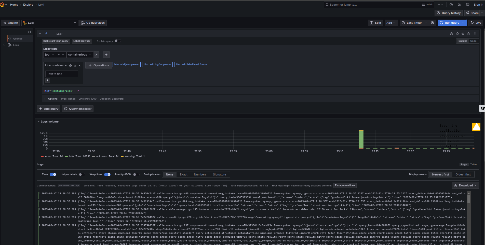
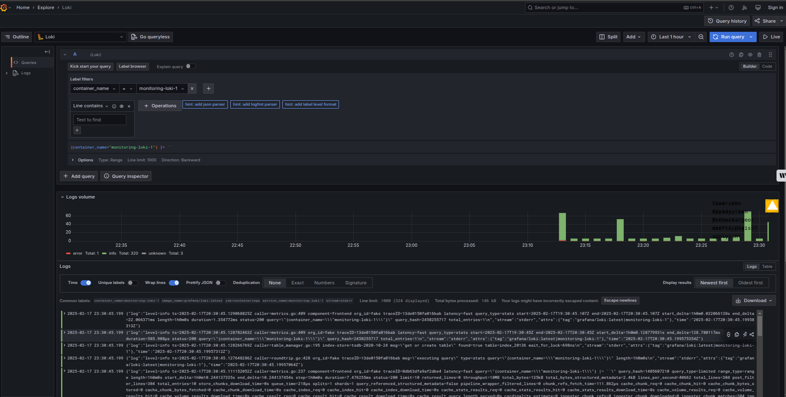
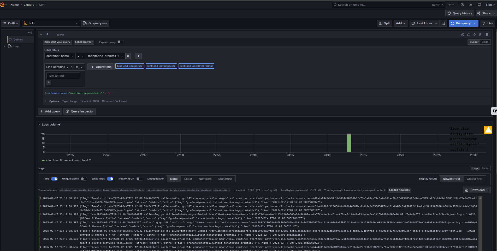
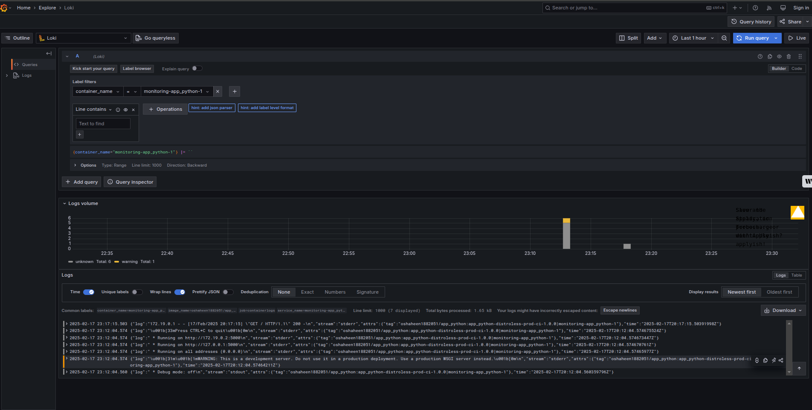
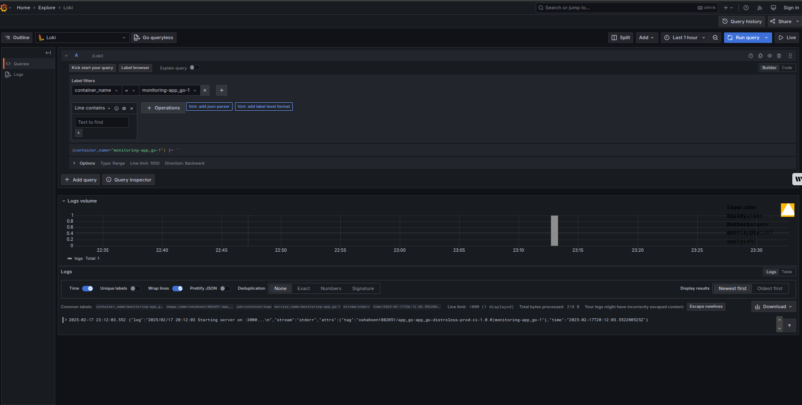

# Logging Stack Documentation

This document provides an overview of the logging stack setup using **Promtail**, **Loki**, and **Grafana**. The stack is configured to collect, store, and visualize logs from multiple Docker containers.

---

## Components of the Logging Stack

### 1. **Promtail**

- **Role**: Promtail is responsible for collecting logs from the application containers and forwarding them to Loki.
- **Configuration**:
  - The `promtail.yml` file defines how logs are scraped and sent to Loki.
  - It collects logs from Docker containers located in `/var/lib/docker/containers/*/*log`.
  - Logs are enriched with metadata such as `image_name`, `container_name`, and `container_id`.

### 2. **Loki**

- **Role**: Loki is a horizontally scalable, highly available log aggregation system. It stores logs and provides a query interface for Grafana.
- **Configuration**:
  - Loki is configured using the default `local-config.yaml` file.
  - It listens on port `3100` for log ingestion from Promtail.

### 3. **Grafana**

- **Role**: Grafana is used to visualize and query logs stored in Loki.
- **Configuration**:
  - Grafana is pre-configured with a Loki datasource using the provisioning feature.
  - It listens on port `4000` (mapped to Grafana's default port `3000`).
  - Anonymous authentication is enabled for ease of access.

---

## Docker Compose Configuration

The `docker-compose.yml` file defines the services for the logging stack and your applications:

- **Applications**:
  - `app_python`: A Python application exposed on port `5000`.
  - `app_go`: A Go application exposed on port `3000`.
  - Both applications use the `json-file` logging driver with a maximum log size of `100m` and up to `10` log files.

- **Logging Stack**:
  - `loki`: Runs the Loki service on port `3100`.
  - `promtail`: Collects logs from Docker containers and forwards them to Loki.
  - `grafana`: Provides a web interface for log visualization on port `4000`.

---

## Promtail Configuration

The `promtail.yml` file is used to configure log collection:

```yaml
server:
  http_listen_port: 9080
  grpc_listen_port: 0

positions:
  filename: /tmp/positions.yaml

client:
  url: http://loki:3100/loki/api/v1/push

scrape_configs:
  - job_name: containers
    static_configs:
      - targets:
          - localhost
        labels:
          job: containerlogs
          __path__: /var/lib/docker/containers/*/*log # For linux only

    pipeline_stages:
      - json:
          expressions:
            stream: stream
            attrs: attrs
            tag: attrs.tag
            time: time
            log: log
      - timestamp:
          source: time
          format: RFC3339Nano
      - regex:
          expression: ^(?P<image_name>([^|]+))\|(?P<container_name>([^|]+))$
          source: "tag"
      - labels:
          stream:
          time:
          image_name:
          container_name:
          container_id:
```

---

## Screenshots

Below are screenshots demonstrating the successful operation of the logging stack:

### 1. **Grafana Dashboard**

- Shows logs from the `app_python` and `app_go` containers.
- Example query: `{job="containerlogs"}`.



---

### 2. **Loki Logs**

- Logs ingested by Loki and displayed in Grafana.
- Example query: `{container_name="monitoring-app_go-1"}`.



---

### 3. **Promtail Log Collection**

- Promtail successfully collecting logs from Docker containers.



---

### 4. **Logs from `app_python`**

- Logs generated by the `app_python` container.
- Example query: `{container_name="monitoring-app_python-1"}`.



---

### 5. **Logs from `app_go`**

- Logs generated by the `app_go` container.
- Example query: `{container_name="monitoring-app_go-1"}`.


