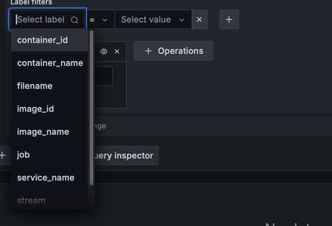
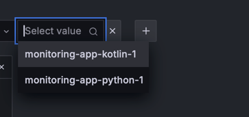
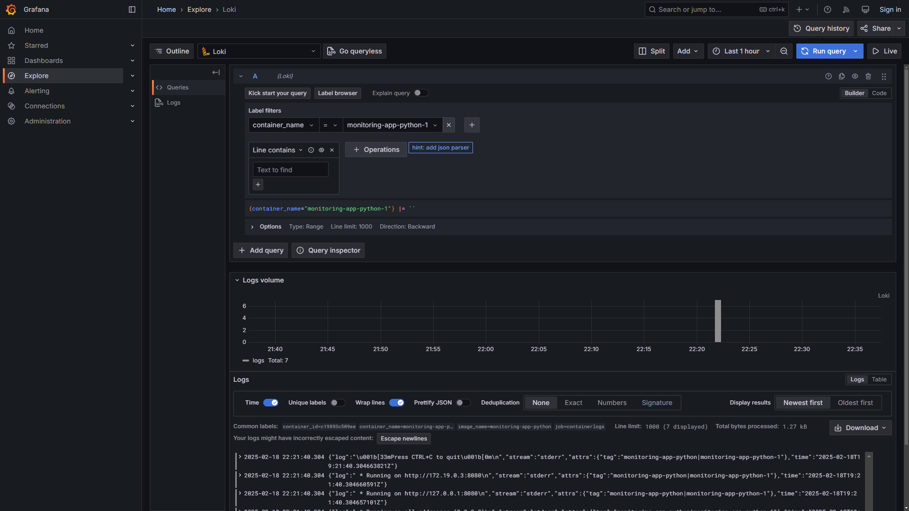
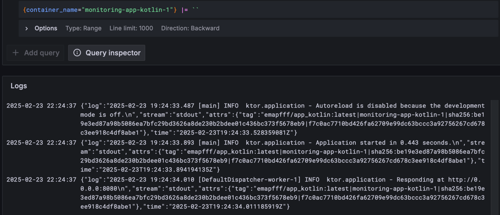

# Graphana

Grafana is an open-source data visualization and monitoring solution.

In homework we don't need to modify options for Grafana, Loki is used to get data.

# Loki

Loki is an open-source log aggregation system that is designed to be lightweight and highly scalable.

Also runned with default parameters.

# Promtail

Is used to show logs for specific source.

I added such labels:

# Logs

## List of names of containers

## Python app logs

## Kotlin app logs

