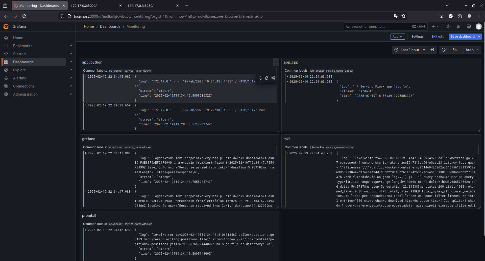

# Logging

This report describes the configuration details for the logging system.

## Components

There are 3 components in stack:
1. **Promtail**: Collects logs from the application and sends them to Loki.
2. **Loki**: Aggregates and stores logs.
3. **Grafana**: Visualizes logs stored in Loki.

## Configuration

I user configuration from "[Example Docker Compose Configuration from Loki Repository](https://github.com/grafana/loki/blob/main/production/docker-compose.yaml)" with small changes in `promtail` configuration. Changes made to add collection logs from mapped `/var/lib/docker/container/<container_id>`, where docker containers save their logs. There was ability to avoid these changes and just map `/var/lib/docker/container/<container_id>`, however it allows to store logs only from one container.

### loki

`Loki` service for logs storing and aggregation from 

### network

The same `loki` network for all components `Promtail` service. It runs on 3100 port. There is defined default configuration file `/etc/loki/local-config.yaml`.

### promtail

`Promtail` service, which collects logs and send them to the `Loki`. There are mapped volume `/var/lib/docker/containers` and defined default configiration file `/etc/promtail/config.yml`. The last one was modifying to define Docker's logs collection.

### grafana

`Grafana` service for visualisation logs. It runs on 3000 port, which is also mapped. Configuration defines creation configuration for defining the source (Loki) with creation directory for it.

## Results demonstrarion

On the screenshot above you may see dashboard with all containers logs. My application on C++ does not write logs, so I had no ability to show them. The simplest way to demonstrate its log aggregation was to manually write in its *.log file. I saved there line from app_python log (look on diference in time).
