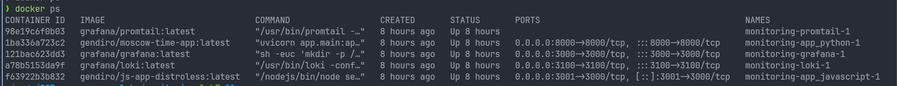
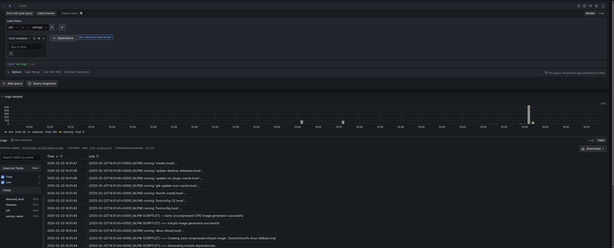
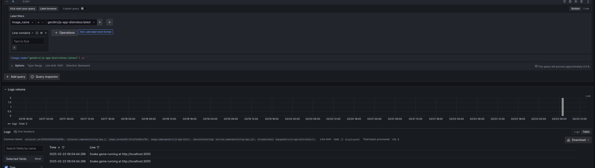

# LOGGING

## The setup

### Protmail

It's an agent that collects the data from the source specified in it's config file (which you can see at `promtail-config.yml`) to later send to aggregator like
Loki. In my case, the protmail is set up to have two separate  jobs - `varlogs` and `containerlogs`. I also additionaly configured the pipeline for the container logs to add additional tags such as `tag`, `image_name`, `container_name` and etc for better quering experience later on. The first job is responsible for tracking
general system information (you can't run docker on a broken system after all), and the latter keeps track of all docker containers.

### Loki

It's a log aggregator that tracks matadata of the logs rather than text itself for efficient tracking and storing. The config for this service is not provided as it uses the default one (I found that there is no reason to change the defaults for loki). While grafana is the default way to access the data stored in Loki, it
runs it's api on `localhost:3100` (or `loki:3100` with dns) and can be accessed that way as a standalone.

### Grafana

The frontend developed by the same company that created Loki. It's used for more convinient display and visualisation of data from loki than, for example, cli.
It gets the public `localhost:3100` from Loki and outputs the much better GUI at `localhost:3000` (had to change port mapping of js app because of that, lol).

## Review of the system

Here is the screenshot of the setup described above + two apps running from the docker-compose file. As you can see we can access app by themselves and also
look into grafana whenever we need to

Here are the logs from the system itself. We can query them by doing `{job=varlogs}` because they are in a separate  job.

Here is the python app. Because a single job keeps track of all docker containers, it's better to use labels such as `image_name` or `container_name` (if there are multiple instances of the same image) to see a specific image/container.

And finally here is the javascript app. As you can see it's equally as convinient to query it as the previous one.

