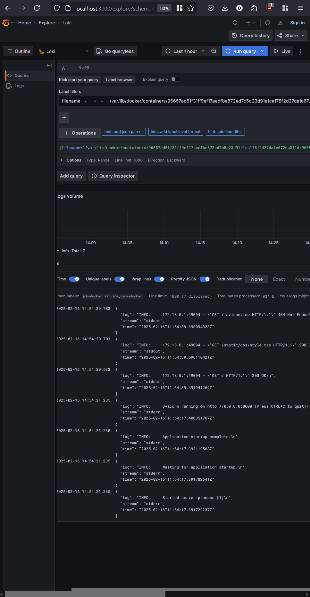
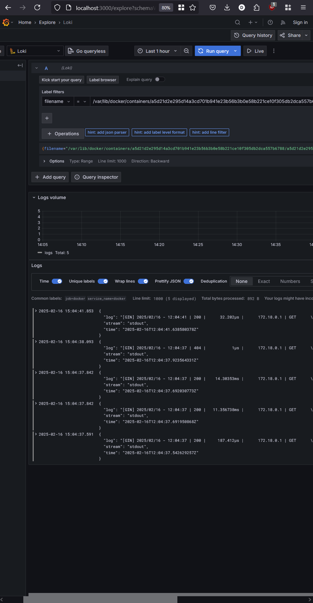

# Logging

## Overview

The logging stack contains Loki, Promtail, and Grafana. This setup enables efficient log collection and monitoring for debugging.

## Components

### Loki
  
  It is a scalable log aggregator. It indexes logs and stores them in a time-series database.
  
  It runs using the configuration file located at `/etc/loki/local-config.yaml`, listens on port `3100` for incoming log data. Logs are stored persistently in the `loki-data` volume.

### Promtail

  It is an agent that collects logs from the Docker container and forwards them to Loki. It scrapes log files using the given config.

  `promtail.yml` file includes listening for HTTP on port `9080`, tracking progress of scraped files from the folder `/var/lib/docker/containers/*/*log` in `/tmp/positions.yaml`, specifying the URL `http://loki:3100/api/prom/push` for sending logs to Loki.

### Grafana

  Grafana provides UI for the logging stack. It queries Loki for log data and shows dashboards and query results.

  It listens on **port** `3000` and is accessible without authentication.

## Screenshots

### Containers

### All Logs

### Python App Logs

### Go App Logs

