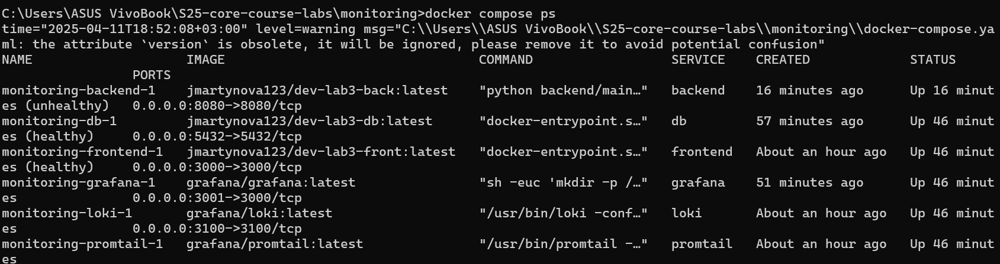

# Logging results

## 1. Network

```yaml
networks:
  loki:
```

**Role**: Defines a custom network named loki that is used for communication between the services. This allows services to interact with each other using internal DNS names.

## 2. Loki

```yaml
services:
  loki:
    image: grafana/loki:latest
    ports:
      - "3100:3100"
    command: -config.file=/etc/loki/local-config.yaml
    networks:
      - loki
```

**Role**: Loki is a log aggregation system. It collects logs from various sources and makes them available for analysis.
**Configuration**:

- Uses the grafana/loki:latest image.
- Exposes port 3100 for external access.
- Runs with the configuration file /etc/loki/local-config.yaml.
- Connected to the loki network

## 3. Promtail

``` yaml
  promtail:
    image: grafana/promtail:latest
    volumes:
      - /var/log:/var/log
      - ./promtail-config.yaml:/etc/promtail/config.yml
      - /var/lib/docker/containers:/var/lib/docker/containers:ro
    command: -config.file=/etc/promtail/config.yml
    networks:
      - loki
```

**Role**: Promtail is an agent that collects logs from the host and sends them to Loki.

**Configuration**:

- Uses the grafana/promtail:latest image.
- Mounts the /var/log and /var/lib/docker/containers directories to collect logs.
- Uses the configuration file ./promtail-config.yaml.
- Connected to the loki network.

## 4. Gafana

``` yaml
  grafana:
    environment:
      - GF_PATHS_PROVISIONING=/etc/grafana/provisioning
      - GF_AUTH_ANONYMOUS_ENABLED=true
      - GF_AUTH_ANONYMOUS_ORG_ROLE=Admin
      - GF_FEATURE_TOGGLES_ENABLE=alertingSimplifiedRouting,alertingQueryAndExpressionsStepMode
    entrypoint:
      - sh
      - -euc
      - |
        mkdir -p /etc/grafana/provisioning/datasources
        cat <<EOF > /etc/grafana/provisioning/datasources/ds.yaml
        apiVersion: 1
        datasources:
        - name: Loki
          type: loki
          access: proxy
          orgId: 1
          url: http://loki:3100
          basicAuth: false
          isDefault: true
          version: 1
          editable: false
        EOF
        /run.sh
    image: grafana/grafana:latest
    ports:
      - "3001:3000"
    networks:
      - loki
```

**Role**: Grafana is a platform for data visualization and monitoring. It is used to create dashboards and analyze data collected by Loki.

**Configuration**:
Uses the grafana/grafana:latest image.
Exposes port 3001 for external access.
Configures anonymous access and enables certain features.
Creates a configuration file to connect to Loki.
Connected to the loki network

## 5. Database

```yaml
  db:
    image: jmartynova123/dev-lab3-db:latest
    environment:
      POSTGRES_DB: times
      POSTGRES_USER: myuser
      POSTGRES_PASSWORD: mypassword
    volumes:
      - ./init.sql:/docker-entrypoint-initdb.d/init.sql
    networks:
      - loki
    ports:
      - "5432:5432"
    healthcheck:
      test: ["CMD-SHELL", "pg_isready -U myuser -d times"]
      interval: 30s
      timeout: 10s
      retries: 5
```

**Role**: PostgreSQL database for storing application data.

**Configuration**:

- Uses the custom image jmartynova123/dev-lab3-db:latest.
- Configures the times database with the user myuser and password mypassword.
- Mounts the init.sql file for database initialization.
- Exposes port 5432 for external access.
- Connected to the loki network.
- Has a healthcheck to verify the database's readiness.

## 6. Backend

```yaml
  backend:
    image: jmartynova123/dev-lab3-back:latest
    environment:
      DATABASE_URI: postgresql://myuser:mypassword@db:5432/times
    ports:
      - "8080:8080"
    networks:
      - loki
    depends_on:
      db:
        condition: service_healthy
        restart: true
    healthcheck:
      test: ["CMD-SHELL", "curl -f http://localhost:8080/times || exit 1"]
      interval: 30s
      timeout: 10s
      retries: 5
```

**Role**: Backend service that interacts with the database and provides an API for the frontend service.

**Configuration**:

- Uses the custom image jmartynova123/dev-lab3-back:latest.
- Configures the database connection via the DATABASE_URI environment variable.
- Exposes port 8080 for external access.
- Connected to the loki network.
- Depends on the db service and waits for it to be ready.
- Has a healthcheck to verify the backend service's readiness.

## 7. Frontend

```yaml
  frontend:
    image: jmartynova123/dev-lab3-front:latest
    ports:
      - "3000:3000"
    networks:
      - loki
    healthcheck:
      test: [ "CMD-SHELL", "curl -f http://localhost:3000 || exit 1" ]
      interval: 30s
      timeout: 10s
      retries: 5
```

**Role**: Frontend service that provides the user interface for interacting with the backend service.

**Configuration**:

- Uses the custom image jmartynova123/dev-lab3-front:latest.
- Exposes port 3000 for external access.
- Connected to the loki network.
- Has a healthcheck to verify the frontend service's readiness.

## Check for successful job

All containers:

All logs:


Python logs:

