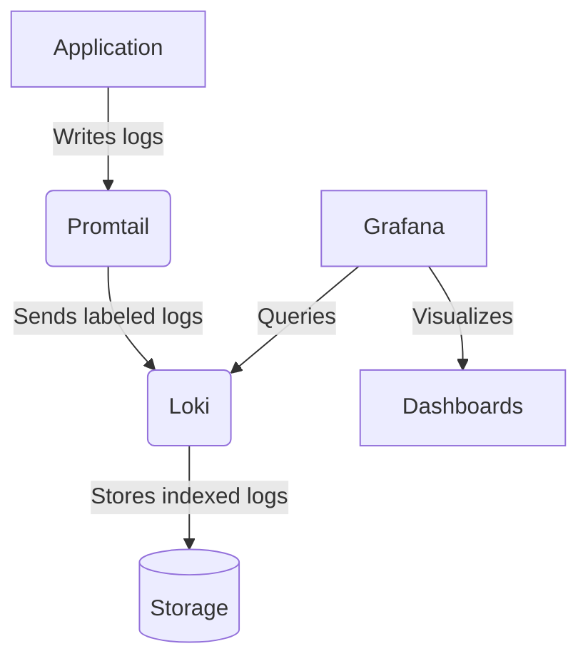

# Monitoring

### 1. Grafana
**Purpose**: Open-source analytics and monitoring platform  
**Function**:
- Visualizes metrics and logs through customizable dashboards
- Provides querying capabilities for log analysis
- Supports alerts and notifications

### 2. Loki
**Purpose**: Horizontally-scalable log aggregation system  
**Key Features**:
- Indexes logs with labels for efficient querying
- Optimized storage for log data
- Tight integration with Grafana

### 3. Promtail
**Purpose**: Log collection agent  
**Capabilities**:
- Discovers and tails log files
- Adds metadata labels to log entries
- Pushes logs to Loki in batches

## Component Interaction

### Screenshots

#### Grafana

#### Loki

#### Promtail

#### Python app

