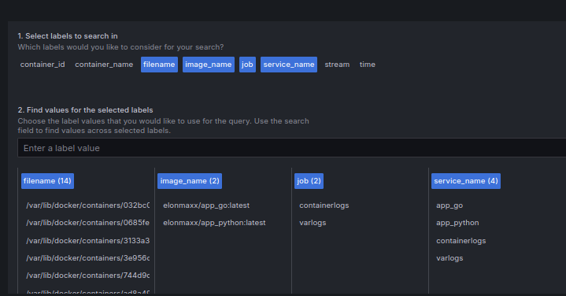
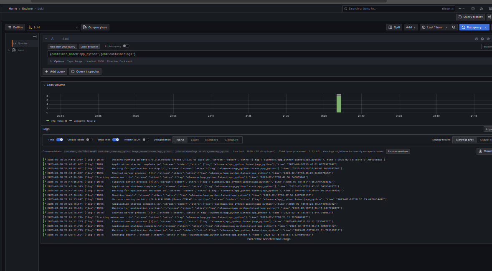
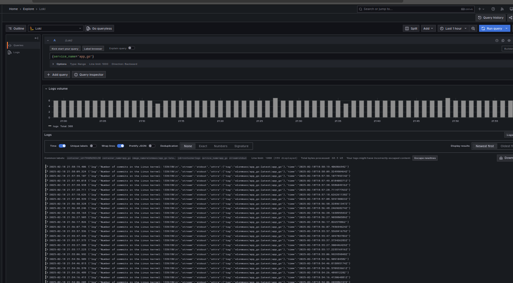

# Monitoring

## Log sources

In the docker-compose we set up logging type json:

```yml
    logging:
      driver: "json-file"
```

## Log scrapper promtail

Promtail is configured to scrap all the docker logs and properly
aggregate them by labels, so we may monitor logs from a particular container.

## Log storage, aggregator system loki

It is used to store, aggregate the scrapped data. It is a database that
facilitates fast search, troubleshooting service problems.

## Grafana

This is our service that visualises data we search in loki. We search by labels
that are assigned to every container, so we visualise events by every service,
see the images.

### Service log choice



### Python service monitoring



### Go service monitoring


