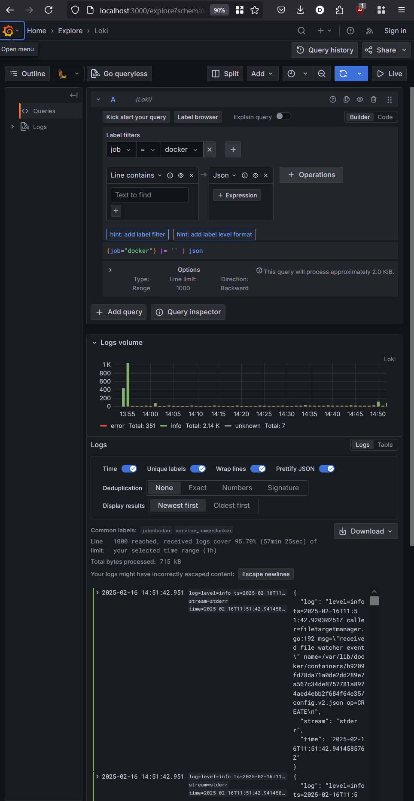
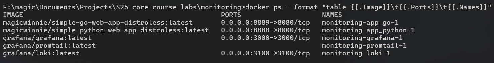
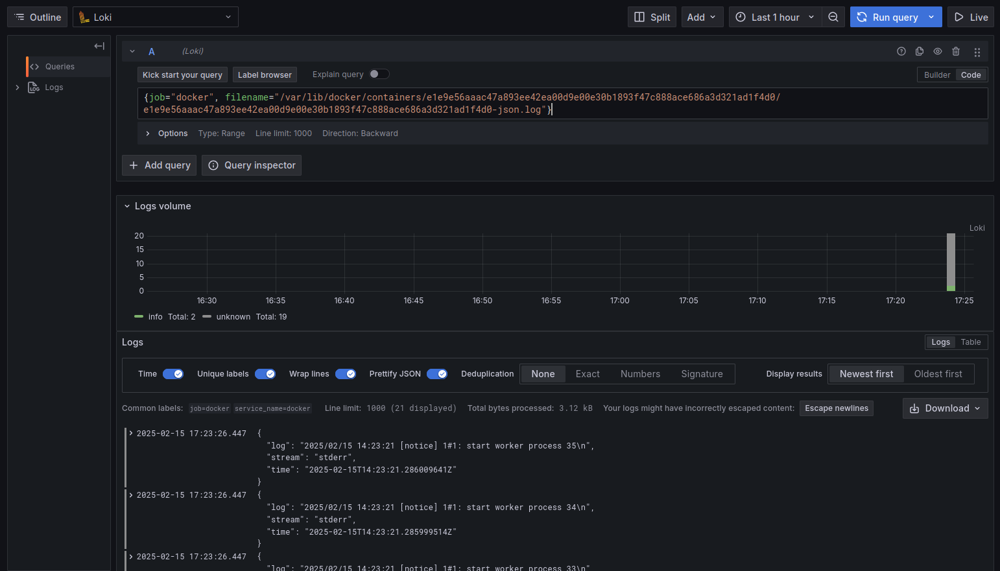
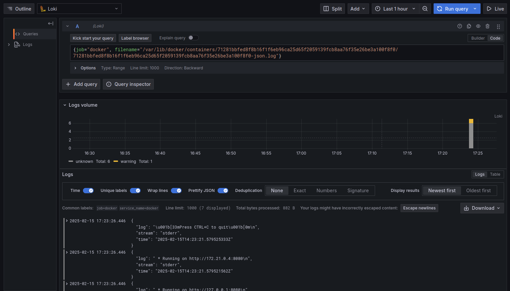

# Loggin Setup

## Grafana

***Grafana*** is used a visualization tool for technical monitoring from different sources (here, Docker containers).

The setup via [Docker-Compose](docker-compose.yml) allows to browse and filter logs from the project containers (logs from Flutter web app and Python web app) using the web interface (will be available on http://0.0.0.0:3000/).

## Promtail

***Promtail*** is used as log agent that *pulls* logs from the required datasources and *pushes* them to the log engine.

## Loki

***Loki*** is used as a log engine. It allows to store containers logs and query them via LogQL using labels.

## Web applications

Two applications ([flutter](https://hub.docker.com/repository/docker/paranid5/app_flutter/general) and [python](https://hub.docker.com/repository/docker/paranid5/app_piton/general) web apps) fetched from the DockerHub as Docker images. For now, both applications were not addapted for smart logging with extensive search system.

## Results

* All logs

* Running containers

* Flutter logs

* Python logs

