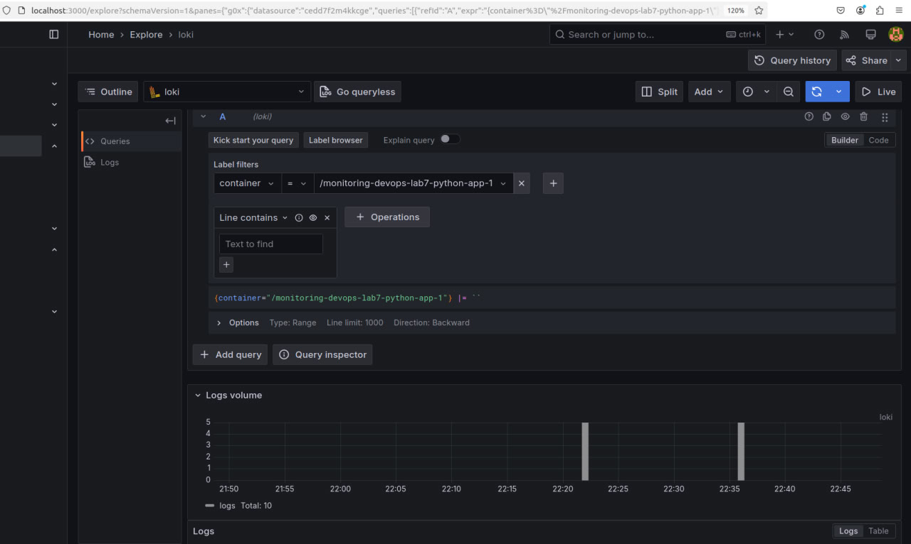
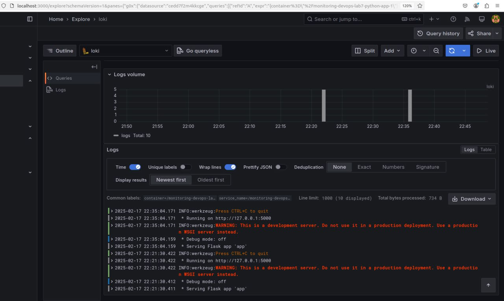

# Lab 7 Logging

## Logging Stack

The logging stack consists of three main components:

### Promtail

Promtail is a log scraper that gathers logs from Docker containers and forwards them to Loki.

Promtail functions as an agent that gathers logs from Docker containers

• Discovering Logs  
  It employs Docker service discovery (docker_sd_configs) to automatically identify active containers

• Delivering Logs  
  It sends the collected logs to Loki by using the API endpoint (http://loki:3100/loki/api/v1/push)

### Loki

Loki is a log aggregation system that collects, indexes, and stores logs.

Loki handles the receipt, indexing, and storage of log data. It operates on port 3100 and is set up using the loki-config.yaml file

• Managing Storage and Indexes  
  Loki utilizes the boltdb-shipper store for handling log indexes and saves log chunks on the filesystem

• General Settings  
  The common section defines the path_prefix for all file paths

• Compaction  
  A compactor is specified with a working directory to manage log compaction tasks

### Grafana

Grafana is a visualization platform that queries and displays logs stored in Loki

Grafana offers an intuitive interface for visualizing and analyzing the logs

• Data Source Integration  
  It links to Loki as its data source

### Application (app_python)

This container operates the application (built from app_python) which produces logs during runtime. Promtail collects these logs and forwards them to Loki, enabling them to be queried and visualized in Grafana

### Screenshots

The screenshot validates the functionality of the logging stack.

