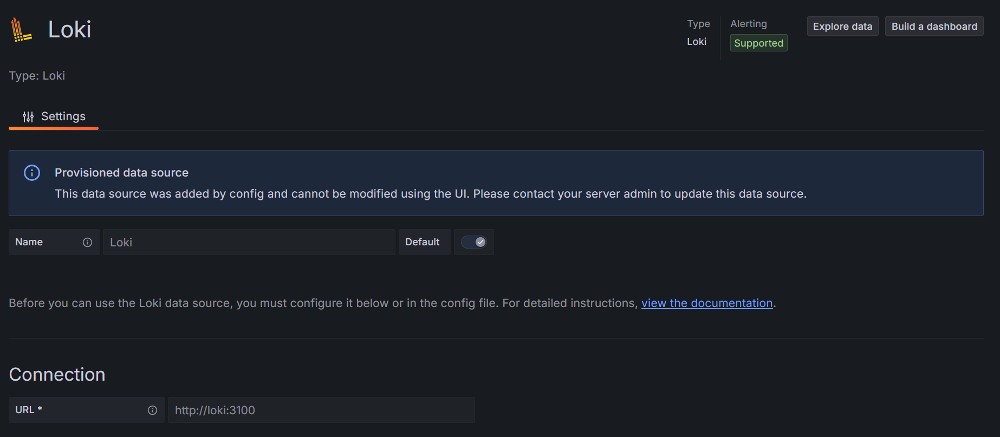
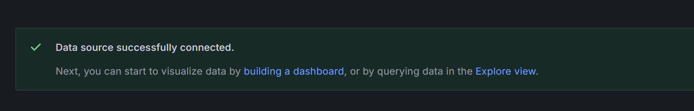
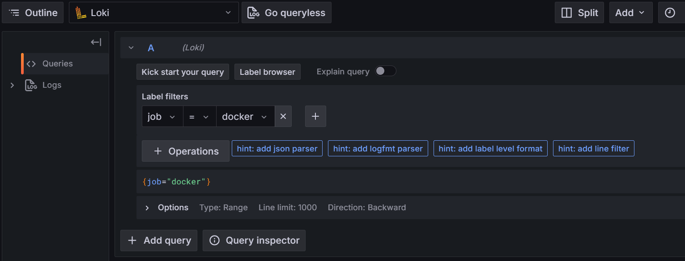
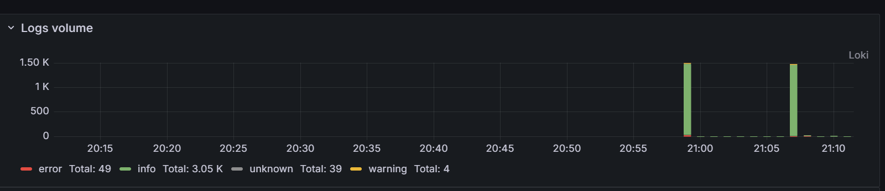
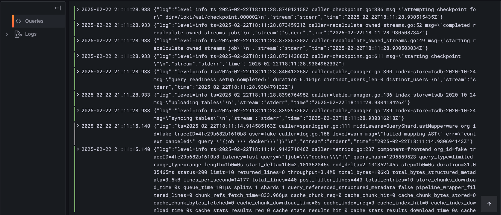

# Logging Stack Documentation

This document describes the components of the logging stack configured using Docker Compose. The stack includes Loki for log aggregation, Promtail for log collection, and Grafana for visualizing the logs.

## Overview

The stack consists of the following services:

1. **Loki**: A log aggregation system designed for cloud-native applications.
2. **Promtail**: An agent responsible for collecting logs and sending them to Loki.
3. **Grafana**: A tool for visualizing logs stored in Loki.
4. **App_Python**: A simple Python application whose logs are collected by Promtail.
5. **Networking**: The services are connected via a Docker network called `monitoring_network`.

## Services

### 1. **App_Python**

The `app_python` service runs a simple Python application (`chr1st1na/app_python:latest`). This application exposes logs that are collected by Promtail.

- **Ports**: Exposes port 8000 on the host mapped to port 5000 inside the container.
- **Logs**: These logs are sent to Loki via Promtail for aggregation and storage.

### 2. **Loki**

The `loki` service is responsible for storing and indexing logs.

- **Ports**: Exposes port 3100 on the host mapped to port 3100 inside the container.
- **Configuration**: Loki is configured to read from the default `local-config.yaml` file and stores logs in the `loki-storage` volume.

### 3. **Promtail**

The `promtail` service collects logs from Docker containers and sends them to Loki. It monitors logs from `/var/log` and the `/var/lib/docker/containers` directories.

- **Ports**: No ports exposed (internal communication only).
- **Configuration**: Promtail is configured via the `promtail.yml` file.

### 4. **Grafana**

The `grafana` service is used for visualizing logs stored in Loki.

- **Ports**: Exposes port 3000 on the host mapped to port 3000 inside the container.
- **Configuration**: Grafana is provisioned with a datasource pointing to the Loki service. The configuration is set in `/etc/grafana/provisioning/datasources/ds.yaml`.

## Docker Compose Configuration

Here is a snippet from the `docker-compose.yml` file that defines the stack:

```yaml
version: "3"

networks:
  default:
    name: monitoring_network

volumes:
  loki-storage:

services:
  app_python:
    image: chr1st1na/app_python:latest
    ports:
      - "8000:5000"

  loki:
    image: grafana/loki:latest
    ports:
      - "3100:3100"
    command: -config.file=/etc/loki/local-config.yaml
    volumes:
      - loki-storage:/loki

  promtail:
    image: grafana/promtail:latest
    volumes:
      - /var/log:/var/log
      - ./promtail.yml:/etc/promtail/config.yml
      - /var/lib/docker/containers:/var/lib/docker/containers:ro
    command: -config.file=/etc/promtail/config.yml
    depends_on:
      - loki

  grafana:
    environment:
      - GF_PATHS_PROVISIONING=/etc/grafana/provisioning
      - GF_AUTH_ANONYMOUS_ENABLED=true
      - GF_AUTH_ANONYMOUS_ORG_ROLE=Admin
    entrypoint:
      - sh
      - -euc
      - |
        mkdir -p /etc/grafana/provisioning/datasources
        cat <<EOF > /etc/grafana/provisioning/datasources/ds.yaml
        apiVersion: 1
        datasources:
        - name: Loki
          type: loki
          access: proxy 
          orgId: 1
          url: http://loki:3100
          basicAuth: false
          isDefault: true
          version: 1
          editable: false
        EOF
        /run.sh
    image: grafana/grafana:latest
    ports:
      - "3000:3000"
    depends_on:
      - loki
```
## Setup and Run
1. Run Docker Compose:

    To start the stack, run:
    ```bash
    docker-compose up -d
    ```
    This will start all the services in detached mode.

2. Access Grafana:

    After the stack is running, access Grafana by navigating to http://localhost:3000.

    The default username is `admin` and the password is also `admin`.

3. Check Logs:

    You can view logs in Grafana in `Explore` by configuring Loki as a datasource and exploring logs from the `app_python` service.
    ```
    {job="test"}
    ```
4. `app_python` running at http://localhost:8000

## Screenshots
1. Loki configured



2. Logs




This concludes the documentation for the logging stack setup.