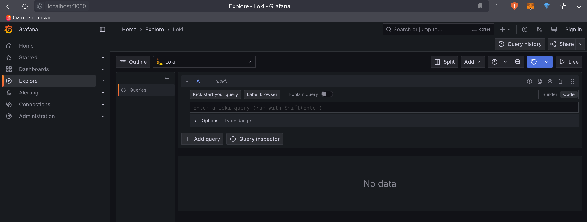
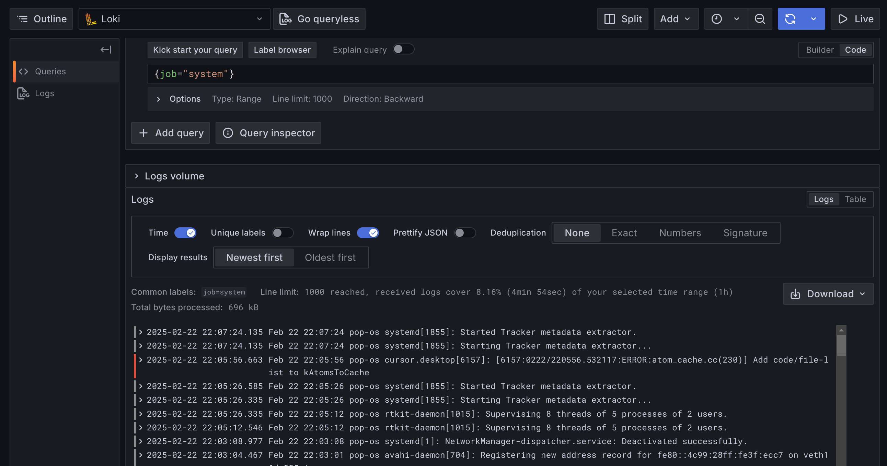

# Logging Stack Documentation

This document describes the logging stack implementation for the Moscow Time application using Grafana, Loki, and Promtail.

## Stack Components

### 1. Grafana
- **Role**: Visualization and monitoring interface
- **Port**: 3000
- **Features**:
  - Web-based dashboard
  - Query builder for logs
  - Pre-configured with Loki datasource
  - Anonymous access enabled for easy testing

### 2. Loki
- **Role**: Log aggregation system
- **Port**: 3100
- **Features**:
  - Stores and indexes log data
  - Highly efficient log storage
  - Label-based log querying
  - Integration with Grafana

### 3. Promtail
- **Role**: Log collector
- **Features**:
  - Collects logs from multiple sources:
    - Docker containers
    - System logs
    - Application logs
  - Adds labels for better organization
  - Forwards logs to Loki

### 4. Moscow Time Application
- **Role**: Main application being monitored
- **Port**: 80 (external) -> 5000 (internal)
- **Logging Configuration**:
  - Uses JSON log format
  - Log rotation enabled (10MB max size, 3 files)
  - Tagged with "logging=promtail" label

## Configuration Details

### Docker Compose Configuration
```yaml
# Key configurations in docker-compose.yml
moscow-time:
  logging:
    driver: "json-file"
    options:
      max-size: "10m"
      max-file: "3"
  labels:
    - "logging=promtail"
```

### Promtail Configuration
```yaml
# Key configurations in promtail-config.yml
scrape_configs:
  - job_name: docker
    static_configs:
      - labels:
          job: docker
          __path__: /var/lib/docker/containers/*/*log
```

### Grafana Datasource
```yaml
# Configuration in loki.yml
datasources:
  - name: Loki
    type: loki
    url: http://loki:3100
```

## Usage Guide

### Starting the Stack
```bash
cd monitoring
docker-compose up -d
```

### Accessing Logs

1. Open Grafana: http://localhost:3000

2. Navigate to Explore section

3. Example LogQL queries:
   - All Moscow Time logs:
     ```
     {container_name="moscow-time-app"}
     ```
   - System logs:
     ```
     {job="system"}
     ```
   - Docker logs:
     ```
     {job="docker"}
     ```

### Log Retention and Performance

- Logs are automatically rotated (10MB max size, 3 files)
- Loki data is persisted using Docker volumes
- Promtail ensures no log loss during restarts

## Screenshots

### Grafana Dashboard

*Main Grafana interface showing log queries*

### Log Query Example

*Example of LogQL query showing Moscow Time application logs*

### System Overview

*Overview of all system components and their logs*

## Troubleshooting

### Common Issues

1. **No Logs Appearing**
   - Check Promtail status: `docker logs promtail`
   - Verify Loki connection: `curl http://localhost:3100/ready`

2. **Container Logs Missing**
   - Ensure proper volume mounts
   - Check Docker logging driver configuration

3. **Grafana Can't Connect to Loki**
   - Verify Loki is running: `docker ps`
   - Check Loki datasource configuration

### Maintenance

1. **Log Cleanup**
   - Logs are automatically rotated
   - Manual cleanup: `docker system prune`

2. **Volume Backup**
   ```bash
   docker run --rm -v loki-data:/source -v $(pwd):/backup alpine tar czf /backup/loki-backup.tar.gz /source
   ```

## Security Considerations

- Anonymous access enabled for testing (disable in production)
- Read-only access to Docker container logs
- System log access limited to local machine

## Future Improvements

1. Add log parsing for specific application events
2. Create custom Grafana dashboards
3. Implement alerting based on log patterns
4. Add metrics collection (Prometheus integration)

## References

- [Grafana Documentation](https://grafana.com/docs/)
- [Loki Documentation](https://grafana.com/docs/loki/latest/)
- [Promtail Documentation](https://grafana.com/docs/loki/latest/clients/promtail/) 