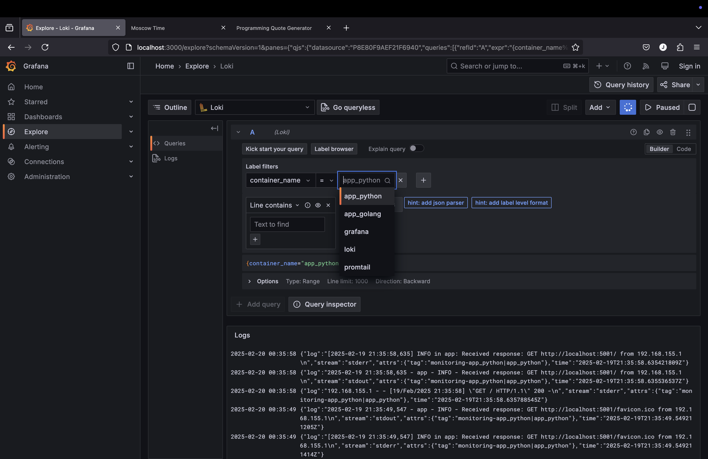
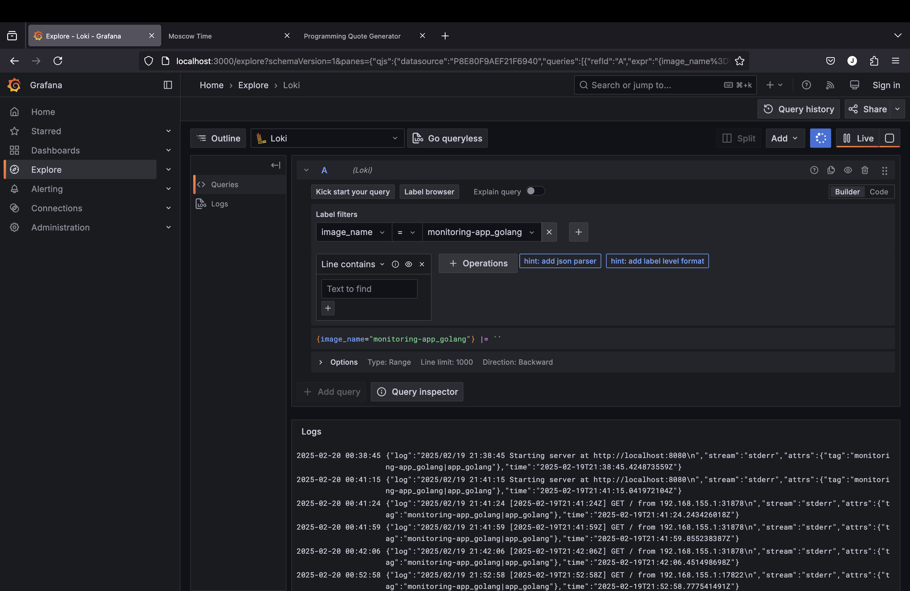
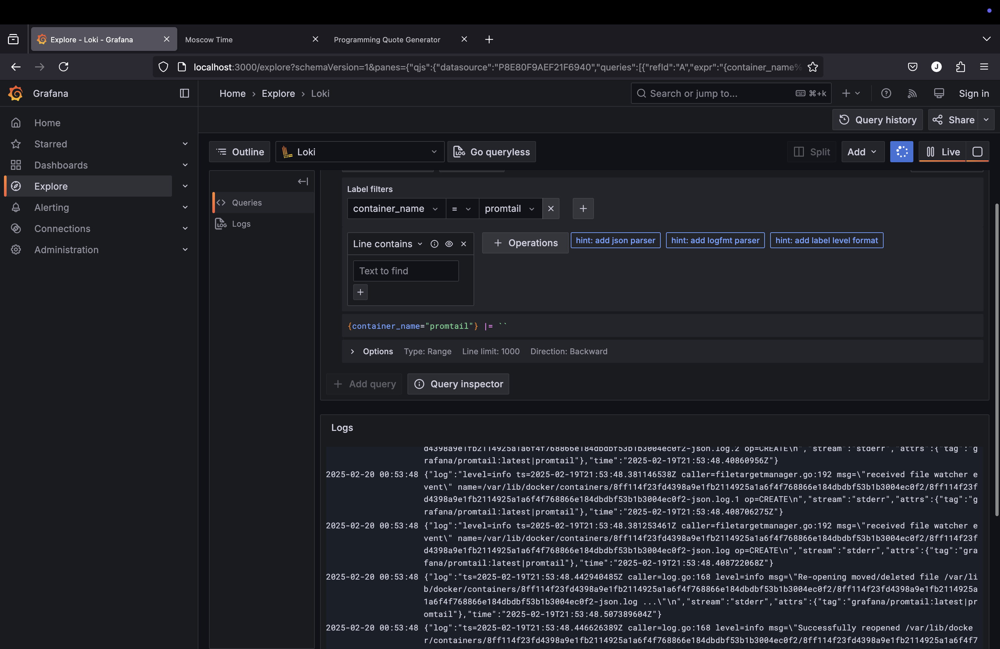
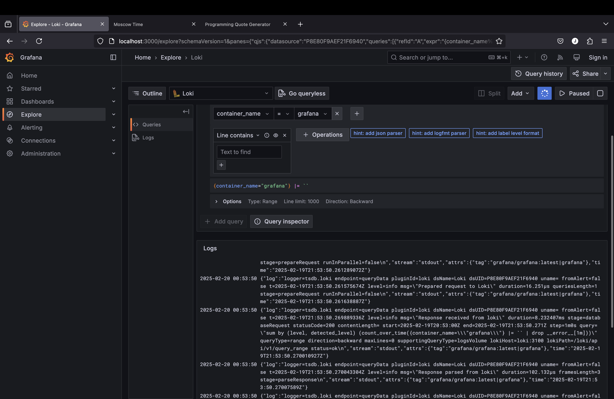
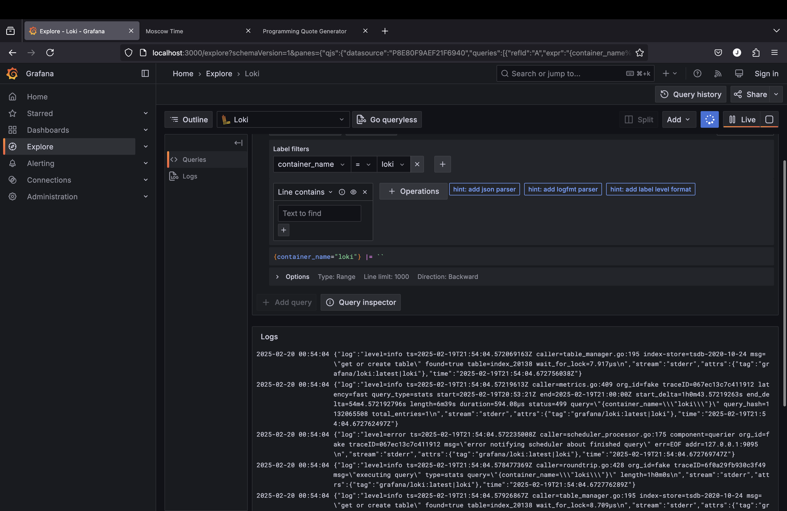
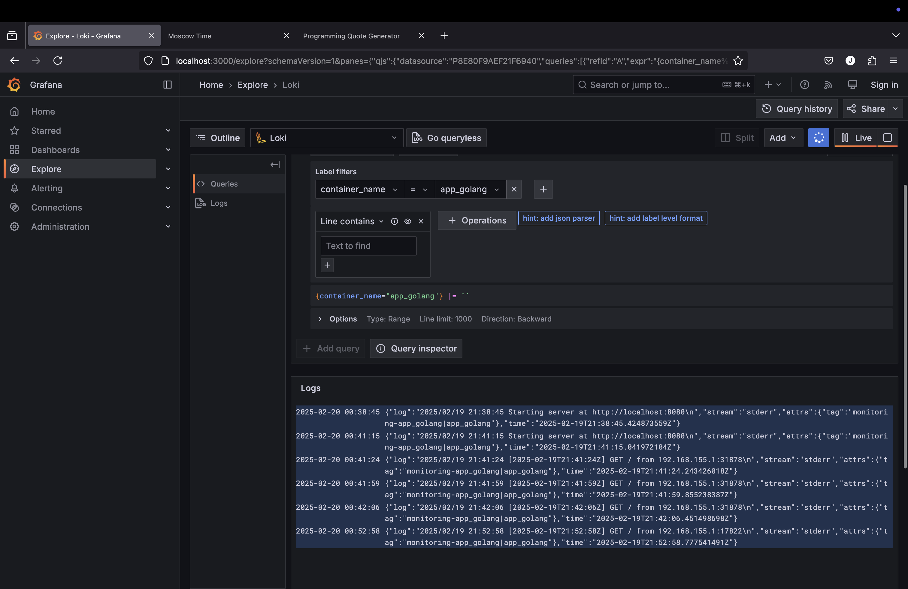
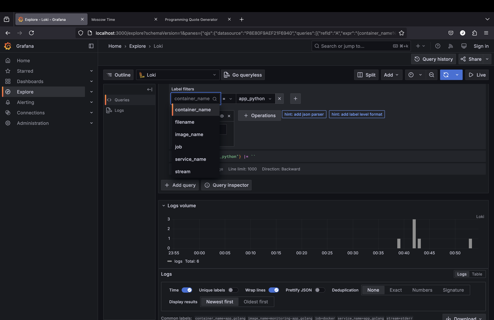

# Logging

## 1. Overview of the Logging Stack

Our stack consists of:
- **Loki** – a log aggregation system by Grafana Labs, responsible for storing and indexing logs.  
- **Promtail** – an agent that scrapes logs from Docker containers and sends them to Loki.  
- **Grafana** – a visualization and analytics platform that queries Loki and displays logs in a user-friendly interface.

We also have two application containers:
- **app_python** – a Python (Flask) application.  
- **app_golang** – a Go application.

All containers are configured to use a custom `json-file` logging driver, which includes both the image name and container name in the log tag (e.g., `imageName|containerName`). Promtail parses that tag to create more descriptive labels in Loki.

---

## 2. Flow of Logs

1. **Application Containers** write logs to stdout/stderr.  
2. **Docker** captures these logs via the `json-file` driver, storing them on disk. Each log entry contains a custom tag such as `imageName|containerName`.  
3. **Promtail** reads these JSON-formatted logs, extracts and splits the tag into `image_name` and `container_name`, and forwards them to **Loki**.  
4. **Loki** indexes and stores the logs.  
5. **Grafana** queries Loki and displays the logs in dashboards or via the **Explore** feature.

---

## 3. Key Configuration Highlights

- **Custom Logging Driver**  
  Each service in the Docker Compose file references a `json-file` driver with a custom `tag` format like `"{{.ImageName}}|{{.Name}}"`.

- **Promtail Pipeline**  
  Promtail uses stages to parse each log line as JSON, extract the tag, split it, and convert the timestamp. Below is an example snippet illustrating how the tag is processed:

  ```yaml
  pipeline_stages:
    - json:
        expressions:
          tag: attrs.tag
    - regex:
        expression: "^(?P<image_name>(?:[^|]*[^|]))\\|(?P<container_name>(?:[^|]*[^|]))$"
        source: tag
    - labels:
        container_name:
        image_name:
  ```  
- **Loki Datasource**  
  Grafana is automatically configured to use Loki as a data source, making it simple to query logs.

## 4. How to View Logs in Grafana

1. **Access Grafana** at [http://localhost:3000](http://localhost:3000).
2. Go to **Explore** in the left-hand menu.  
3. Select **Loki** as the data source.  
4. Use LogQL queries to filter by labels. For example:
   ```yaml
   {container_name="app_python"}
   ```
   
   or
   ```yaml
   {image_name="app_golang"}
   ```
   
6. Adjust the time range in the upper-right corner if logs do not appear immediately.

---

## 5. Troubleshooting

- **No Logs Shown**  
- Generate new logs (e.g., by making requests to the containers).  
- Check Promtail’s container logs for permission or path errors.  
- Ensure Grafana’s time range covers recent activity.

- **Old Logs Rejected by Loki**  
- Loki may reject logs with timestamps that are too far in the past. Generating new logs often fixes this.

- **Mac/Windows Path Issues**  
- On non-Linux systems, `/var/lib/docker/containers` might not be accessible inside the Promtail container. Consider Docker Service Discovery if direct file scraping fails.

---

## 6. Screenshots

Include your own screenshots demonstrating:

1. **Promtail Targets** – showing discovered containers.
   
2. **Grafana Explore** – logs from `app_python` or `app_golang` with visible labels like `container_name` and `image_name`.  
   
3. **Log Labels** – highlighting the parsed labels in the log viewer.
   
   
   
   

---

## 7. Conclusion

By combining Loki, Promtail, and Grafana:

- **Promtail** collects and labels Docker container logs.  
- **Loki** efficiently stores and indexes these logs.  
- **Grafana** provides a powerful interface for querying, visualizing, and analyzing logs.

With this setup, all containers in the Docker Compose file are monitored, and their logs are easily accessible for troubleshooting and monitoring purposes.
   
