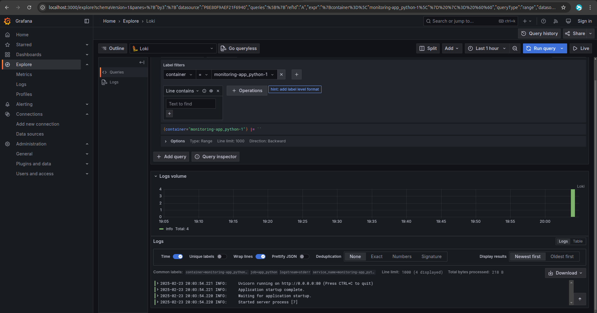
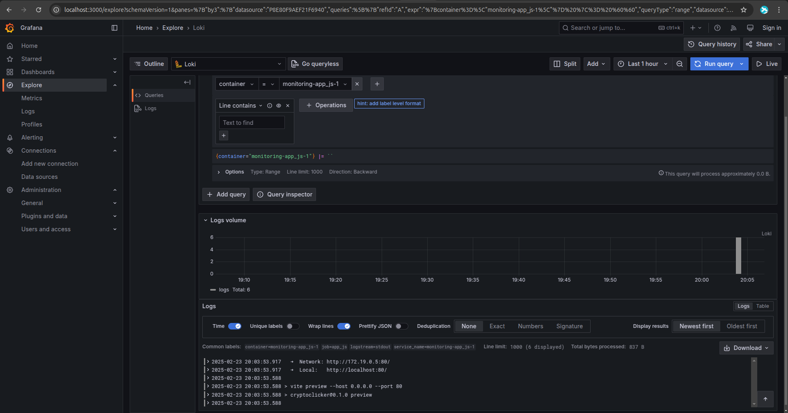

# Logging

## Stack

- **Grafana**: a web interface to visualize data
- **Loki**: a logging aggregator and storage
- **Promtail**: the endpoint that connects local logs with loki

## Grafana datasource

The only datasource there is Loki, chosen by default from port 3100.

## Loki config

The configuration is a minimal, single-node setup with authentication disabled, using the local filesystem for storage (time-series db schema) and an in-memory ring for simplicity.

## Promtail config

Promtail here listens to docker socket and picks data labelled as "promtail", to then remap the docker meta labels to something human readable.

## Queries screenshots

- app_python

- app_js

