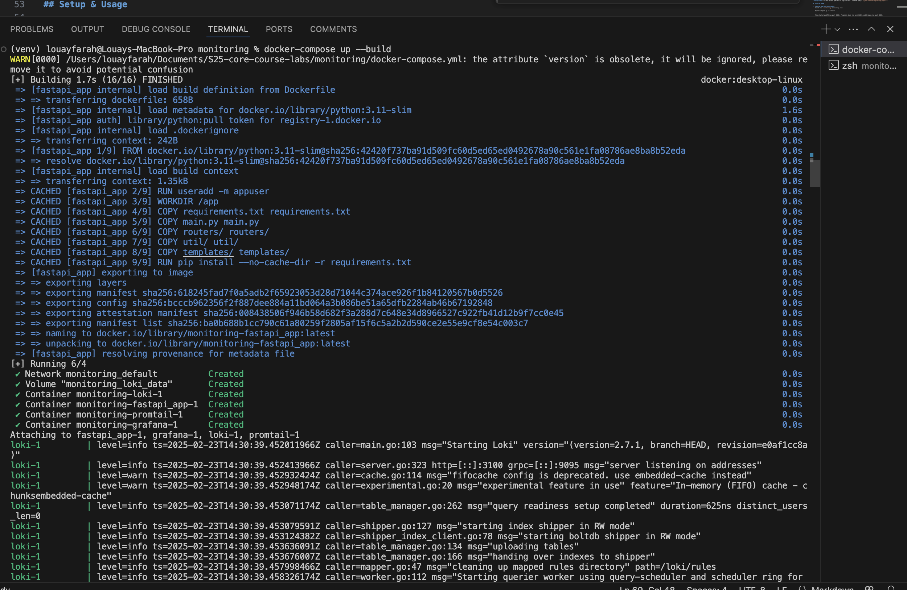
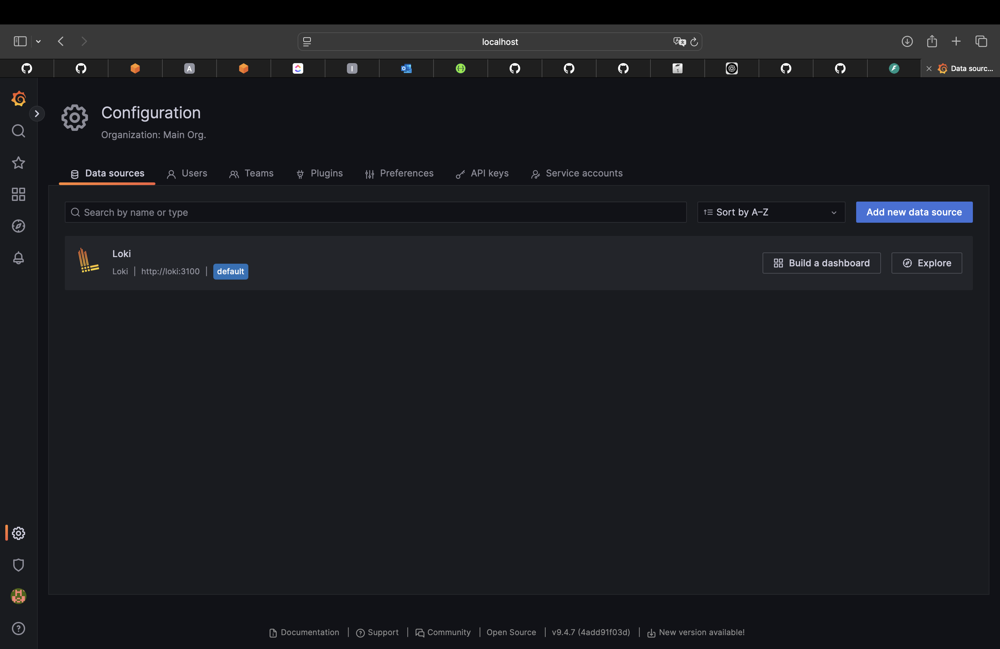
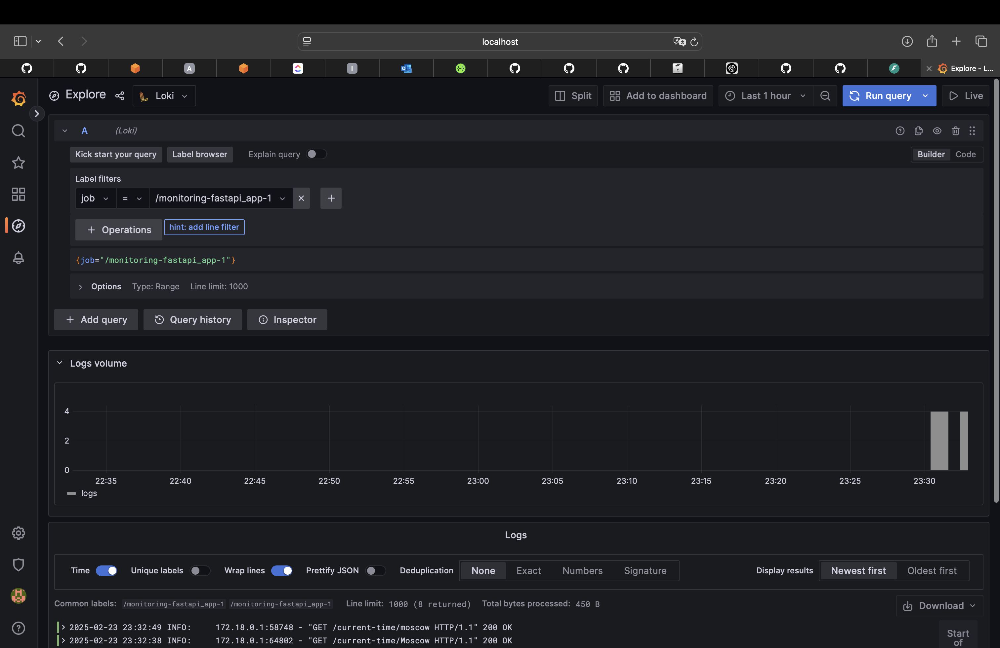
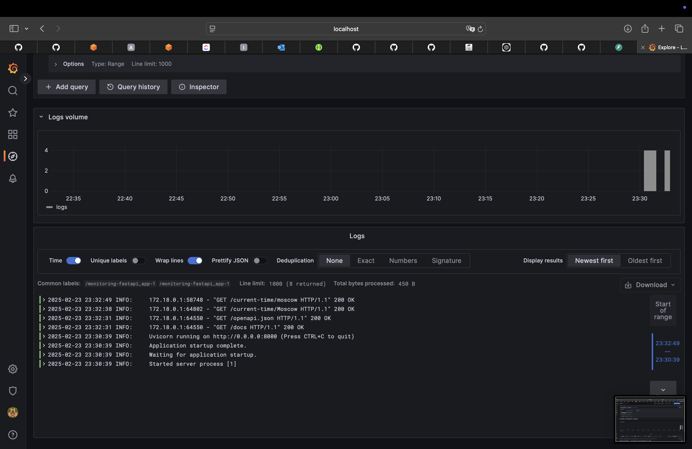
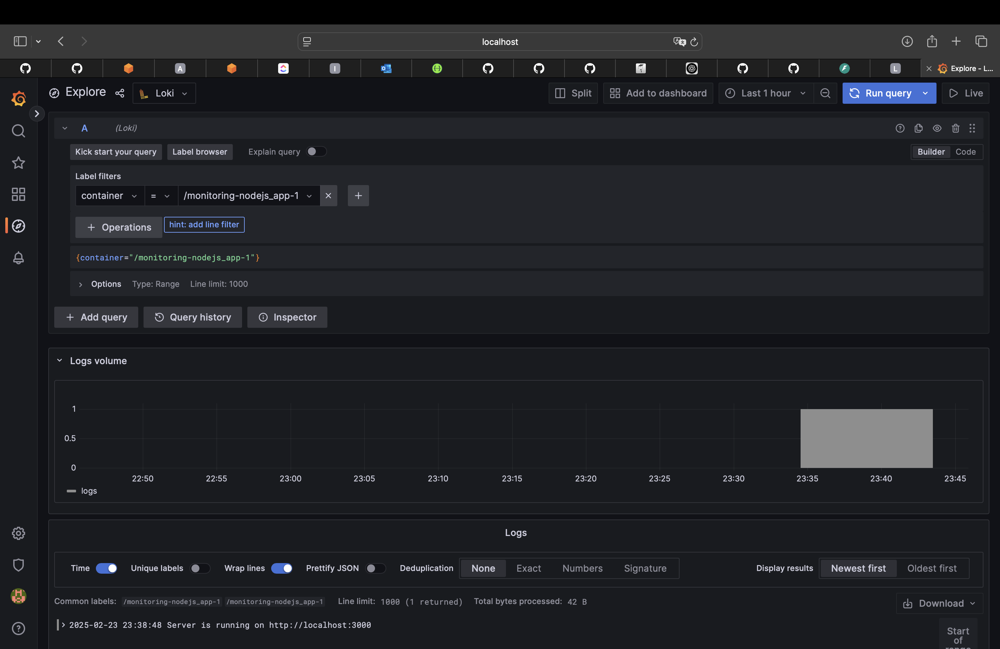
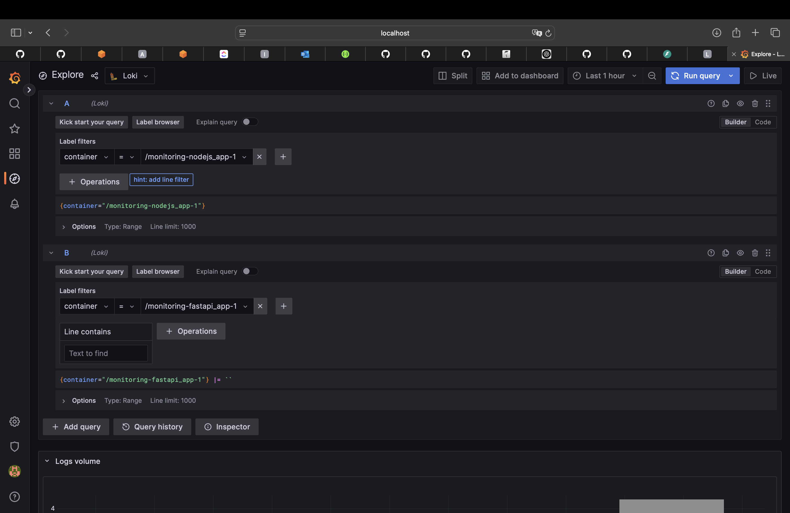
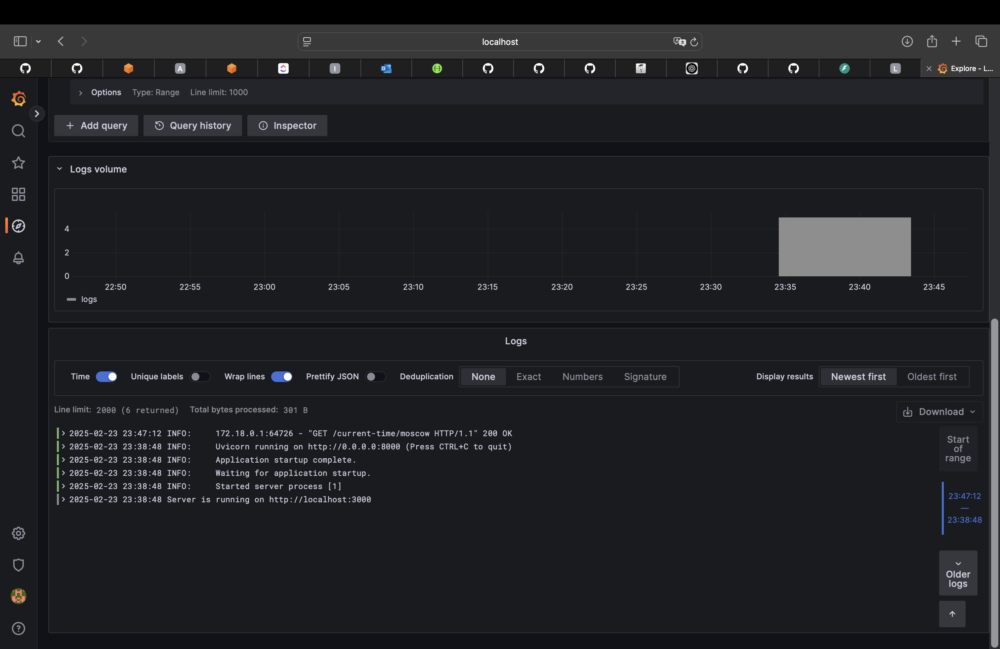

# LOGGING.md

## Overview
This document describes the logging stack that collects and visualizes logs from our FastAPI application running in Docker. The stack comprises the following components:

- **FastAPI** (Python web framework)  
- **Promtail** (agent that ships logs to Loki)  
- **Loki** (horizontally-scalable log aggregation system)  
- **Grafana** (UI to query and visualize logs)

## Architecture
The flow of logs is:

1. **FastAPI Container**  
   The current time zone FastApi application runs in a Docker container. All log output, mainly the request related information and response code. The original return type is a formatted html page.

2. **Promtail**  
   Promtail uses Docker Service Discovery to detect running containers and tail their stdout logs. It packages the logs into batches and forwards them to Loki.

3. **Loki**  
   Loki receives log batches from Promtail, indexes them, and stores them locally (or in any configured backend). It exposes an HTTP API (on port 3100 by default) to query logs.

4. **Grafana**  
   Grafana is configured with a Loki data source. It allows you to explore logs, build dashboards, and visualize log data in real time.

### Logical pipeline

Python App --logs-> Promtail --batched logs-> Loki --query logs-> Grafana


## Component Details

### 1. FastAPI
- **Role**: Hosts the main current time zone app.
- **Logging**: Outputs logs.
- **Location**: Defined in `app_python/` directory, built by Dockerfile.

### 2. Promtail
- **Role**: Collects Docker logs from the host Docker daemon via `/var/run/docker.sock`.  
- **Key Config**: `scrape_configs` telling Promtail to discover Docker containers and label them appropriately.  
- **Output**: Pushes logs to Loki using HTTP (`http://loki:3100`).

### 3. Loki
- **Role**: Receives logs from Promtail, stores them, and indexes them.  
- **Key Config**: `config.yml` sets up file-based storage, schema, etc.  
- **HTTP Port**: `3100`

### 4. Grafana
- **Role**: Visualization and dashboarding platform.  
- **Data Source**: Configured to point to Loki at `http://loki:3100`.  
- **Explore**: Allows ad-hoc queries of logs in Loki. Example query: `{job="/monitoring-fastapi_app-1"}`

## Setup & Usage

1. **Build and run the stack**  
   Inside the `monitoring` directory, run:
   ```
   docker-compose up -d --build
   ```

   This starts FastAPI (on port 8000), Promtail, Loki (on port 3100), and Grafana (on port 4000).

2. **Verify services**  
   - **FastAPI**: http://localhost:8000  
   - **Grafana**: http://localhost:4000  
     - Default credentials: `admin` / `admin` (you will be asked to change the password).

3. **View Logs in Grafana**  
   - Log in to Grafana at http://localhost:4000
   - Navigate to **Explore** → Select the **Loki** data source (top-left dropdown).  
   - Enter a query to filter logs, for example:
     {job="/monitoring-fastapi_app-1"}

4. **Generate Application Logs**  
   - Send requests to your FastAPI app:
     curl http://localhost:8000  

   - Return to Grafana **Explore** and confirm logs are appearing.

## Screenshots

1. **Docker Containers Running**  
   

2. **Grafana Data Source**  
   

3. **Logs in Grafana Explore**  
   
   


## Bonus Task: Additional Configuration

### Integrating the Node.js App

We have extended our setup to include an additional application written in Node.js. This new app runs in its own container and is also monitored by our existing logging stack.

1. **Application Overview**  
   - **Location**: `app_nodejs/` folder with independen Dockerfile.
   - **Exposed Port**: 3000 inside the container, mapped to a different host port 8080 to avoid conflicts.

2. **Docker Compose Extension**  
   In the same `docker-compose.yml`, a new service named `nodejs_app` is defined. For example:

3. **Promtail Configuration**  
   Since Promtail is already configured with Docker Service Discovery and does not filter out any containers, it automatically collects logs from *all* running containers in this Compose file, including the new `nodejs_app`.

4. **Querying Logs in Grafana**  
   - Access the Node.js application at http://localhost:8080  
   - Generate logs by hitting its endpoints 
   - In Grafana (http://localhost:4000), open **Explore** with the **Loki** data source.

### Comprehensive Logging

By default, Promtail’s Docker SD config collects logs from **any** container using the Docker socket. This means:

- **FastAPI** logs appear under its container label `{container="monitoring-fastapi_app-1"}`
- **Node.js** logs appear under its container label `{container="monitoring-nodejs_app-1"}`

### Screenshots

1. **Node.js Logs in Grafana**  


2. **Both Applications' Logs**  

