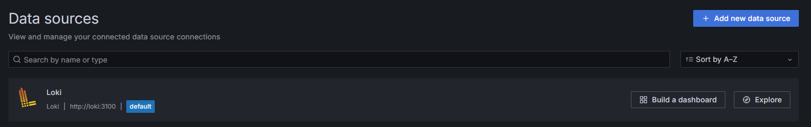
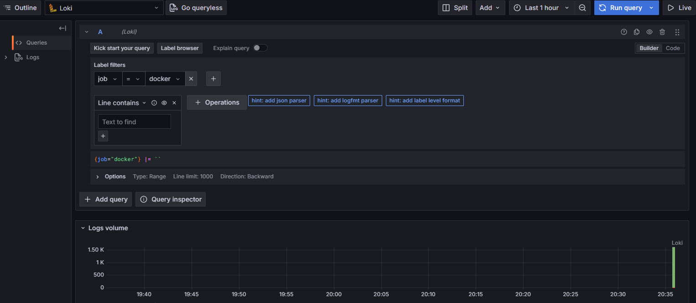
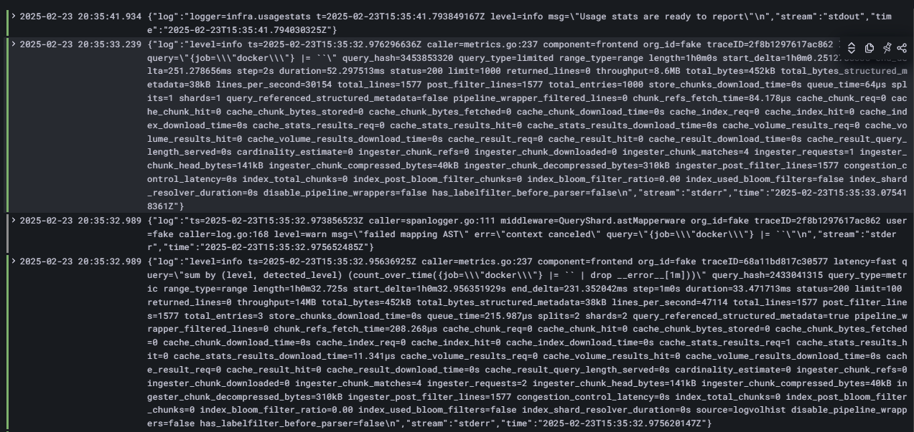

# Logging with Promtail, Loki, and Grafana

## Logging stack description

### Stack components

1. **Loki**:
- **Role**: Loki is a log storage and aggregation system. It indexes only log metadata, making it lightweight compared to other log storage systems such as Elasticsearch.
- **Configuration**: In our project, Loki runs as a Docker container and listens on port `3100`.

2. **Promtail**:
- **Role**: Promtail is an agent that collects logs from the host and sends them to Loki. It can collect logs from files, system logs, and Docker containers.
- **Configuration**: Promtail is configured to collect logs from `/var/log` and `/var/lib/docker/containers`. Promtail configuration is in `promtail.yml` file.

3. **Grafana**:
- **Role**: Grafana is a data visualization tool. It connects to Loki and allows you to create dashboards for log analysis.
- **Configuration**: Grafana is automatically configured to use Loki as a data source via provisioning.

4. **Applications**:
- Our project uses application `app_python`. It logs are also collected and sent to Loki.

## Setup and Startup

1. **Start the stack**:
- Go to the `monitoring` folder and run the command:
```bash
docker-compose up -d
```
- This will start all the components of the stack: Loki, Promtail, Grafana and applications.

2. **Test it works**:
- Open Grafana in your browser at `http://localhost:3000`.
- Add the Loki data source with the URL `http://loki:3100`.
- Create a new dashboard and start visualizing logs.
- 
## Screenshots

### Screenshot 1: Grafana with Loki connected


### Screenshot 2: Application logs in Grafana

