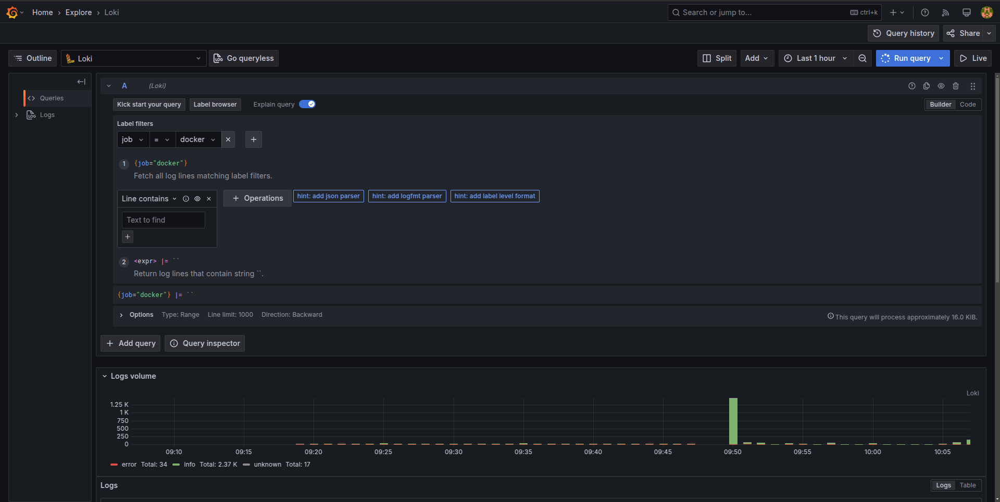
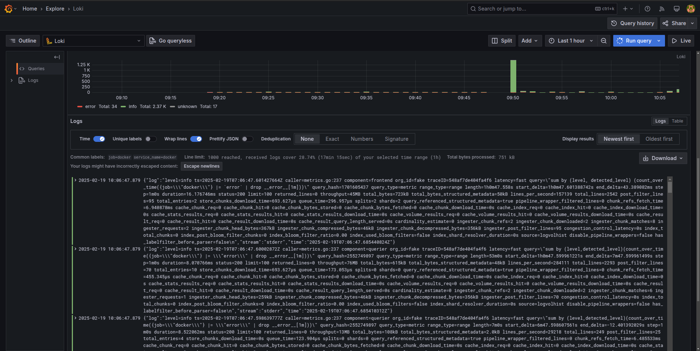
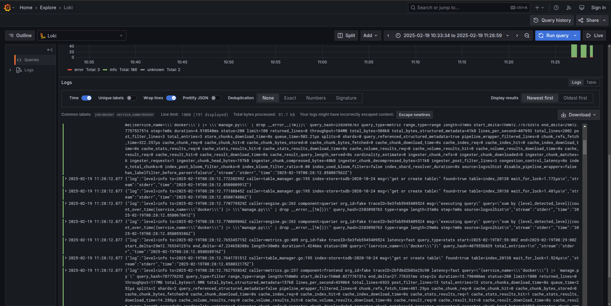
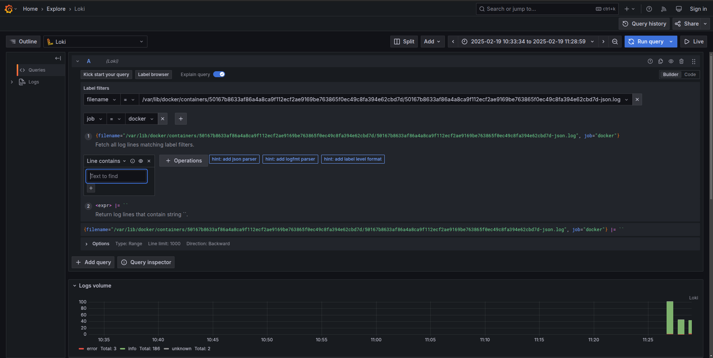
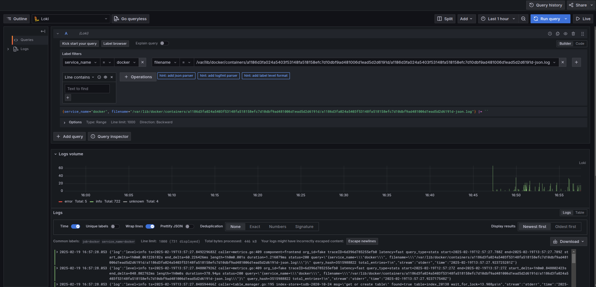
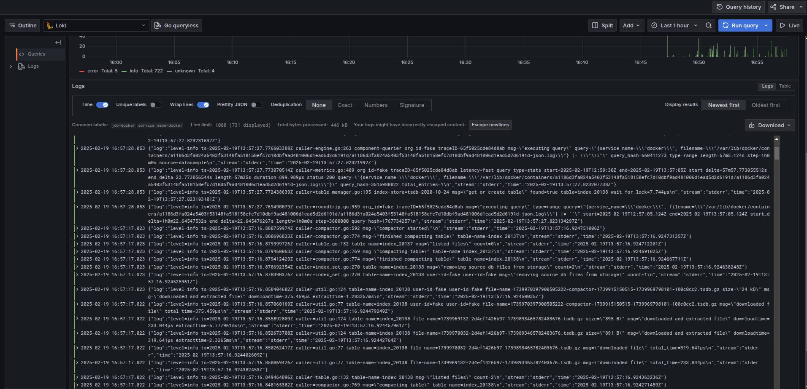

## Overview
The logging stack consists of Loki, Promtail, and Grafana, enabling efficient log collection, storage, and monitoring to aid in debugging and operational insights.

## Components
This system includes the following components (as per the docker-compose file):

- Grafana : Provides a dashboard for visualizing and querying logs.
- Loki : Acts as the log aggregation system, storing logs and allowing queries via LogQL.
- Promtail : Collects logs from Docker containers (including those of the applications, Loki, and Grafana) and forwards them to Loki.
- app_python : A Python web application that returns the current Moscow time.
- app_go : A bonus Go web application that also returns the current Moscow time.

Note : Promtail collects logs from all Docker containers running in the system, not directly from the applications themselves.

## Functionality
1. Log Collection : Promtail monitors logs generated by Docker containers and sends them to Loki.
2. Log Storage and Querying : Loki stores these logs efficiently using metadata-based indexing and allows querying through LogQL.
3. Visualization : Grafana provides an interface to explore, filter, and analyze logs in real-time.

## Screenshots
### All logs : 

### Python app logs 

### Go app Logs

