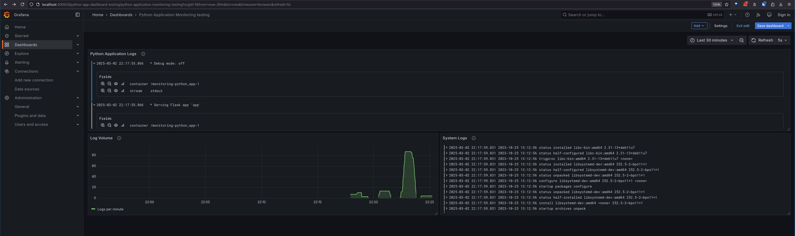

# Logging Stack Documentation

## Components Overview

### Loki

Loki is a log aggregation system. It acts as the storage backend for logs.

### Promtail

Promtail is a log collector designed to work with Loki. It discovers targets and attaches labels to log streams. It collects local log files and forwards them to Loki. It also annotates logs with metadata like container name and host.

### Grafana

Grafana is a visualization platform for metrics and logs. It provides a web interface to query and display logs from Loki. It supports creating dashboards and alerts. It allows for exploration of logs using LogQL.

## Setup

1. Start the logging stack:

```bash
cd monitoring
docker-compose up -d
```

1. Access Grafana:

- Open browser and navigate to `http://localhost:3000`
- Default credentials are `admin`/`admin`
- Add Loki as a data source:
  - URL: `http://loki:3100`
  - Click "Save & Test"

1. Create a dashboard:

- Click "+ Create" -> "Dashboard"
- Add a new panel
- Select Loki as the data source
- Use LogQL to query logs (e.g., `{job="flask_app"}`)

## Dashboard Panels



Dashboard consists of three main panels:

**1. Python Application Logs**
This panel displays raw logs from our Python Flask application. It shows:

- Timestamp of each log entry
- Log content with full details
- Container labels for context
- Sorted in descending order (newest logs first)

The query used is: `{stream="stdout", container="/monitoring-python_app-1"}`

This panel is useful for real-time debugging and monitoring application behavior.

**2. Log Volume**
This panel shows the rate of logs being generated by our application over time. Features:

- Line graph showing logs per minute
- Smooth interpolation for better visualization
- Helps identify unusual spikes in logging activity
- Useful for detecting potential issues or high traffic periods

The query used is: `sum(count_over_time({container="/monitoring-python_app-1"} [1m]))`

**3. System Logs**
This panel displays system-level logs from the host machine. It helps:

- Monitor system health
- Identify infrastructure issues
- Correlate application problems with system events
- Provide context for troubleshooting

The query used is: `{job="system"}`
