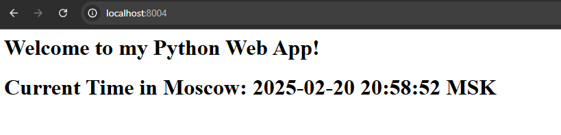
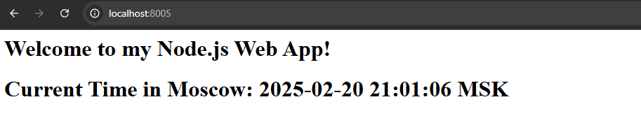
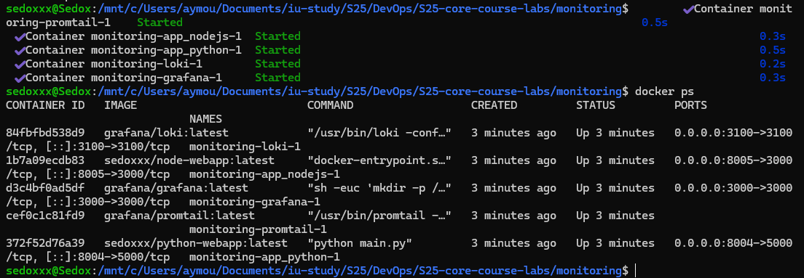
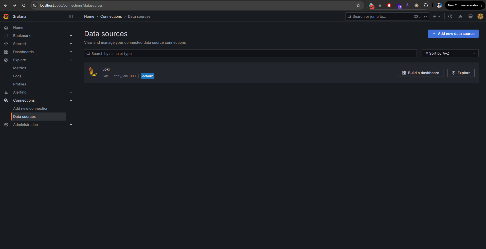
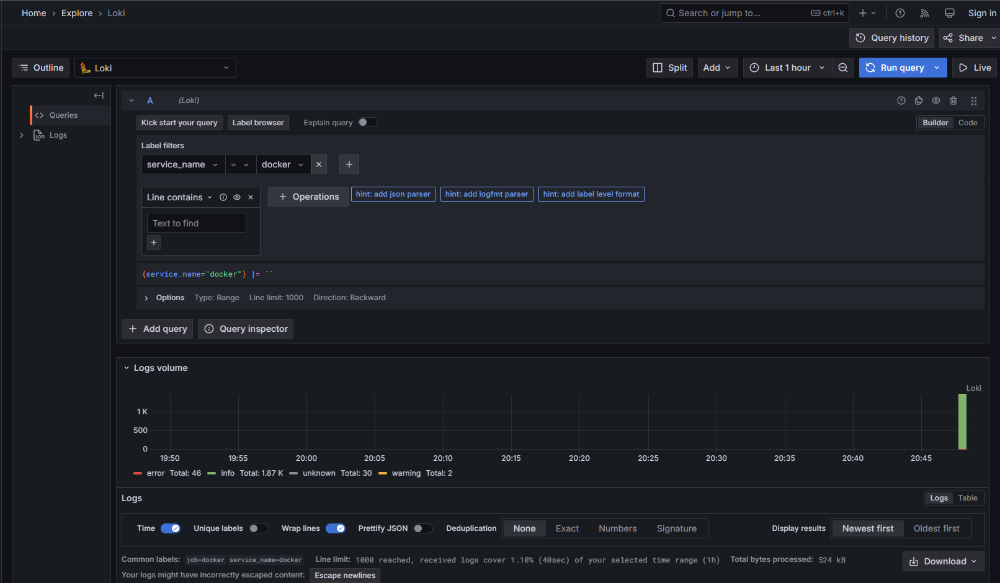
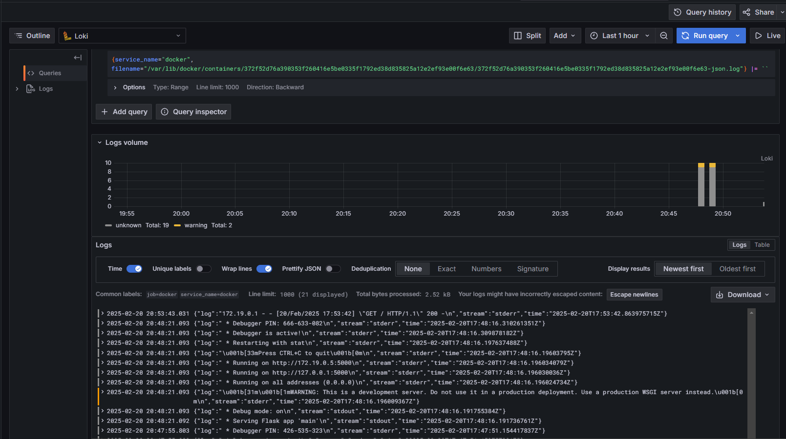
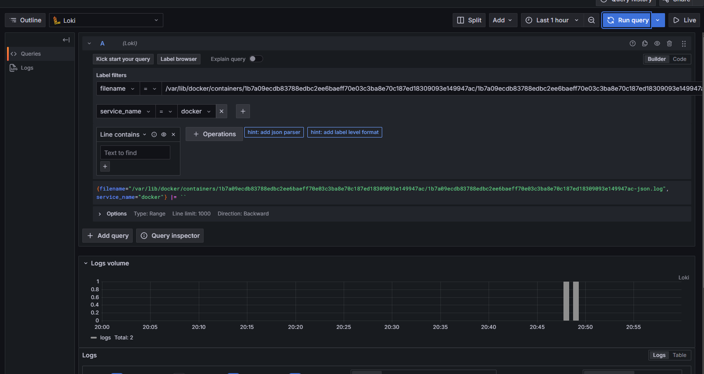

# Logging Stack Report

## Overview

This document describes the logging stack configured using Docker Compose, which includes the following components:
- **Loki:** Aggregates logs from various sources.
- **Promtail:** Collects and ships logs from the host to Loki.
- **Grafana:** Provides a dashboard for visualizing logs and metrics.
- **Python App:** Our deployed application container whose logs are collected.
- **NodeJS App:** Our deployed application container whose logs are collected.

## Component Details

### Promtail
- **Role:** Log shipper that reads log files from the host and sends them to Loki.
- **Configuration:**  
  - Monitors `/var/log` for any log files.
  - Configured to push logs to Loki at `http://loki:3100/loki/api/v1/push`.
- **Configuration File:** [`promtail-config.yaml`](promtail-config.yaml)

### Grafana
- **Role:** Dashboard and visualization tool.
- **Usage:**  
  - Accessible on port 3000.
  - Configured to use Loki as a data source for log visualization.

### App Python
- **Role:** The primary application container whose logs are being monitored.
- **Usage:**  
  - Deployed via Docker Compose on port 8004.
  - Its logs are collected by Promtail and forwarded to Loki.

### App NodeJS
- **Role:** The primary application container whose logs are being monitored.
- **Usage:**  
  - Deployed via Docker Compose on port 8005.
  - Its logs are collected by Promtail and forwarded to Loki.

## Testing and Verification

1. **Starting the Stack:**
   - The logging stack is brought up using:
     ```sh
     docker-compose up -d
     ```

2. **Verifying Components:**
   - **Grafana:** Accessible at [http://localhost:3000](http://localhost:3000). Confirm that Loki is added as a data source.
   - **Loki:** Accessible on port 3100.
   - **Promtail:** Confirm by checking logs:
     ```sh
     docker logs promtail
     ```
   - **Web Application:** Accessible at [http://localhost:8080](http://localhost:8080).

## Screenshots

Below are screenshots demonstrating the successful operation of the logging stack:
- **Python App:**
  
- **Node App:**  
  

- **Running Containers:**
  
  
- **Grafana Dashboard:**  
  

- **Data Sources:**
  

- **Docker Logs:**  
  

- **Python App Logs:**  
  

- **Node App Logs:**  
  

## Bonus: Extended Logging Configuration

### Additional Application Integration
- The Docker Compose configuration has been extended to include our nodejs application container.

### Comprehensive Logging
- The logging stack has been configured to collect logs from all containers defined in the `docker-compose.yml` file by mounting the host’s `/var/log` directory to Promtail.  
- Additional configuration can be added to further refine log collection per container.

## Conclusion

This logging stack using Promtail, Loki, and Grafana successfully aggregates and visualizes logs from our application container. The stack is fully operational and can be extended to integrate additional applications as needed.
