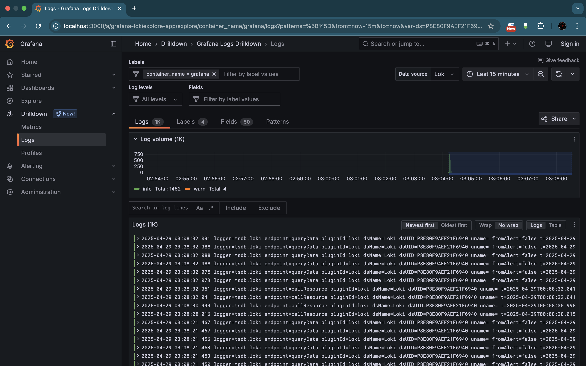
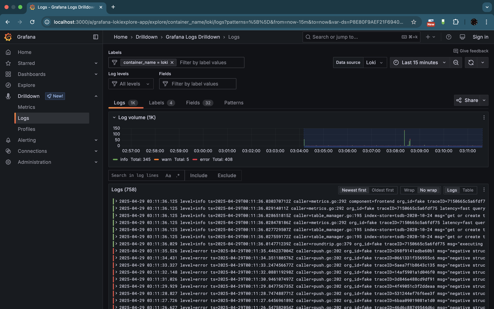
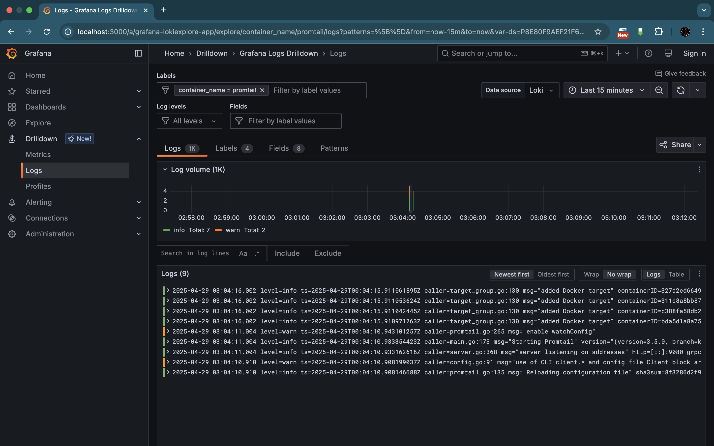

# Monitoring

## Grafana

Grafana is a platform for monitoring applicaitons. It is used to visualize and analyze metrics and logs. It connects to
data sources that ship data to grafana.

## Loki

Loki is a part of Grafana that is used to store and index logs. Loki is horizontally scalable which allows effecient
log collection and storage.

## Promtail

Promtail is a tool designed to collect logs from various sources like Docker or local files.

### Components' interaction

- Promtail collects logs from the application and labels them.
- Promtail sends these logs to Loki, which stores them efficiently.
- Grafana queries Loki to retrieve and display logs in a convenient format.

### Screenshots

#### Grafana monitoring

#### Loki monitoring

#### Promtail monitoring

#### Python app monitoring

