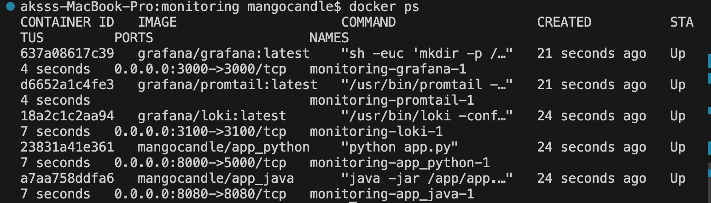
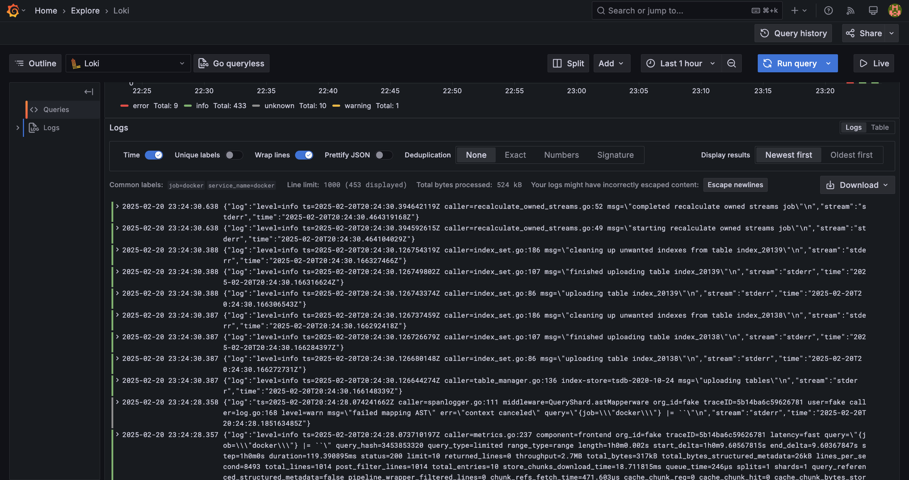

# Logging Report

## Components

1. Loki

- Role: Log aggregation and storage system.
- Image: grafana/loki:latest
- Ports: Exposes port 3100 for API access.
- Network: Connected to the loki network.
- Interaction: Receives logs from Promtail and serves log data to Grafana.

2. Promtail

- Role: Log collection agent.
- Image: grafana/promtail:latest
- Configuration: Defined in promtail.yml.
- Log Sources: Collects logs from Docker containers in /var/lib/docker/containers/*/*log.
- Labels: Adds metadata labels such as job: docker.
- Network: Connected to the loki network.
- Interaction: Sends logs to Loki (http://loki:3100/api/prom/push).

3. Grafana

- Role: Log visualization and monitoring dashboard.
- Image: grafana/grafana:latest
- Ports: Exposes port 3000 for web access.
- Configuration: Provisioned to use Loki as the default data source.
- Network: Connected to the loki network.
- Interaction: Queries Loki for log data and presents it in a user-friendly UI.

## Promtail Configuration (promtail.yml)

- Server: Runs on port 9080.
- Client: Pushes logs to http://loki:3100/api/prom/push.
- Scrape Configuration:

* Job Name: docker_logs
* Targets: localhost
* Log Path: /var/lib/docker/containers/*/*log
* Labels: job: docker

## Accessing Logs

- Grafana UI: http://localhost:3000 (you can see the results on the screenshots)
- Loki API: http://localhost:3100/loki/api/v1/query

## Screenshots:

### Docker processes:

### Grafana:

