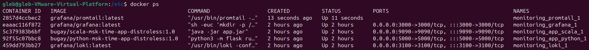
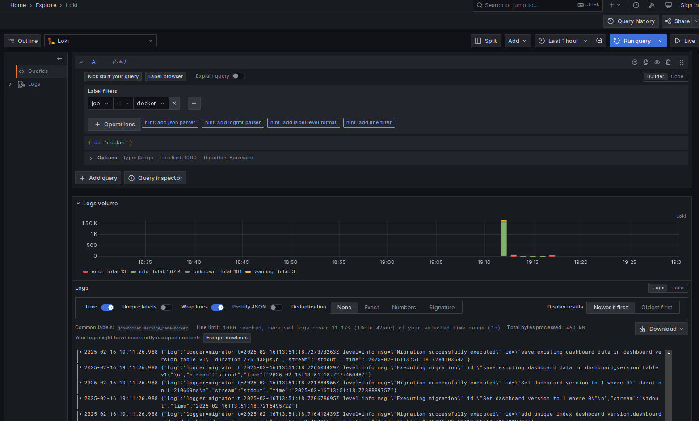
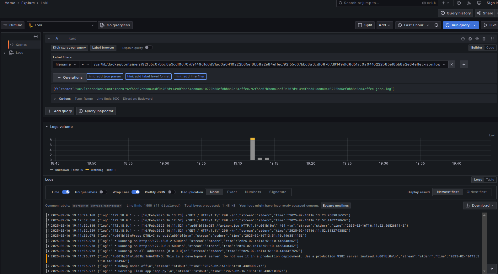
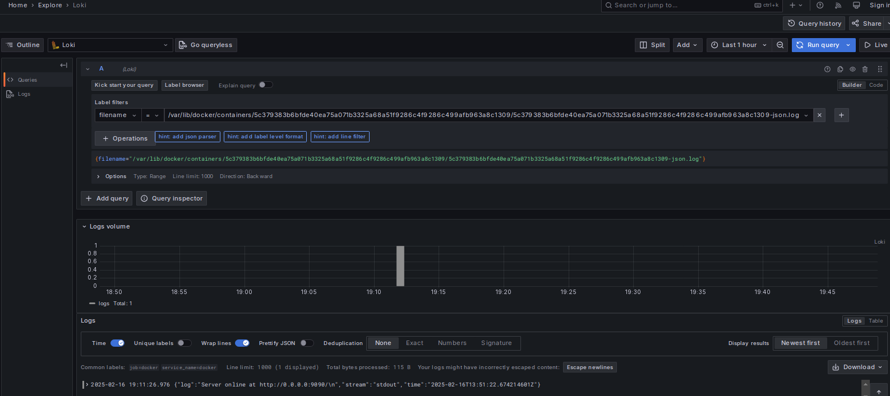

# Logging

## Components of logging stack

- **Loki** - A highly scalable, multi-tenant log aggregation system designed to store and query logs efficiently.

In docker-compose.yml it was configured to listen to port 3100 for incoming logs, which are stored to loki-data volume.

- **Promtail** - An agent used to collect logs from various sources (here - from docker containers), label them, and ship them to Loki for storage and querying.

In docker-compose.yml and promtail-config.yml it was configured to listen on port 9080, track logs of files `/var/lib/docker/containers/*/*log`, and send them to Loki (`http://loki:3100/api/prom/push`).

- **Grafana** - An open-source platform for data visualization and monitoring, here used to explore logs from Loki.

In docker-compose.yml it was configured to listen on port 3000.

---

## Logs monitoring in Grafana

Here are all containers that were up by docker-compose.yml:

Now I openned Grafana with standard usertame and password (both `admin`) to see all logs:

Then I chose Python app container logs only:

And the same for Scala app container logs only:

---
