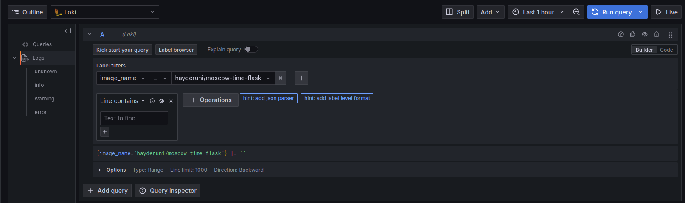
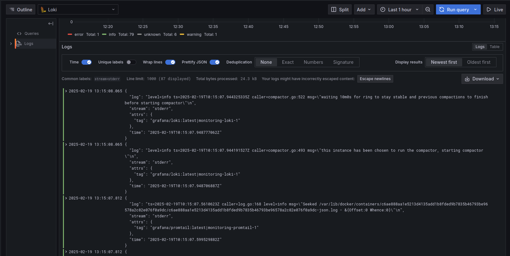
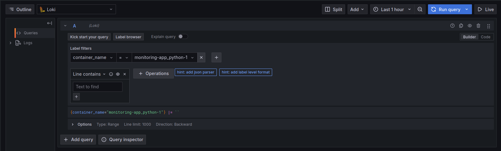
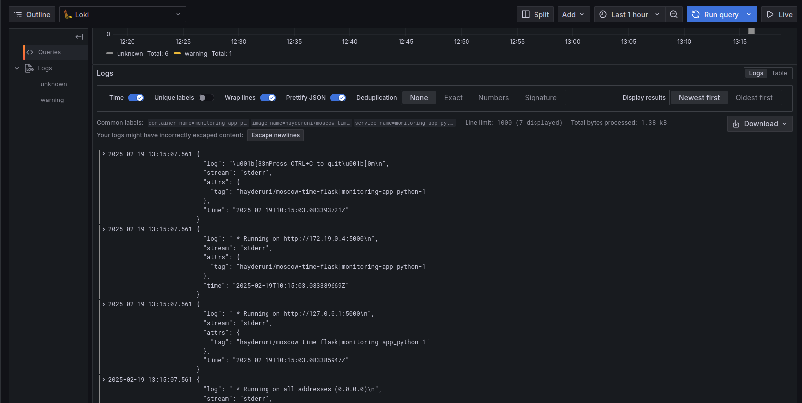
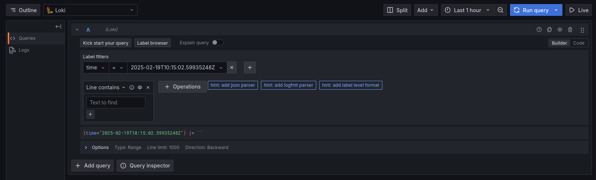
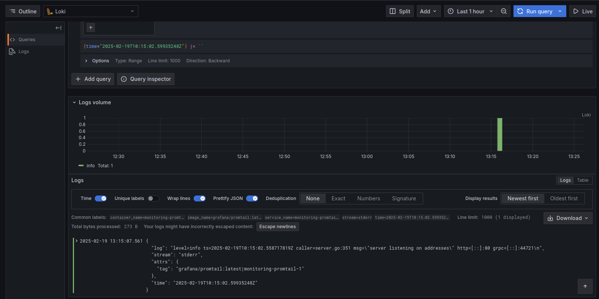
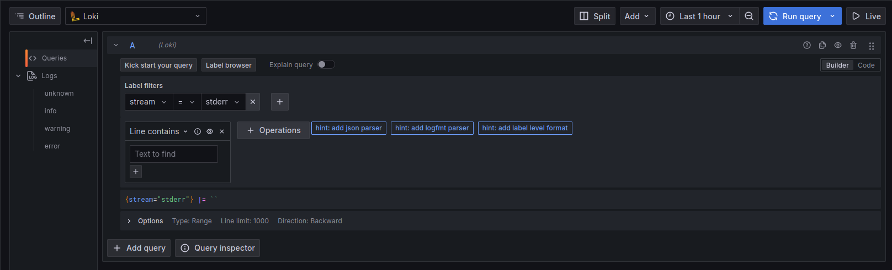
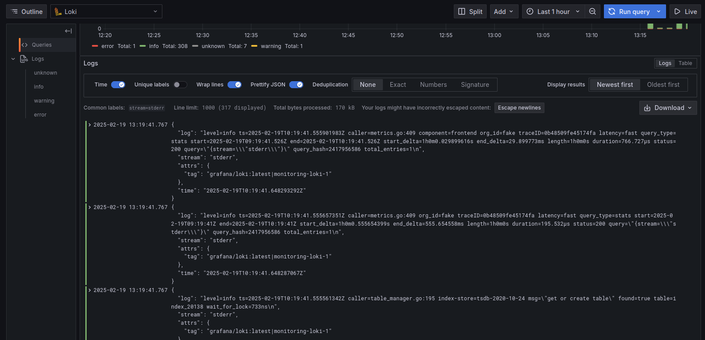

# LOGGING

## Overview
This document provides an overview of the logging stack configured using **Promtail, Loki, and Grafana**. It explains how each component functions and how they interact to collect, store, and visualize logs.

## Logging Stack Components

### 1. **Promtail (Log Collector)**
- **Purpose**: Promtail collects logs from Docker containers and forwards them to Loki.
- **Configuration**:
  - Reads logs from `/var/lib/docker/containers/*/*log`.
  - Extracts metadata like `image_name` and `container_name`.
  - Sends logs to Loki at `http://loki:3100/loki/api/v1/push`.
- **Pipeline Stages**:
  - Parses logs as JSON.
  - Extracts timestamps and assigns structured labels.

### 2. **Loki (Log Aggregator)**
- **Purpose**: Loki stores logs received from Promtail and indexes them efficiently.
- **Configuration**:
  - Listens on port `3100` for logs.
  - Stores logs efficiently.
  - Organizes logs into streams based on labels like `image_name` and `container_name`.

### 3. **Grafana (Visualization Tool)**
- **Purpose**: Grafana queries logs from Loki and provides a user-friendly dashboard for visualization.
- **Configuration**:
  - Loki is added as a data source in Grafana (`http://loki:3100`).
  - Users can filter logs using labels.
  - Runs on port `3000`.


## Running the Logging Stack
To start the stack:
```bash
docker-compose up -d
```

To access components:
- **Application**: [http://localhost:5000](http://localhost:5000)
- **Grafana**: [http://localhost:3000](http://localhost:3000)

## Logging Results
In grafana, we can query logs based on labels:
- `image_name`: Querying based on the image name of the containers we are running
    - **Query:**
    
    - **Logs:**
    
- `container_name`: Querying based on the running container name
    - **Query:**
    
    - **Logs:**
    
- `time`: Querying based on a specific time
    - **Query:**
    
    - **Logs:**
    
- `stream`: Querying based type of log output (normal/error)
    - **Query:**
    
    - **Logs:**
    