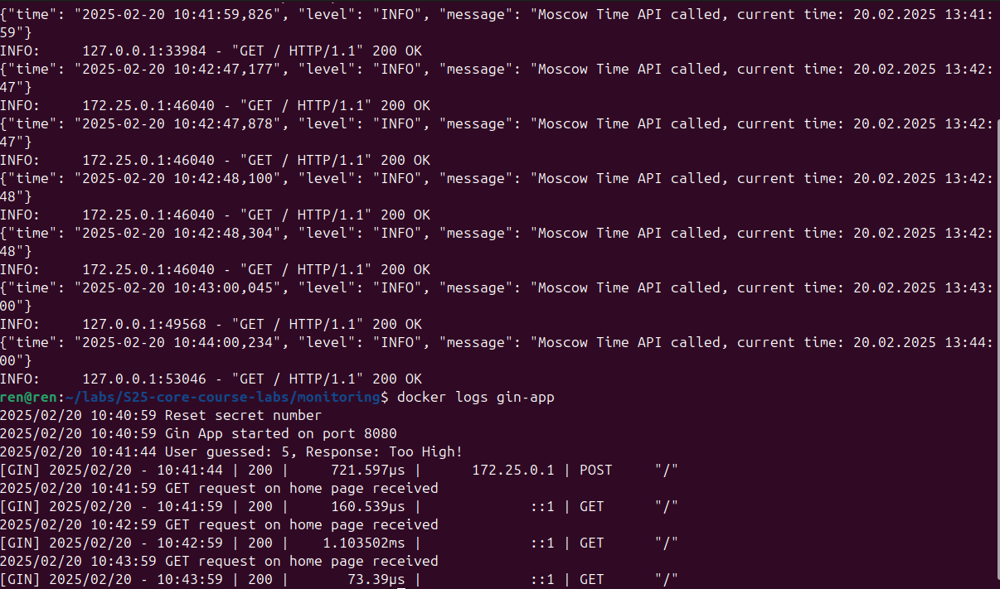

# Logging

## Stack

- *Loki*
  - Log aggregation and storage
- *Promtail*
  - Log collection and forward to Loki
- *Grafana*
  - Visualization tool that connects to Loki and provides a user-friendly interface for querying and visualizing logs.
- *Applications*
  - `flask-app`.

## Screenshots

### Data Source: Loki

### Working logging stack

