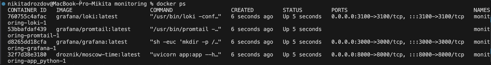
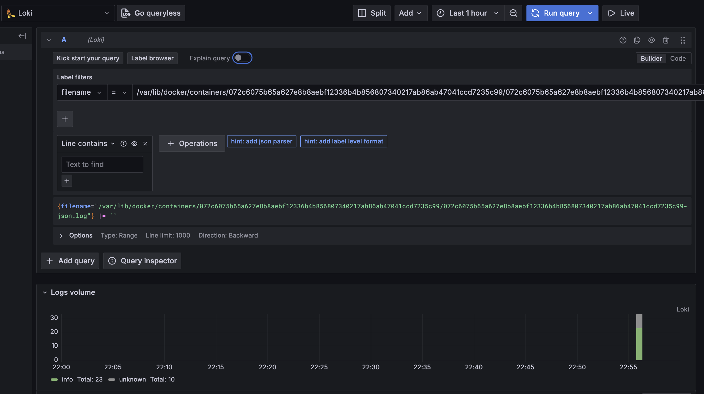
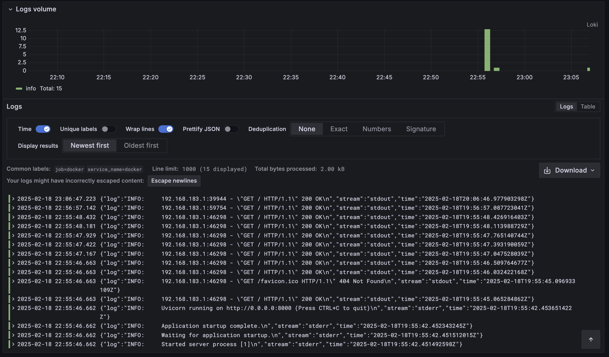

# Logging Stack Documentation

## Overview
This document describes the implementation of a comprehensive logging stack using Grafana, Loki, and Promtail. The stack provides centralized logging and monitoring capabilities for our containerized applications.

## Components Description

### 1. Loki (Log Aggregation)
- **Role**: Central log aggregation system
- **Port**: 3100
- **Features**:
  - Highly scalable log aggregation system
  - Efficient storage by only indexing metadata
  - Supports multi-tenancy
  - Integrates seamlessly with Grafana
- **Configuration**: Uses default configuration with local storage

### 2. Promtail (Log Collector)
- **Role**: Log collection agent
- **Features**:
  - Discovers and tails Docker container logs
  - Attaches labels to log streams
  - Ships logs to Loki
- **Sources Configured**:
  - Docker container logs (`/var/lib/docker/containers`)
  - System logs (`/var/log`)
  - Application logs from our Python service

### 3. Grafana (Visualization)
- **Role**: Visualization and querying interface
- **Port**: 3000
- **Features**:
  - Web interface for log querying
  - Dashboard creation
  - Pre-configured Loki data source
  - Anonymous access enabled for demo purposes

### 4. Application Integration
- Python application successfully integrated into the logging stack
- All application logs are collected and viewable in Grafana
- Container logs are automatically tagged with metadata

## Implementation Details

### Docker Compose Configuration
```yaml
version: "3.3"
networks:
  monitoring:

services:
  loki:
    image: grafana/loki:latest
    ports:
      - "3100:3100"
    networks:
      - monitoring

  promtail:
    image: grafana/promtail:latest
    volumes:
      - /var/log:/var/log
      - ./promtail-config.yaml:/etc/promtail/config.yml
      - /var/lib/docker/containers:/var/lib/docker/containers:ro
    networks:
      - monitoring

  grafana:
    image: grafana/grafana:latest
    ports:
      - "3000:3000"
    environment:
      - GF_AUTH_ANONYMOUS_ENABLED=true
      - GF_AUTH_ANONYMOUS_ORG_ROLE=Admin
    networks:
      - monitoring

  app_python:
    image: droznik/moscow-time:latest
    platform: linux/amd64
    ports:
      - "8000:8000"
    networks:
      - monitoring
```

## Demonstration Screenshots

### 1. Running Services

*Screenshot showing all services running successfully in Docker*

### 2. Grafana Loki Query Interface

*Screenshot showing the Loki query interface in Grafana with log volume visualization*

### 3. Application Logs

*Screenshot showing the collected logs from our Python application with successful HTTP requests*

## Usage Guide

### Accessing the Stack
1. Grafana Dashboard: http://localhost:3000
2. Python Application: http://localhost:8000
3. Loki API: http://localhost:3100

### Basic Log Queries
1. View all container logs:
   ```
   {job="docker"}
   ```
2. View Python application logs:
   ```
   {container_name="monitoring-app_python-1"}
   ```
3. Filter for specific HTTP status:
   ```
   {container_name="monitoring-app_python-1"} |= "200 OK"
   ```

## Maintenance

### Log Retention
- Default retention period configured in Loki
- Logs are stored efficiently with metadata indexing
- No automatic deletion configured for demonstration purposes

### Monitoring the Stack
- Container health can be monitored via Docker
- Loki metrics available at :3100/metrics
- Grafana provides system monitoring dashboards

## Security Considerations
- Authentication is disabled for demonstration
- In production environment, it's recommended to:
  - Enable authentication
  - Use secure passwords
  - Implement proper access controls
  - Enable HTTPS
  - Restrict network access

## Troubleshooting
1. Check service status:
   ```bash
   docker-compose ps
   ```
2. View service logs:
   ```bash
   docker-compose logs [service_name]
   ```
3. Verify Loki connectivity in Grafana
4. Check Promtail configuration if logs are missing 