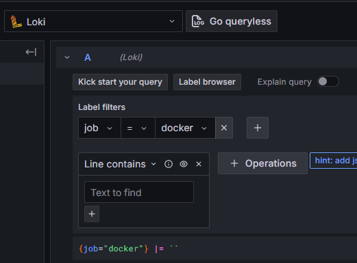
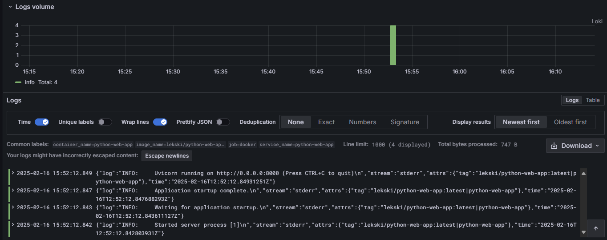

# Lab 7: Monitoring and Logging | Mametov Eldar

This is a report on monitoring and logging using Loki and docker-compose. Below you can see the steps I took to successfully complete the basic and bonus tasks.

## Structure of docker-compose and promtail.yml
I followed the standard docker-compose example that was presented (https://github.com/grafana/loki/blob/main/production/docker-compose.yaml), but adapted it to the requirements in the task. Below is a brief explanation of each service.
- Loki - a database for logs that come from promtail, which can then be used to view/search logs in Grafana. I used the latest version of Loki `grafana/loki:latest`, as well as the standard configuration version without changes `local-config.yaml`.
- Promtail - a log collector, which then sends them to Loki. I used the latest version of promtail `grafana/promtail:latest`. In volumes, we mounted volumes to access logs in `/var/log` and, most importantly, in `docker/containers`, where our Docker container logs are stored. We also specified a new Promtail configuration, which differs from the standard `./promtail.yml:/etc/promtail/config.yml`. This configuration is identical to the example (https://github.com/black-rosary/loki-nginx/blob/master/promtail/promtail.yml) and is created to collect logs from Docker containers, where the directory where the logs are located is specified.
- Grafana - visualization of all collected logs. It allows you to perform many different operations with the Loki log database. It has a standard setting in docker-compose.yml.
- python-web-app and golang-web-app - Docker containers of my web projects that are launched for further collection of their logs in Grafana/Loki. `tag: "{{.ImageName}}|{{.Name}}"` is used for Promtail so that it can identify and process them.

## Screenshots of Functionality
To log in to the system, I used the default login: admin and password: admin.



As you can see in the picture, Loki was automatically added as a data source, since we had configured its automatic addition in docker-compose.yml. The `job = docker` filter, which we specified in promtail.yml, was also added correctly.
```
    static_configs:
      - targets:
          - localhost
        labels:
          job: docker
          __path__: /var/lib/docker/containers/*/*-json.log 
```



Example of logs when using `run query`. As you can see, all processes have started and both sites are accessible via the links `127.0.0.1:80` and `127.0.0.1:81`