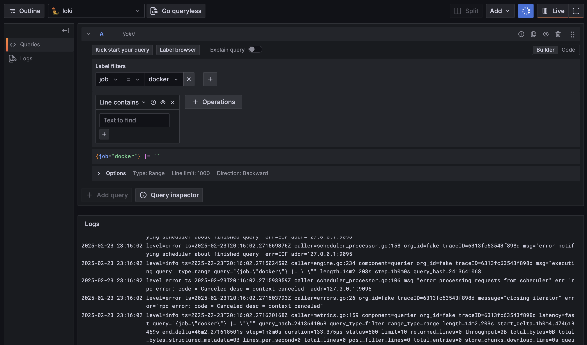
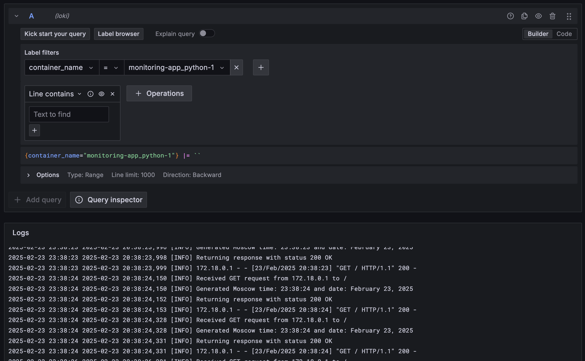
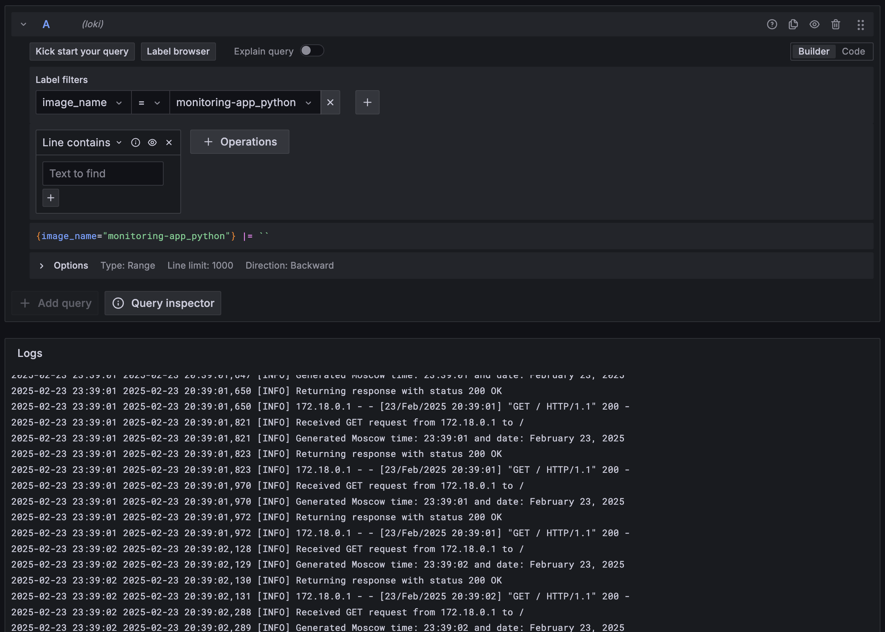
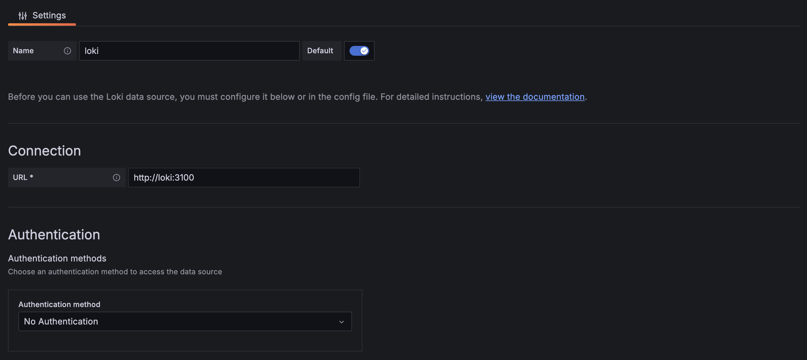
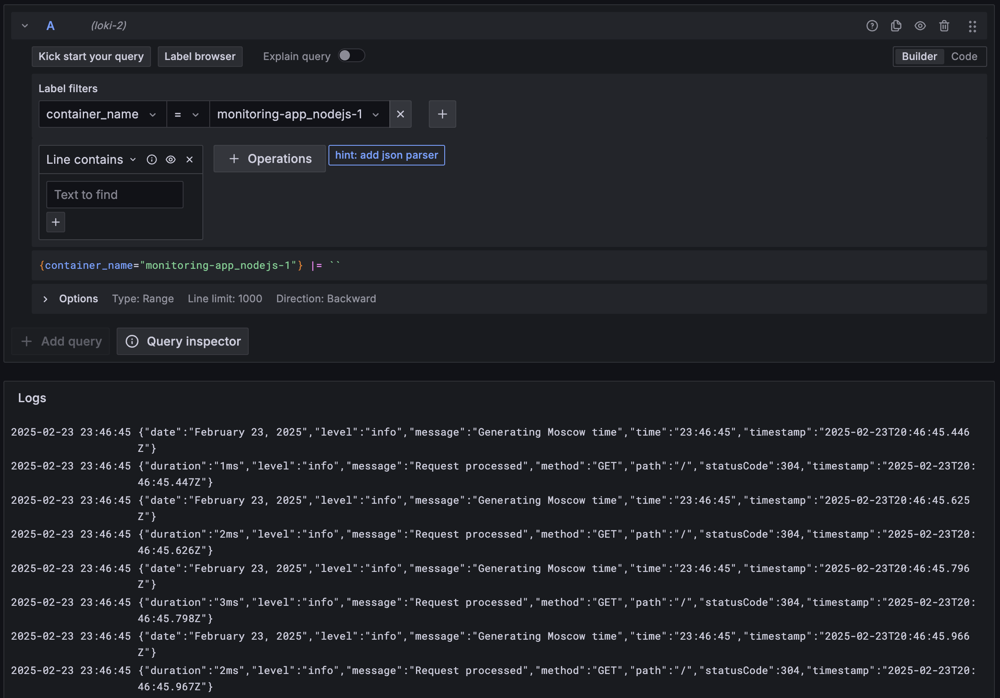

# Logging Stack Implementation Report

## Introduction

For this lab, I implemented a logging stack using Grafana Loki, Promtail, and Grafana for visualization. The stack collects and aggregates logs from our Flask application that serves Moscow time. This report details the implementation and configuration of each component.

## Stack Components

### 1. Loki

Loki serves as our log aggregation system. It's configured with a local file storage in the `/loki` directory. The main advantage of Loki is its ability to handle logs efficiently by separating the logs' metadata from their content.

Configuration highlights from `loki-config.yaml`:

```yaml
auth_enabled: false
server:
  http_listen_port: 3100
storage:
  filesystem:
    chunks_directory: /loki/chunks
```

### 2. Promtail

Promtail acts as a log collector, scraping logs from our Docker containers. I configured it to:

- Parse Docker JSON logs
- Extract container and image names
- Add appropriate labels for better querying

Key configuration from `promtail-config.yaml`:

```yaml
scrape_configs:
  - job_name: containers
    static_configs:
      - targets:
          - localhost
        labels:
          job: docker
          __path__: /var/lib/docker/containers/*/*-json.log
    pipeline_stages:
      - json:
          expressions:
            stream: stream
            attrs: attrs
            tag: attrs.tag
            time: time
            log: log
      - timestamp:
          source: time
          format: RFC3339Nano
      - regex:
          expression: ^(?P<image_name>([^|]+))\|(?P<container_name>([^|]+))$
          source: "tag"
      - labels:
          image_name:
          container_name:
```

### 3. Grafana

Grafana provides the visualization layer. I configured it with anonymous access enabled for easier testing. Here's how it looks in the Explore view:


_Figure 1: Viewing all Docker container logs using {job="docker"}_


*Figure 2: Filtering logs by container name using {container_name=~".*app*python.*"}\_


*Figure 3: Filtering logs by image name using {image_name=~".*app*python.*"}\_


_Figure 4: Loki data source configuration in Grafana_

## Implementation Details

### Docker Compose Configuration

The services are orchestrated using Docker Compose. Key configuration decisions include:

- Volume mounts for persistent storage
- Network configuration for inter-service communication
- Proper logging configuration for the Python app

```yaml
logging:
  driver: "json-file"
  options:
    max-size: "10m"
    max-file: "3"
    tag: "{{.ImageName}}|{{.Name}}"
```

### Log Querying

To query logs in Grafana, I've set up several useful filters:

1. `{job="docker"}` - Shows all container logs
2. `{container_name=~".*app_python.*"}` - Shows only Python application logs
3. `{image_name=~".*app_python.*"}` - Filters logs by image name

## Bonus Task: Additional Application Integration

For the bonus task, I integrated an additional Node.js application into our logging stack. The Node.js app serves the same functionality as our Python app - displaying Moscow time.

### Node.js App Logging Implementation

I added structured logging to the Node.js application using the Winston library:

```javascript
const logger = winston.createLogger({
  level: "info",
  format: winston.format.combine(
    winston.format.timestamp(),
    winston.format.json()
  ),
  transports: [new winston.transports.Console()],
});
```

The logging implementation includes:

- Request middleware for logging HTTP requests
- Time generation logging
- Health check endpoint logging
- Server startup logging

### Integration with Docker Stack

I added the Node.js app to our `docker-compose.yml` with similar logging configuration as the Python app:

```yaml
app_nodejs:
  build:
    context: ../app_nodejs
    dockerfile: Dockerfile
  ports:
    - "5002:3000"
  environment:
    - NODE_ENV=production
  networks:
    - logging-network
  logging:
    driver: "json-file"
    options:
      max-size: "10m"
      max-file: "3"
      tag: "{{.ImageName}}|{{.Name}}"
  labels:
    logging: "promtail"
    service: "app_nodejs"
```

### Verification

Both applications now send their logs to our logging stack, allowing us to monitor them in Grafana:


_Figure 5: Viewing logs from both Python and Node.js applications_

This integration demonstrates the flexibility of our logging stack in handling multiple applications with different technologies while maintaining consistent log collection and visualization capabilities.
