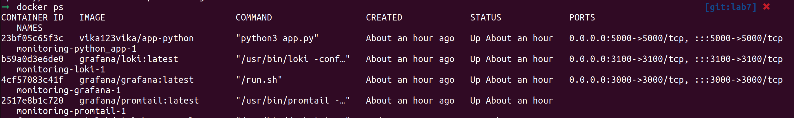
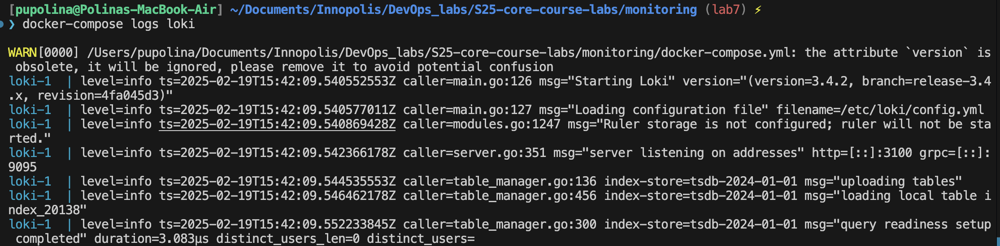
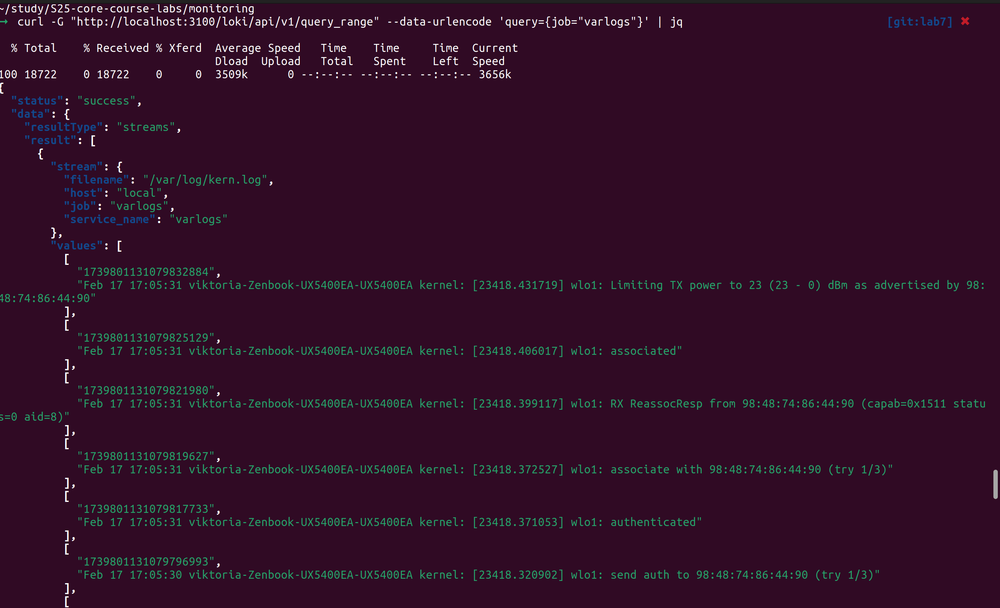
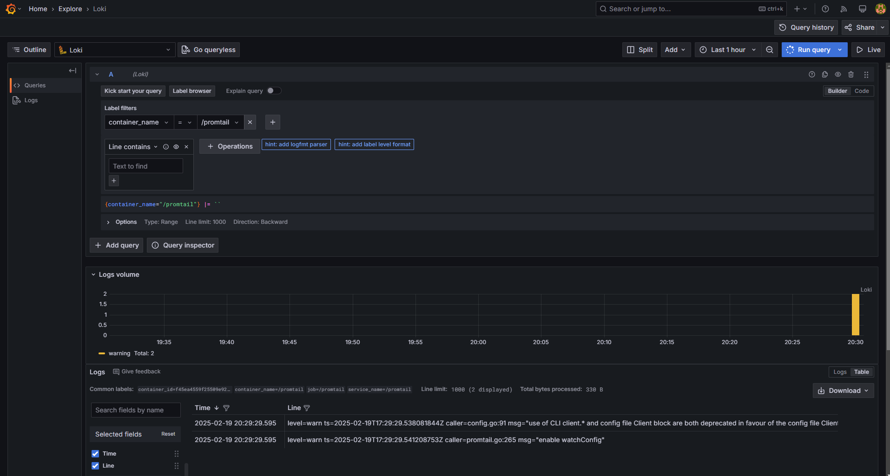

# Logging

The following **compose contains 4 services**:

- `app_python`: Container with python web application.
- `loki`: Loki log aggregation system.
- `promtail`: Log shipper for grafana.
- `grafana`: Grafana log dashboard.

## Components

1. Grafana

- Visualization tool used to monitor and analyze logs.
- Provides dashboards for log analysis.
- Runs on port 3000.

2. Loki

- Centralized log aggregation system.
- Collects logs from various services.
- Exposes an API for querying logs (http://loki:3100).

3. Promtail

- Log collector that sends logs to Loki.
- Reads logs from /var/log/*.log and forwards them to Loki.
- Uses a configuration file (promtail-config.yml)

## Testing the Stack

To ensure the stack is functioning correctly:

1. Start the services using `docker-compose up -d`.
2. Generate logs by interacting with the Python application at `http://localhost:5000`.
3. Access Grafana at `http://localhost:3000` and navigate to the Explore tab.
4. Run a query in Grafana, such as `{job="varlogs"}` or `{rate({job="varlogs"}[5m])}` for graph, to check if logs are being ingested correctly.
5. Verify that logs appear in Grafana with the expected labels and timestamps.

## Resulting Logs

1. **Grafana** - Dashboard with logs

2. **Loki** - API request results

3. **Promtail** - Job Logs

