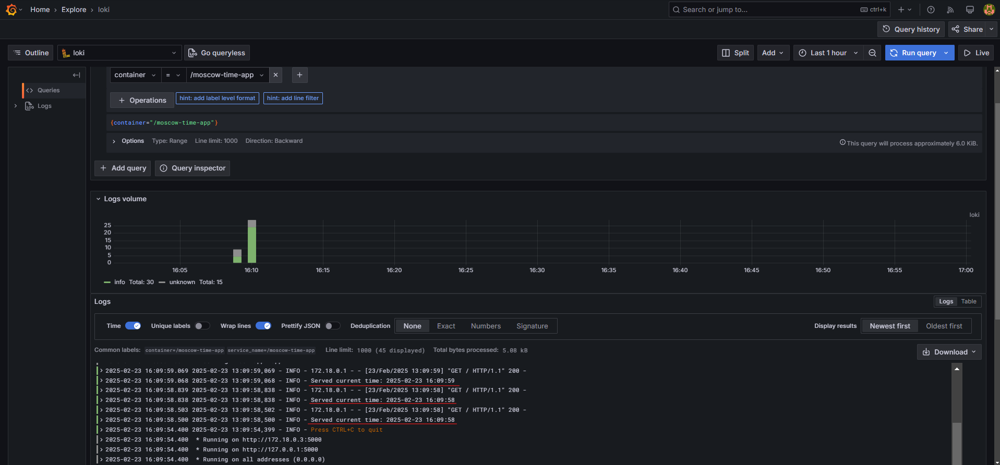

# Logging Stack Report

## Overview

This document outlines the setup of a logging stack using Promtail, Loki, and Grafana for `S25-devops-engineering-labs`, enabling log collection, storage, and visualization for the Moscow Time Web Application.

## Components

### **Loki** (Log Aggregation)

- **Config:** `loki-config.yml`
- **Service:** `loki`
- **Port:** `3100`
- **Storage:** TSDB + Filesystem

### **Promtail** (Log Collector)

- **Config:** `promtail-config.yml`
- **Service:** `promtail`
- **Functions:** Collects, structures, and forwards logs from Docker

### **Grafana** (Visualization)

- **Service:** `grafana`
- **Port:** `3000`
- **Admin:** `admin:admin`
- **Loki as Data Source**

## Setup Steps

1. **Create Monitoring Directory**

   ```bash
   mkdir monitoring && cd monitoring
   ```

2. **Define `docker-compose.yml`**
   - Includes all services for logging.
3. **Configure Loki (`loki-config.yml`)**
   - Defines storage and indexing.
4. **Configure Promtail (`promtail-config.yml`)**
   - Collects and forwards logs.
5. **Run Stack:**

   ```bash
   docker-compose up -d
   ```

## Verification

1. **Check Running Services:**

   ```bash
   docker ps
   ```

   Ensure `loki`, `promtail`, `grafana`, and `moscow-time-app` are active.

2. **View Logs in Grafana:**
   - Open `http://localhost:3000`
   - Go to Configuration > Data Sources.
   - Add Data Source and select Locks.
   - Navigate to **Explore**
   - Select **Loki** as source
   - Query:

     ```sql
     {container="moscow-time-app"}
     ```

## Screenshots



