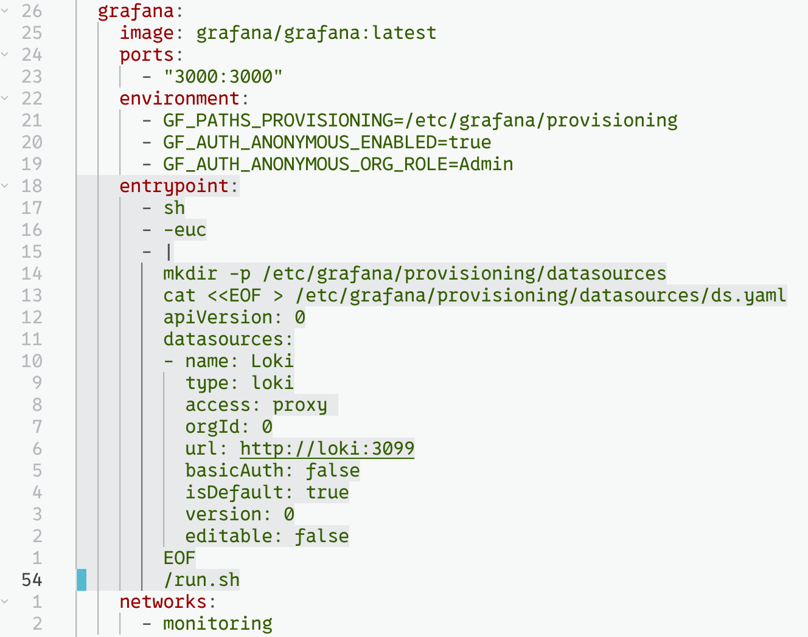
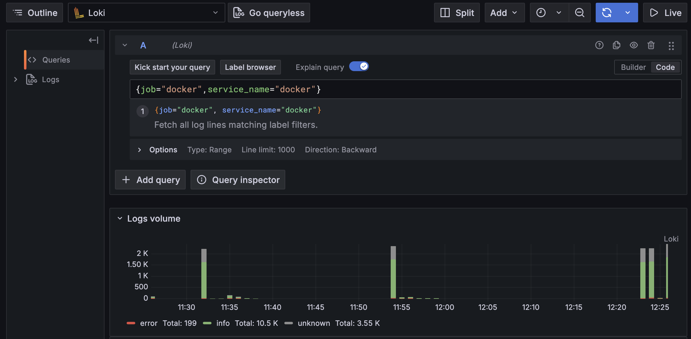
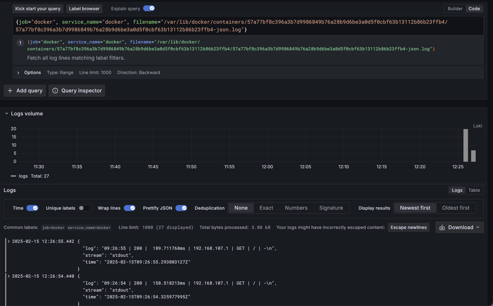
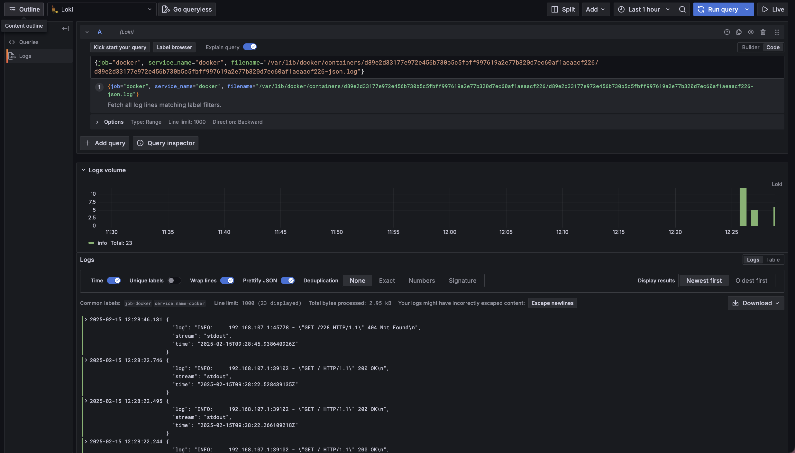
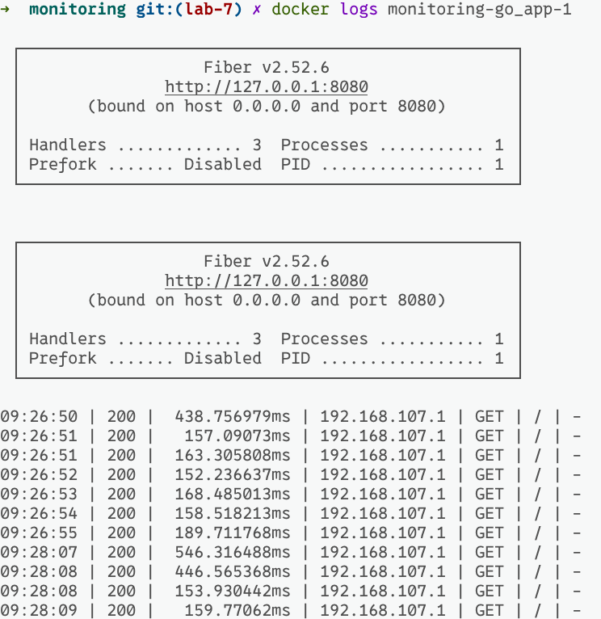
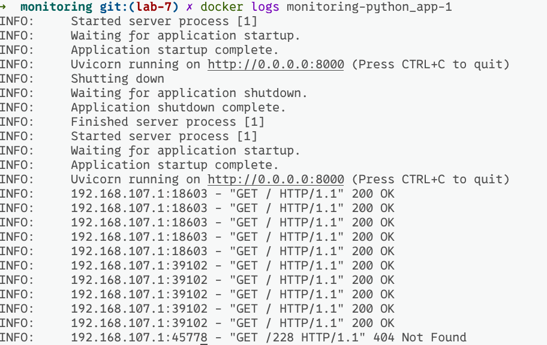

# Logging infrastructure

## Grafana

This is a powerful tool that can represent data from different sources
using numerous of visualization ways.

For now it is used only to conveniently view and search logs in Loki.
Therefore I added it as a default datasource to the config.

## Loki

This is a lightweight and efficient log storing and search engine.
It is set up for the purpose of storing application logs, indexing them
over labels and allowing fast search.

## Promtail

It is a log agent. It uses `pull` model to extract logs from the sources
described in jobs, and `push` them to the log collection engine (in our case it is Loki).

In my applications I do not have specific log files to log in them, therefore
the only job I have is the collection of logs from all the running Docker containers.

## Applications

Running Go and Python applications flush their logs to the `STDOUT` and after this
they can be successfully pulled by Promtail. 

In both cases logs do not strictly follow Structured Logging idiom, so the Loki
can not easily identify labels. However, at least `LOG LEVEL` from the logs of 
Python application it successfully detected.

