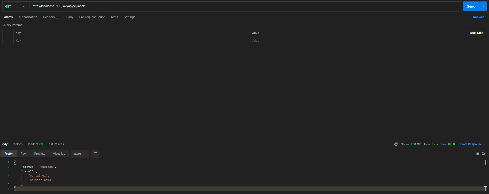
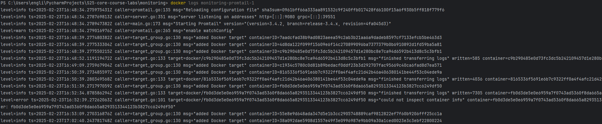
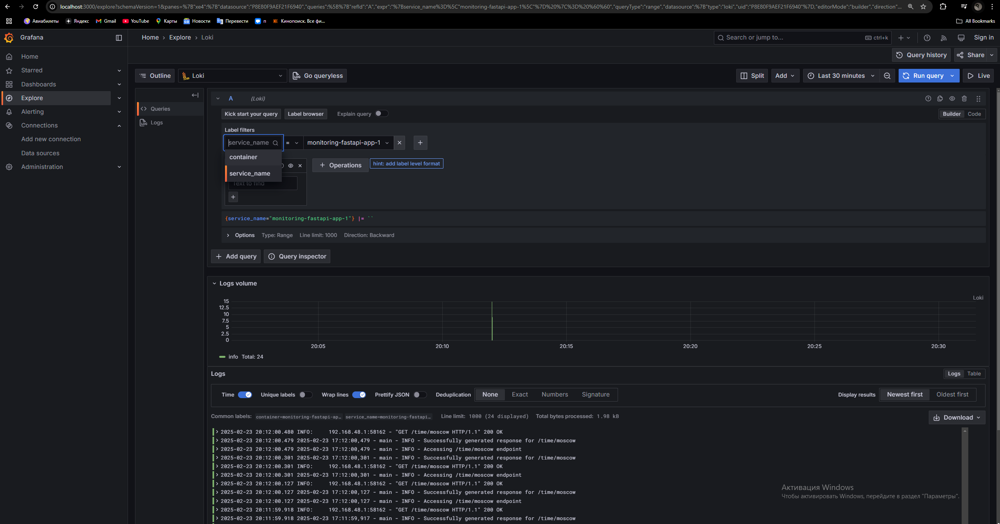
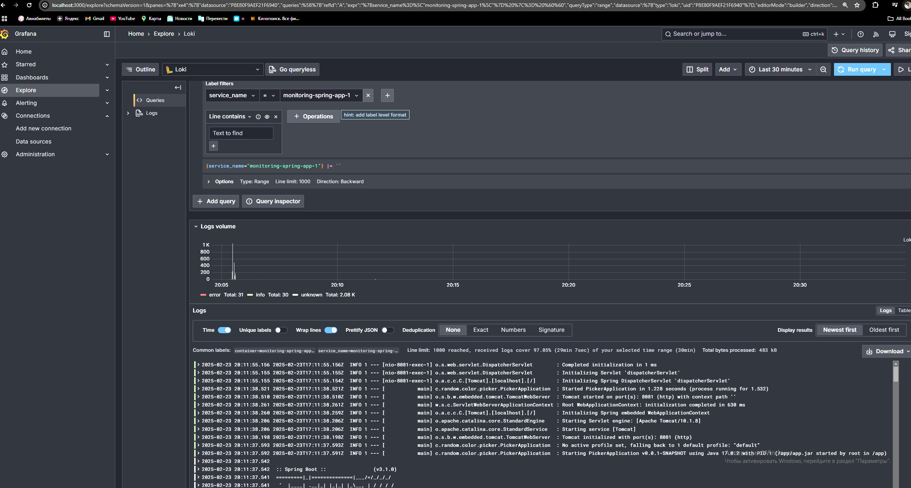

# LOGGING.md

## Overview

This document provides a detailed explanation of the logging stack implemented in this project. The logging stack is designed to collect, store, and visualize logs from all containers defined in the `docker-compose.yml` file. It leverages **Loki**, **Promtail**, and **Grafana** to achieve comprehensive log management.

---

## Logging Stack Components

### 1. Loki
- **Role**: Loki acts as the centralized log aggregation system. It stores logs in a compressed, cost-effective format and allows querying based on labels.
- **Configuration**:
    - Loki listens on port `3100`.
    - Loki is set up as the default data source for Grafana.
- **Key Features**:
    - Efficient storage and indexing of logs.
    - Supports querying logs using PromQL-like syntax.

### 2. Promtail
- **Role**: Promtail is responsible for collecting logs from various sources and forwarding them to Loki.
- **Configuration**:
    - Promtail scrapes logs from:
        - System logs (`/var/log/*.log`).
        - Docker container logs via the Docker socket (`/var/run/docker.sock`).
    - Logs are labeled with metadata such as container names and job types.
- **Key Features**:
    - Dynamic service discovery for Docker containers.
    - Relabeling configurations to enrich log metadata.

### 3. Grafana
- **Role**: Grafana provides a user-friendly interface for visualizing logs stored in Loki.
- **Configuration**:
    - Grafana is pre-configured with Loki as the default data source.
    - A default dashboard is provisioned to display logs from all containers.
    - Anonymous access is enabled for ease of use during development.
- **Key Features**:
    - Real-time log visualization.
    - Customizable dashboards for different log streams.

### 4. Application Containers
- **FastAPI App**:
    - Built using the `../app_python/Dockerfile`.
    - Exposes logs to Promtail via Docker's logging driver.
- **Spring App**:
    - Built using the `../app_java/Dockerfile`.
    - Logs are collected similarly to the FastAPI app.

---

## Logging Configuration in `docker-compose.yml`

The `docker-compose.yml` file defines a shared logging configuration (`x-logging`) for all services:
- **Driver**: `json-file`
- **Options**:
    - `max-size`: Limits each log file to 10MB.
    - `max-file`: Retains up to 3 log files per container.

This ensures consistent log rotation and prevents excessive disk usage.

---

## Screenshots

### 1. Loki Running

*Screenshot showing Loki running on port 3100.*

### 2. Promtail Logs Collection

*Screenshot demonstrating Promtail collecting logs from Docker containers.*

### 3. Grafana Dashboard

*Screenshot of the default Grafana dashboard displaying logs from the Python application.*

---

## Bonus Task: Additional Configuration

### Integrating an Extra Application
An additional application has been added to the `docker-compose.yml` file. This application is configured to send its logs to Promtail, which forwards them to Loki.

### Comprehensive Logging
The logging stack has been modified to ensure logs from all containers (including the new application) are collected:
- **Promtail Configuration**:
    - Added a new `job_name` for the extra application.
    - Updated `docker_sd_configs` to include metadata for the new container.

### Screenshots for Bonus Task

#### New Application Logs in Grafana

*Screenshot showing logs from the new application in Grafana.*

---

## **docker-compose.yml**
```
version: '3.7'
x-logging: &default-logging
  driver: "json-file"
  options:
    max-size: "10m"
    max-file: "3"

services:
  loki:
    image: grafana/loki:latest
    container_name: loki
    command: -config.file=/etc/loki/local-config.yaml
    ports:
      - "3100:3100"
    logging: *default-logging

  promtail:
    image: grafana/promtail:latest
    volumes:
      - ./promtail-config.yml:/etc/promtail/config.yml
      - /var/log:/var/log
      - /var/run/docker.sock:/var/run/docker.sock
    command: -config.file=/etc/promtail/config.yml

  grafana:
    image: grafana/grafana:latest
    container_name: grafana
    environment:
      - GF_PATHS_PROVISIONING=/etc/grafana/provisioning
      - GF_AUTH_ANONYMOUS_ENABLED=true
      - GF_AUTH_ANONYMOUS_ORG_ROLE=Admin
    entrypoint:
      - sh
      - -euc
      - |
        mkdir -p /etc/grafana/provisioning/datasources
        cat <<EOF > /etc/grafana/provisioning/datasources/ds.yaml
        apiVersion: 1
        datasources:
        - name: Loki
          type: loki
          access: proxy
          orgId: 1
          url: http://loki:3100
          basicAuth: false
          isDefault: true
          version: 1
          editable: false
        EOF
        /run.sh
    ports:
      - "3000:3000"
    logging: *default-logging
    depends_on:
      - loki

  fastapi-app:
    build:
      context: ../app_python
      dockerfile: Dockerfile
    ports:
      - "80:80"
    logging: *default-logging

  spring-app:
    build:
      context: ../app_java
      dockerfile: Dockerfile
    ports:
      - "8081:8081"
    logging: *default-logging

volumes:
  grafana-storage:
```
In this docker-compose we can also notice a part with an additional Java app
```
  spring-app:
    build:
      context: ../app_java
      dockerfile: Dockerfile
    ports:
      - "8081:8081"
    logging: *default-logging
```

## Conclusion

The logging stack implemented in this project provides a robust solution for log management. By leveraging Loki, Promtail, and Grafana, we can efficiently collect, store, and visualize logs from all containers. The modular design ensures scalability and ease of maintenance.

For further details, refer to the `docker-compose.yml` and `promtail-config.yml` files in the *monitoring* folder.