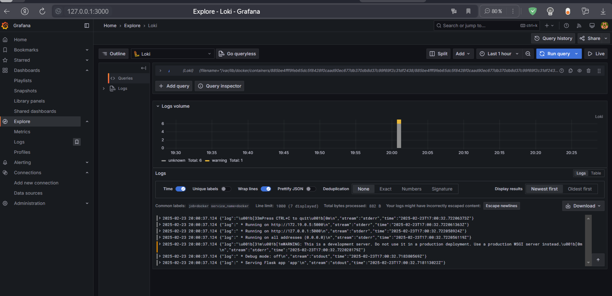

# Logging Stack Documentation

## Components Overview

### 1. Grafana
- **Role**: Visualization and monitoring platform
- **Port**: 3000
- **Features**:
  - Pre-configured Loki data source
  - Anonymous access enabled
  - Admin role for easy testing
  - Advanced alerting features enabled

### 2. Loki
- **Role**: Log aggregation system
- **Port**: 3100
- **Features**:
  - Persistent storage using Docker volume
  - HTTP API for log queries
  - Integration with Grafana
  - Efficient log storage and indexing

### 3. Promtail
- **Role**: Log collector and forwarder
- **Features**:
  - Collects system logs
  - Forwards logs to Loki
  - Automatic service discovery

## Setup Instructions

1. Ensure Docker and Docker Compose are installed
2. Navigate to the monitoring directory
3. Start the stack:
   ```bash
   docker-compose up -d
   ```

## Configuration Details

### Docker Compose Configuration
The stack uses Docker Compose with:
- Shared `loki` network for all services
- Persistent volume `loki-data` for log storage
- Automatic container dependency management
- Port mappings for all web interfaces

### Grafana Configuration
- Auto-provisioned Loki data source
- Anonymous access enabled
- Admin privileges for testing
- Enhanced alerting features

### Loki Configuration
- Uses local file storage
- Accessible within the Docker network
- Persistent storage through Docker volume

### Application Logs
Below is a screenshot showing the application logs in Grafana:



## Accessing the Stack

1. Grafana Interface: http://localhost:3000
2. Loki API (internal): http://loki:3100

### Viewing Logs in Grafana

1. Open Grafana (http://localhost:3000)
2. Go to the "Explore" section
3. Select "Loki" data source
4. Query examples:
   ```
   {container_name=~".*"}
   ```