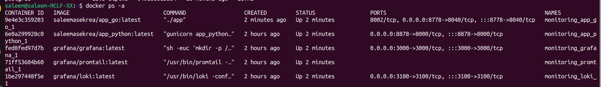
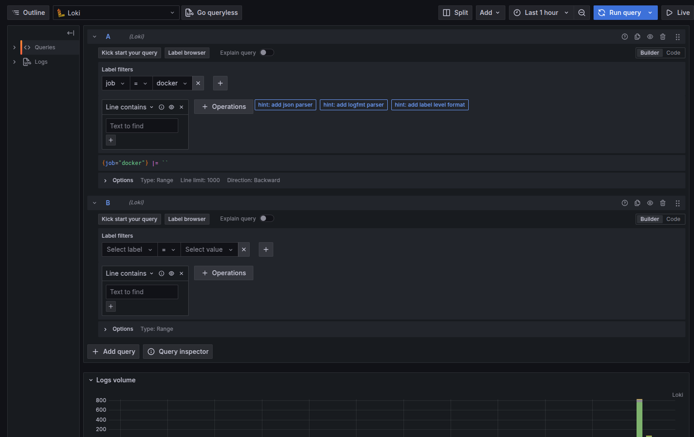
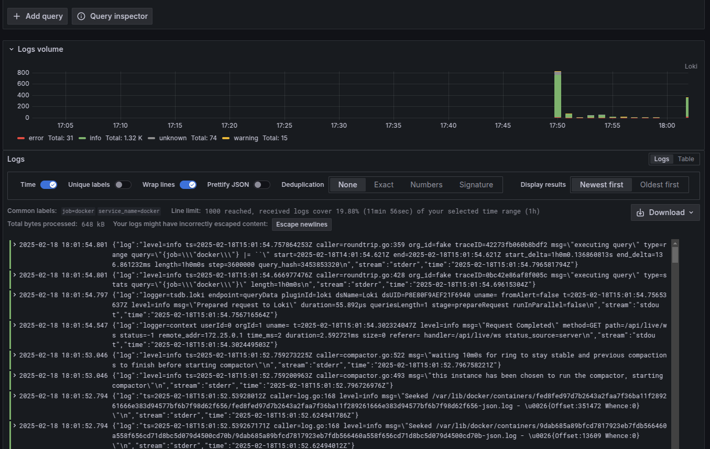
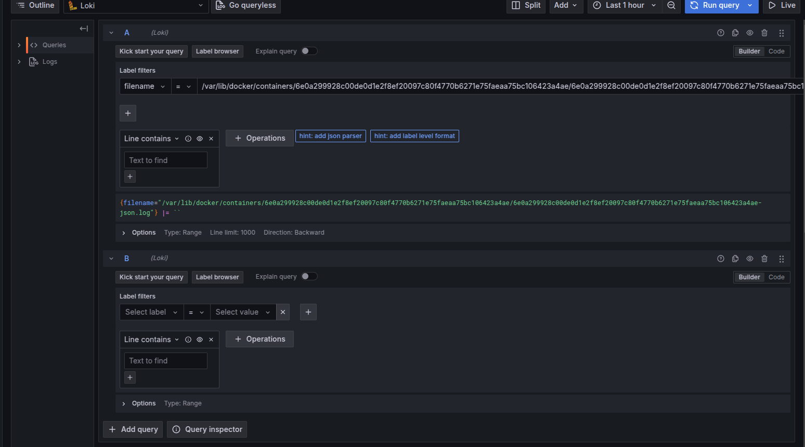
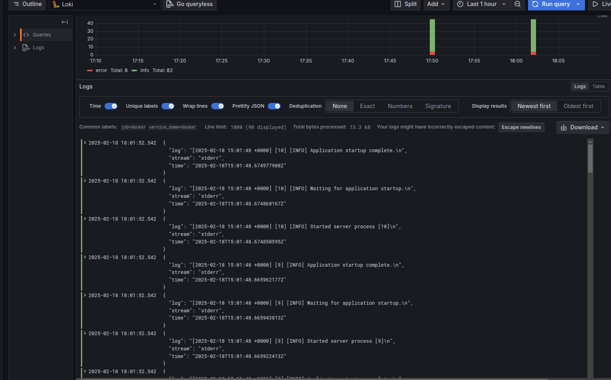
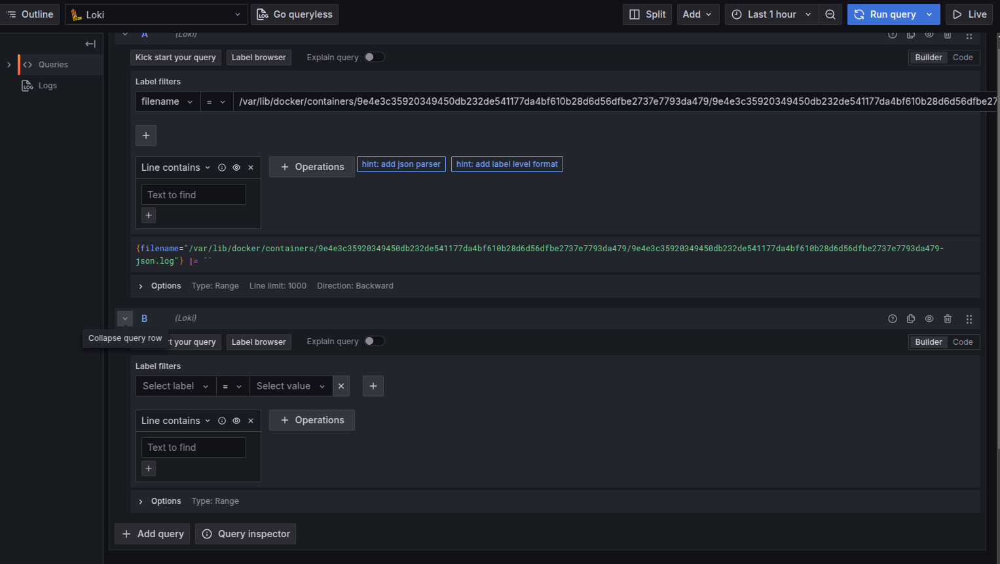
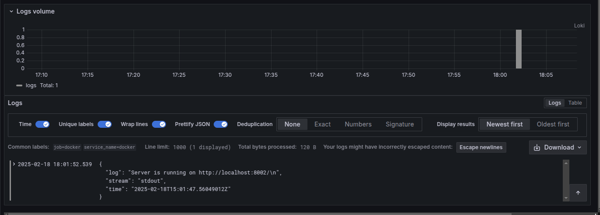

## Table of Contents

1. [Overview](#overview)
2. [Components](#components)
3. [Screenshots](#screenshots)
    - [Containers](#containers)
    - [All Logs](#all-logs)
    - [Python App Logs](#python-app-logs)
    - [Go App Logs](#go-app-logs)

## Overview

The logging stack contains Loki, Promtail, and Grafana. which  enables efficient log collection and monitoring for debugging.

## Components

In this system, we have the following components (according to the docker-compose file):

- Grafana: This provides the dashboard for the monitoring system

- Loki: This is the log aggregation system that stores logs from the applications and let us query them

- Promtail: This is the agent that collects logs from the applications and sends them to Loki

- app_python: This is the python web app that returns the current Moscow Time

- app_go: This is the bonus go web app that returns the current Moscow Time

Here, Promtail actually collects logs for the docker containers and not directly from the applications. Apart from the web apps, it also collects logs from the Loki and Grafana containers.

## Screenshots

### Containers

### All Logs

### Python App Logs

### Go App Logs

