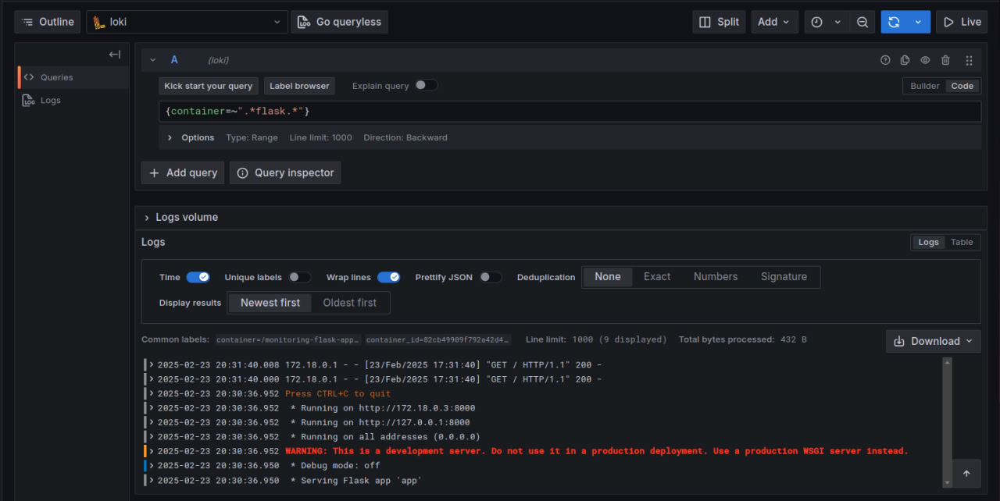
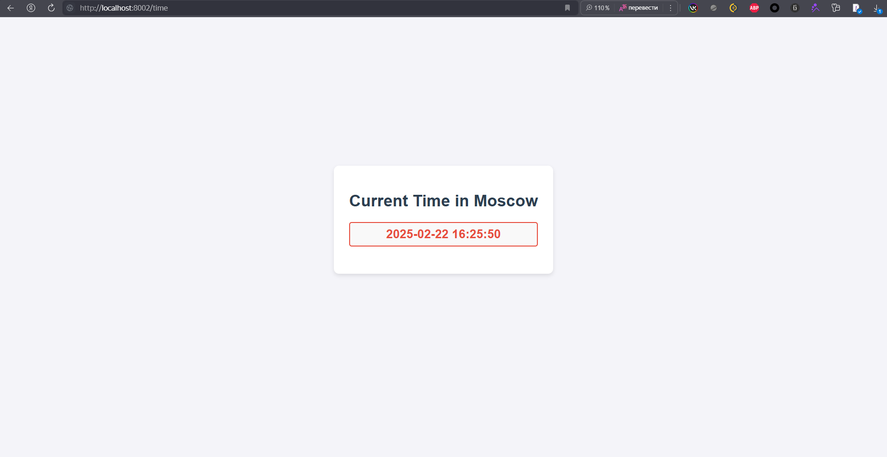
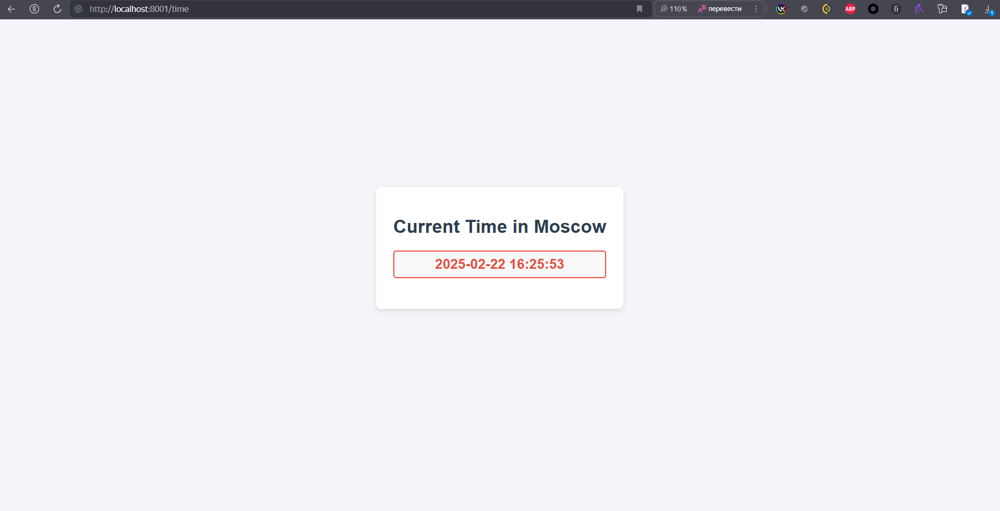
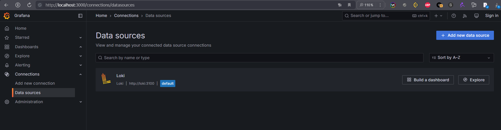
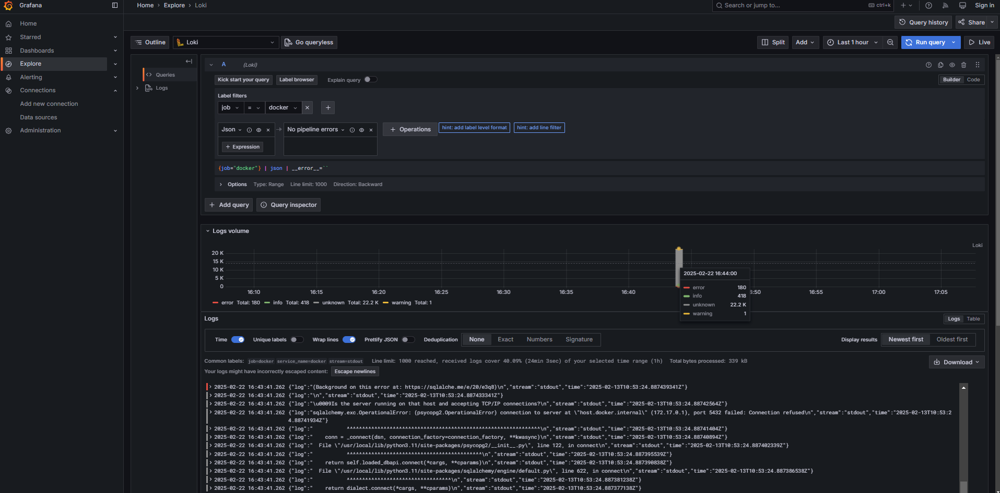

# Logging Stack

## Components

### Loki

Loki is a log aggregation system that collects and indexes logs from multiple sources. 
Runs on port `3100` and can be configured via `-config.file=/etc/loki/local-config.yaml`.

### Promtail

Promtail is responsible for collecting logs from local files and forwarding them to Loki. It reads logs from Docker containers (`/var/lib/docker/containers/*/*log`) and processes them before sending them to Loki.
Runs on port `9080` and can be configured via `promtail.yml`.

### Grafana

Grafana is used to visualize and analyze logs stored in Loki. A preconfigured Loki (http://loki:3100) datasource is added for querying logs.
Runs on port `3000`.

## Process Documentation

Start Logging Stack with `docker-compose up -d`:

Python App:

JS App:

Grafana Data Sources page:

Working Logs in Grafana Explore (caught errors from the stack parsed to json):

