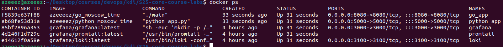

# Monitoring

## Components

- **Grafana** - used to visualize metrics and logs.

- **Loki** - a log aggregation system used to efficiently store the logs and metrics.

- **Promtail** - delivers logs from various sources to Loki.

## Log Images

Python App

Golang App

Grafana

Docker

All running containers

