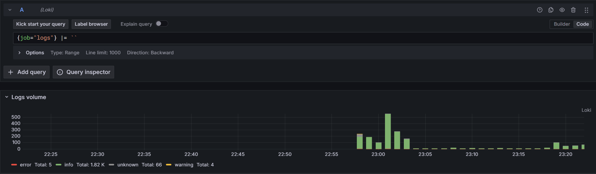

# Logging Stack Documentation

## Overview

This document explains the components of the logging stack that has been set up using **Promtail**, **Loki**, and **Grafana**. The stack is designed to collect, store, and visualize logs.

### Components

1. **Promtail**
2. **Loki**
3. **Grafana**

## Promtail

Promtail is responsible for gathering logs from various sources and pushing them to Loki.

### How it works

- Promtail is configured with `scrape_configs`, which define the locations of the log files to be scraped.
- It watches log files for changes and streams new log entries to Loki.

### Configuration

Promtail is configured via the `promtail.yml` file. It defines how logs are scraped and where they are sent. The configuration includes:

```yaml
scrape_configs:
  - job_name: varlogs
    static_configs:
      - targets:
          - localhost
        labels:
          job: logs
          __path__: /var/lib/docker/containers/*/*log
```

## Loki

Loki is the log aggregation system that stores and indexes logs received from Promtail.

### How it works

- Loki receives logs from Promtail and stores them in chunks for efficient retrieval.
- Logs are indexed by their labels, allowing fast querying by label filters.
- It integrates with Grafana for visualizing and querying logs.

## Grafana

Grafana is the front-end tool that visualizes logs from Loki and enables users to query logs via its web interface.

### How it works

- Grafana queries Loki using the query language.
- Dashboards can be created in Grafana to visualize log data.

### Configuration

Grafana requires a connection to the Loki data source. This can be configured in the Data Sources section of Grafana.

- URL: `http://localhost:3100`
- Data source type: **Loki**

## Screenshots

### Container on Docker Desktop


### Connecting Loki to Grafana


### All Logs on Grafana




### App Logs on Grafana


