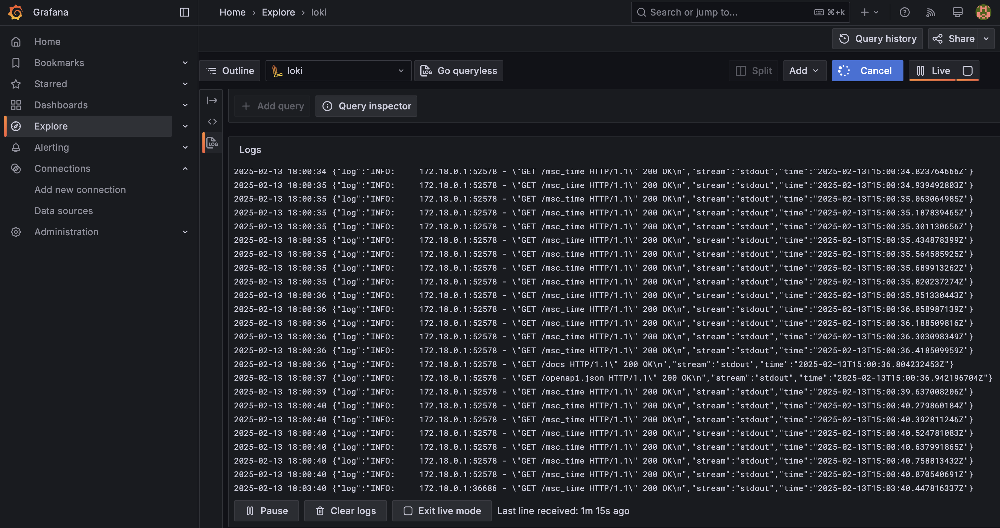
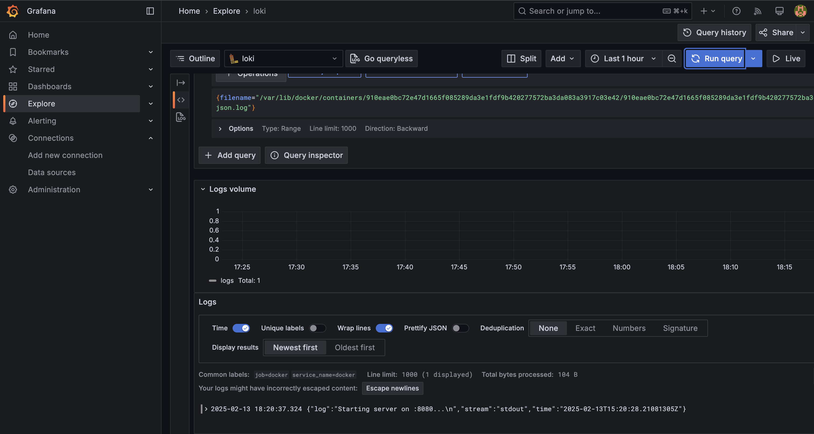

# LOGGING

## Overview
The logging stack consists of **Loki**, **Promtail**, and **Grafana** to collect, store, and visualize logs from Docker containers. The goal is to create a functional logging system that integrates seamlessly with application containers and provides comprehensive log monitoring.

## Components

1. **Loki**
   - **Role**: Loki serves as the central log aggregation system. It stores logs in a compressed format and allows querying based on labels.
   - **Key Features**:
     - Horizontally scalable and highly available.
     - Efficient storage by compressing logs.
     - Query logs using label-based filtering, similar to Prometheus metrics.
   - **How It Works**: Loki listens for log data sent by Promtail and stores it in its backend. Instead of indexing the full text of logs, Loki indexes metadata (labels) associated with the logs. This makes it lightweight and efficient for querying large volumes of logs.

2. **Promtail**
   - **Role**: Promtail collects logs from Docker containers and sends them to Loki.
   - **Key Features**:
     - Scrapes logs from specified paths (`/var/lib/docker/containers/*/*log`).
     - Adds metadata (labels) to logs for easier querying in Loki.
     - Lightweight and integrates seamlessly with Loki.
   - **How It Works**: Promtail reads logs from Docker container log files, applies labels (e.g., `job: docker`), and sends the logs to Loki via its API endpoint (`http://loki:3100/api/prom/push`). It ensures that logs are continuously collected and forwarded.

3. **Grafana**
   - **Role**: Grafana is used to query and visualize logs stored in Loki. It provides an intuitive interface for exploring and analyzing logs.
   - **Key Features**:
     - Real-time log visualization.
     - Powerful querying capabilities using Loki's query language (LogQL).
     - Customizable dashboards for monitoring logs.
   - **How It Works**: Grafana connects to Loki as a data source and retrieves logs based on user-defined queries. Logs can be filtered, searched, and displayed in various formats (e.g., raw logs, histograms).

## Workflow

1. **Log Creation**:
   - Applications running inside Docker containers generate logs, which are automatically stored in Docker's logging directory, typically located at `/var/lib/docker/containers/*/*log`.

2. **Log Collection and Enrichment**:
   - Promtail acts as the log collector, scanning the log files generated by Docker containers. It enriches these logs with metadata, such as labels, and sends them to Loki for centralized storage.

3. **Centralized Log Storage**:
   - Loki receives the enriched logs and stores them in a compressed format. Instead of indexing the entire log content, Loki indexes only the associated metadata (labels), enabling efficient storage and fast querying.

4. **Real-Time Log Exploration**:
   - Users can access Grafana through a web browser at `http://localhost:3000` and use its Explore feature to query logs from Loki. By leveraging Loki's query language (LogQL), users can filter logs based on specific labels, time ranges, or keywords, gaining real-time visibility into system and application behavior.

## Testing the Logging Stack

1. **Start the Services**:
   ```bash
   docker-compose up -d
   ```

2. **Generate Logs**:
   - Interact with the deployed applications to generate logs.
     - Access the Python application `http://localhost:8081`.
     - Access the Go application `http://localhost:8082`.

3. **Access Grafana**:
   - Open Grafana in your browser at `http://localhost:3000`.
   - Navigate to the **Explore** section to begin querying logs.

4. **Query and Validate Logs**:
   - Use Loki's query syntax to filter logs.
     - Query logs from all Docker containers using `{job="docker"}`.

## Resulting Logs

### All Docker Logs


### Python App Logs

```txt
(venv) ➜  monitoring git:(Lab-7) ✗ docker logs python-web
```
```txt
INFO:     Started server process [1]
INFO:     Waiting for application startup.
INFO:     Application startup complete.
INFO:     Uvicorn running on http://0.0.0.0:8000 (Press CTRL+C to quit)
INFO:     192.168.65.1:25675 - "GET / HTTP/1.1" 200 OK
INFO:     192.168.65.1:62086 - "GET / HTTP/1.1" 200 OK
INFO:     192.168.65.1:62086 - "GET / HTTP/1.1" 200 OK
INFO:     192.168.65.1:62086 - "GET / HTTP/1.1" 200 OK
INFO:     192.168.65.1:31680 - "GET / HTTP/1.1" 200 OK
INFO:     192.168.65.1:31680 - "GET / HTTP/1.1" 200 OK
INFO:     192.168.65.1:31680 - "GET / HTTP/1.1" 200 OK
INFO:     192.168.65.1:65165 - "GET / HTTP/1.1" 200 OK
INFO:     192.168.65.1:65165 - "GET / HTTP/1.1" 200 OK
INFO:     192.168.65.1:65165 - "GET / HTTP/1.1" 200 OK
INFO:     192.168.65.1:65165 - "GET / HTTP/1.1" 200 OK
INFO:     192.168.65.1:65165 - "GET / HTTP/1.1" 200 OK
INFO:     192.168.65.1:30312 - "GET / HTTP/1.1" 200 OK
```

### Go App Logs

```txt
(venv) ➜  monitoring git:(Lab-7) ✗ docker logs go-web
```
```txt
[GIN-debug] [WARNING] Creating an Engine instance with the Logger and Recovery middleware already attached.
[GIN-debug] [WARNING] Running in "debug" mode. Switch to "release" mode in production.
 - using env:   export GIN_MODE=release
 - using code:  gin.SetMode(gin.ReleaseMode)
[GIN-debug] GET    /                         --> main.main.func1 (3 handlers)
[GIN-debug] [WARNING] You trusted all proxies, this is NOT safe. We recommend you to set a value.
Please check https://pkg.go.dev/github.com/gin-gonic/gin#readme-don-t-trust-all-proxies for details.
[GIN-debug] Listening and serving HTTP on :8080
[GIN] 2025/02/21 - 19:40:04 | 200 |      83.333µs |    192.168.65.1 | GET      "/"
[GIN] 2025/02/21 - 19:42:07 | 200 |          43µs |    192.168.65.1 | GET      "/"
[GIN] 2025/02/21 - 19:42:08 | 200 |      24.875µs |    192.168.65.1 | GET      "/"
[GIN] 2025/02/21 - 19:42:09 | 200 |      28.667µs |    192.168.65.1 | GET      "/"
[GIN-debug] [WARNING] Creating an Engine instance with the Logger and Recovery middleware already attached.
[GIN-debug] [WARNING] Running in "debug" mode. Switch to "release" mode in production.
 - using env:   export GIN_MODE=release
 - using code:  gin.SetMode(gin.ReleaseMode)
[GIN-debug] GET    /                         --> main.main.func1 (3 handlers)
[GIN-debug] [WARNING] You trusted all proxies, this is NOT safe. We recommend you to set a value.
Please check https://pkg.go.dev/github.com/gin-gonic/gin#readme-don-t-trust-all-proxies for details.
[GIN-debug] Listening and serving HTTP on :8080
[GIN] 2025/02/21 - 19:52:59 | 200 |      39.916µs |    192.168.65.1 | GET      "/"
[GIN] 2025/02/21 - 19:53:01 | 200 |      38.709µs |    192.168.65.1 | GET      "/"
[GIN] 2025/02/21 - 19:53:02 | 200 |      32.875µs |    192.168.65.1 | GET      "/"
[GIN] 2025/02/21 - 19:53:41 | 200 |      31.792µs |    192.168.65.1 | GET      "/"
[GIN] 2025/02/21 - 19:53:41 | 200 |      31.833µs |    192.168.65.1 | GET      "/"
[GIN] 2025/02/21 - 19:53:42 | 200 |      30.125µs |    192.168.65.1 | GET      "/"
```