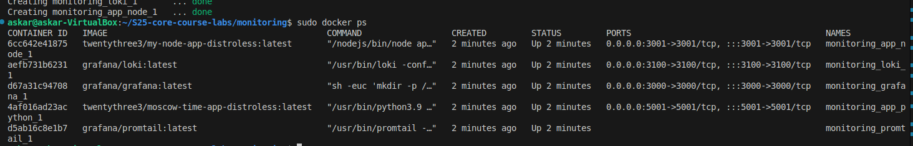

# Logging report

## Stack

### Loki

Loki is a horizontally-scalable, highly-available, multi-tenant log aggregation system.

It listens on port 3100.

### Promtail

Promtail is an agent which ships the contents of local logs to a private Grafana Loki instance or Grafana Cloud.

### Grafana

Grafana is a multi-platform open source analytics and interactive visualization web application.

It listents on port 3000.

## Screenshots

### docker-compose up

### Web application is available

### Grafana logging

