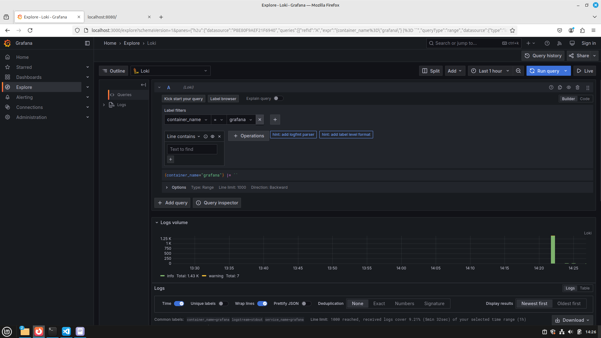

# Logging Stack Setup

- The goal of this task is to prepare monitoring and visualising environment for the python app, as a network of connected containers
- In order to monitor the python application, we will use Grafana Loki - this is a monitoring solution focused on application logs. Those logs are collected by clients, instead of general metrics

## What is used

1. **Loki** - for storing the logs
2. **Promtail** - for reading log files and send them to Loki
3. **Grafana** - displaying logs

## Setup Demonstration

1. - Run `docker-compose up`
2. Verify that all containers are running:
    - Application (`localhost:5000`):

    

    - Grafana UI (`localhost:3000`):

    

## Logs

### Grafana and Loki

## Best Practices

- Logs that are detailed and adhere to a standardized format
- Employ log rotation strategies to optimize memory and disk space usage
- Develop dashboards with clear, meaningful titles