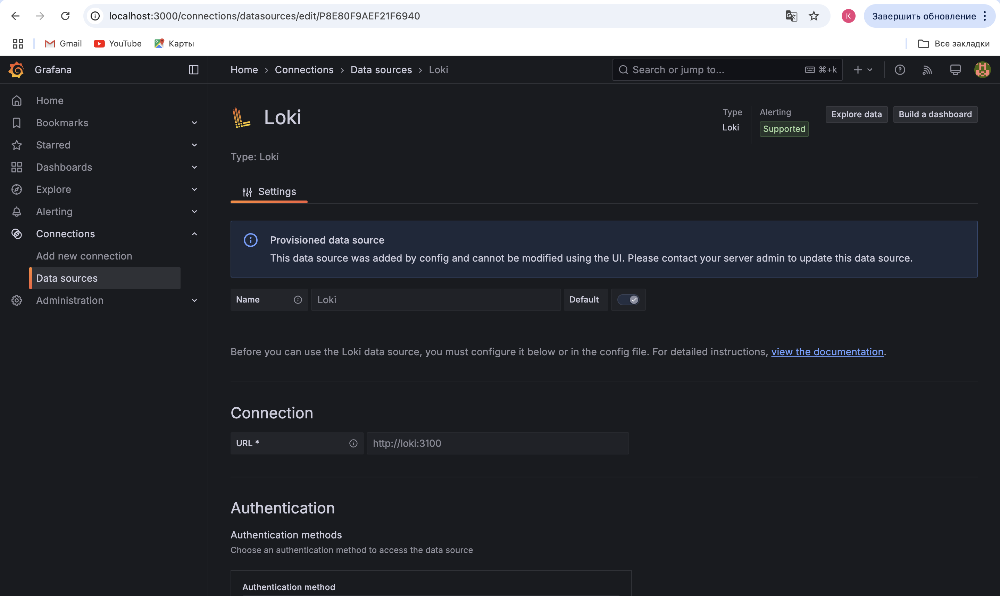

# Logging using Grafana Loki

## Overview

Our logging system includes Grafana, Loki, Promtail

## Components

### Grafana

* Grafana provides an intuitive web UI that lets you create queries and visualize data in custom dashboards.
* It fetches logs directly from Loki, allowing you to display and analyze log data alongside other metrics.
* Runs on port 3000 and, in this setup, is configured to work without authentication for easy access.

### Loki

* Loki is designed to efficiently store and index logs, making it quick and effective to search through time-series log data.
* It runs using the configuration file located at `/etc/loki/local-config.yaml`, which defines its behavior, storage backend, and indexing schema.
* Listens on port 3100 for incoming log streams and uses a time-series database approach to store logs in an organized manner.

### Promtail

* Promtail gathers logs from your containerized environments and forwards them to Loki, ensuring that all relevant log data is captured.
* Operates with settings defined in the `promtail-config.yaml`
* Key settings:
  - Listens for HTTP requests on port 9080.
  - Monitors log files from the directory `/var/lib/docker/docker/containers/*/*log`, which is where Docker stores container logs.
  - Saves its progress in the file `/tmp/positions.yaml` to avoid reprocessing logs.
  - Sends collected logs to Loki at `http://loki:3100/api/prom/push`

## Screenshots

### Docker Containers

### All Logs

### App Logs
