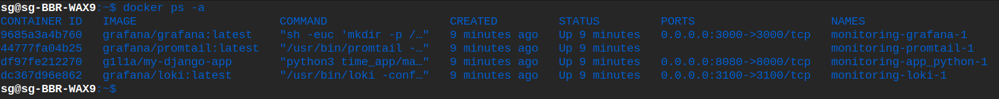
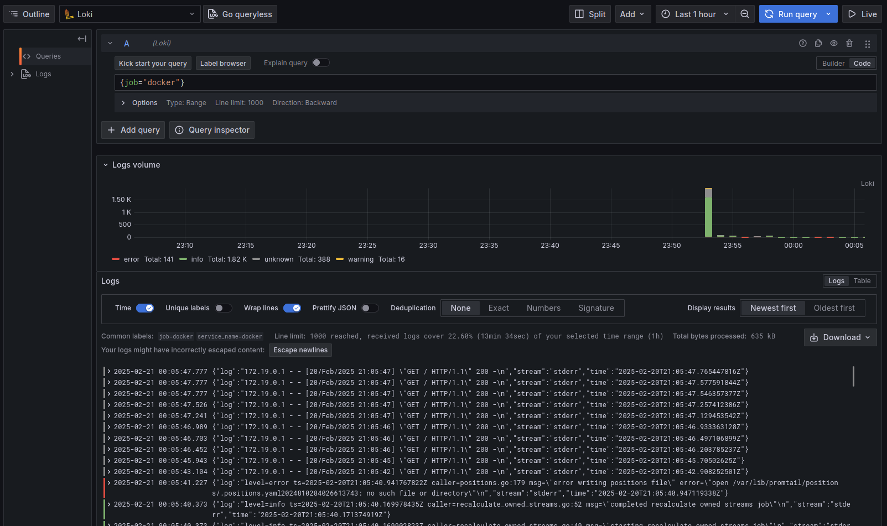
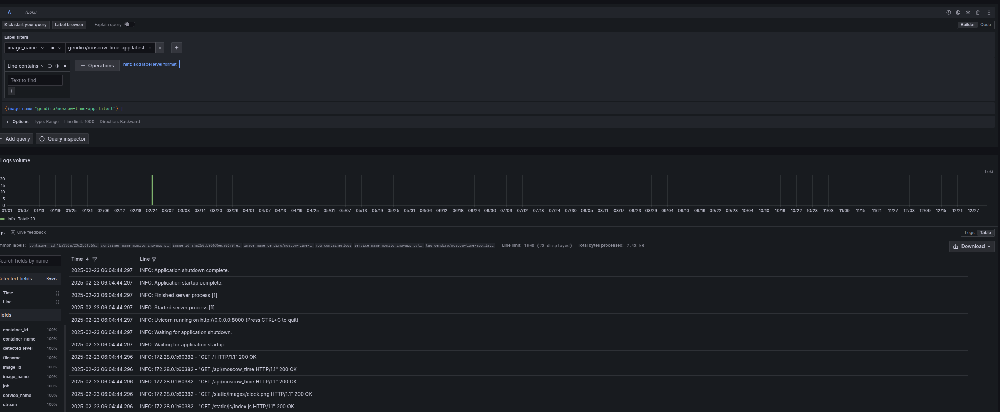

# Logging Stack
## Components:
### Promtail
Promtail is an agent responsible for collecting logs from various sources and sending them to Loki.
Promtail is configured to collect logs from ``/var/log/python-app/*.log`` and send them to Loki with the label ``job=docker``.

### Loki
Loki is a log aggregation system designed for efficiently storing and querying large volumes of log data. It accepts logs from Promtail, stores them with a time-series database, and enables users to search and query the logs.
Loki is configured to listen on port ``3100`` and accepts logs from Promtail. It stores logs on the filesystem with directories for chunks and rules.

### Grafana
Grafana is used for visualizing and analyzing the logs stored in Loki. It connects to Loki as a data source and allows users to build dashboards and run queries on the logs.
Grafana is configured to access Loki at ``http://loki:3100``.

## Containers

## Docker job

## Python App
