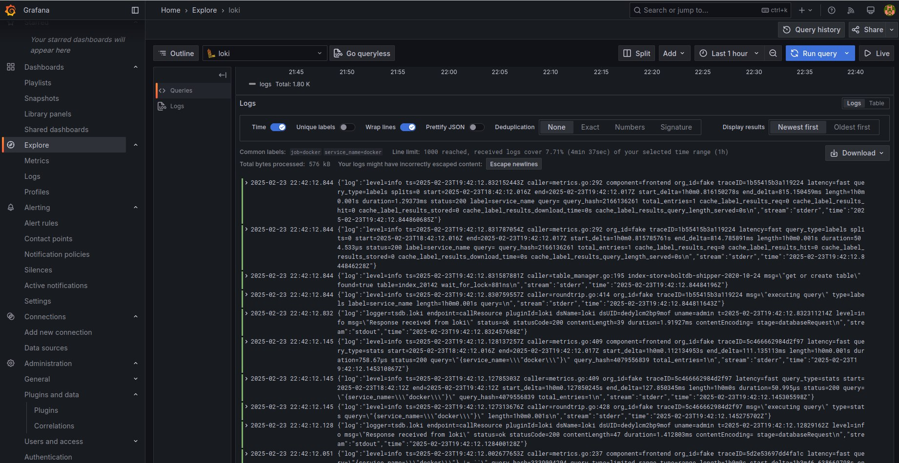

# **Logging Stack Documentation**

## **Overview**  
This document describes the architecture of the logging system, including its components, configuration, and the process of collecting, storing, and analyzing logs.  

## **System Components**  

### **1. Promtail (Log Collector)**  
- **Purpose:** Monitors system logs and forwards them to Loki.  
- **Configuration:**  
  - Reads logs from system files or specific application logs.  
  - Uses labels to structure log data.  
  - Sends processed logs to Loki via HTTP.  

### **2. Loki (Log Aggregation and Storage System)**  
- **Purpose:** Centralizes log storage and enables fast searches.  
- **Configuration:**  
  - Stores logs in a compressed format without full-text indexing.  
  - Uses labels to filter and organize logs.  
  - Provides an API for integration with Grafana and other tools.  

### **3. Grafana (Monitoring and Log Visualization Dashboard)**  
- **Purpose:** Displays and analyzes logs from Loki.  
- **Configuration:**  
  - Loki is added as a data source in Grafana.  
  - Uses LogQL queries to search and filter logs.  
  - Dashboards are configured for real-time log monitoring.  

## **Log Processing Flow**  
1. **Log Generation:** Applications generate logs and save them in log files.  
2. **Log Collection:** Promtail reads the logs, adds labels, and sends them to Loki.  
3. **Storage:** Loki receives logs, optimizes storage, and makes them searchable.  
4. **Visualization:** Grafana queries Loki and visualizes logs on dashboards.  

## **Screenshots**  
Loki logs

Web app logs

