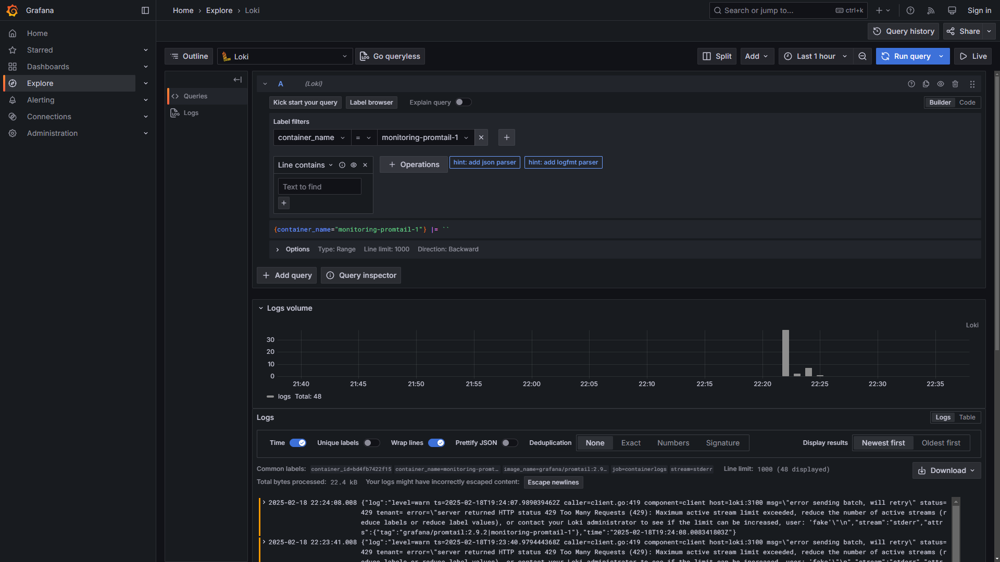

# Logging Setup Documentation

## Overview

This document provides details on the logging setup for your Docker-based environment using Loki, Promtail, and Grafana. This setup enables efficient log collection, storage, and visualization.

## Components

### 1. **Loki**

Loki is the logging backend responsible for storing logs and serving queries.

- **Container Name:** `loki`
- **Image:** `grafana/loki:latest`
- **Ports:**
  - Exposed on `3100:3100`
- **Command:** Uses configuration file `/etc/loki/local-config.yaml`
- **Network:** Connected to `loki` network

### 2. **Promtail**

Promtail is a log shipping agent that collects logs from Docker containers and forwards them to Loki.

- **Container Name:** `promtail`
- **Image:** `grafana/promtail:latest`
- **Volumes:**
  - Mounts `./promtail.yml` to `/etc/promtail/config.yml`
  - Mounts `/var/run/docker.sock` for container log access
- **Command:** Uses configuration file `/etc/promtail/config.yml`
- **Network:** Connected to `loki` network

#### **Promtail Configuration (`promtail.yml`)**

- **Server:**
  - HTTP listening on port `9080`
  - gRPC disabled
- **Positions:**
  - Logs stored in `/tmp/positions.yaml`
- **Client:**
  - Pushes logs to `http://loki:3100/loki/api/v1/push`
- **Scrape Configs:**
  - Job Name: `docker_containers_logs`
  - Uses Docker service discovery with Unix socket `/var/run/docker.sock`
  - Refresh interval: `1s`
  - Filters logs for label `com.docker.compose.project=monitoring`
  - Relabels logs using:
    - `container_name` extracted from container metadata
    - `logstream` based on the container's log stream

### 3. **Grafana**

Grafana is used for visualizing logs stored in Loki.

- **Container Name:** `grafana`
- **Image:** `grafana/grafana:latest`
- **Ports:**
  - Exposed on `3000:3000`
- **Environment Variables:**
  - `GF_PATHS_PROVISIONING=/etc/grafana/provisioning`
  - Enables anonymous authentication with Admin role
  - Feature toggles enabled: `alertingSimplifiedRouting`, `alertingQueryAndExpressionsStepMode`
- **Entrypoint:**
  - Creates a provisioning configuration file for Loki as a default data source
  - Starts Grafana with `/run.sh`
- **Network:** Connected to `loki` network

### 4. **Web Application (Moscow Time App)**

A simple web application that does not integrate with Loki but is part of the setup.

- **Container Name:** `moscow-time-app`
- **Image:** `yoqub/app_python:latest`
- **Restart Policy:** Always
- **Ports:**
  - Exposed on `5000:5000`

## Network Configuration

All services except `web-app` are connected to the `loki` network to facilitate log collection and querying.

## Usage

1. Start the stack with `docker-compose up -d`.
2. Access:
   - **Grafana UI:** `http://localhost:3000` (default credentials: `admin/admin`)
   - **Loki API:** `http://localhost:3100`
   - **Promtail Logs:** Available in Loki via Grafana
   - **Web Application Logs:** Available in Loki via Grafana
3. Configure Grafana dashboard to query logs from Loki.

## Conclusion

This setup ensures a centralized logging solution using Loki, Promtail, and Grafana, with automated service discovery and a predefined logging structure.

## Screenshots

- Web Application Logs

- Loki Logs

- Grafana Logs

- Promtail Logs

