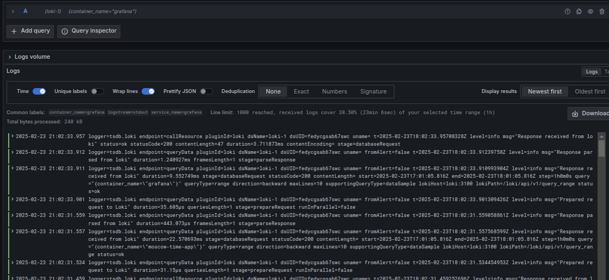
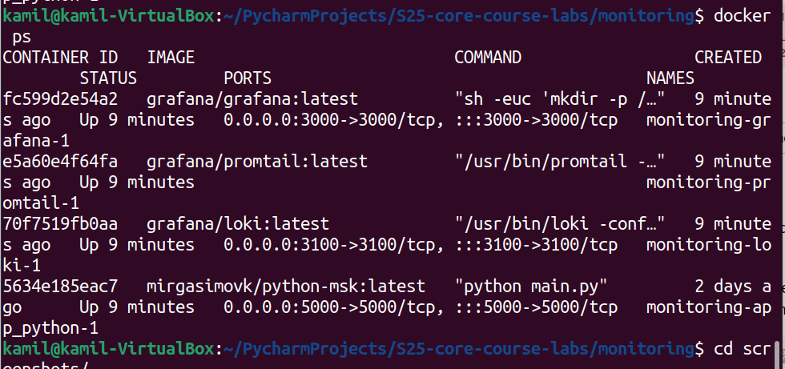

# Logging Setup

This report outlines the configuration and usage of a Docker Compose setup for a logging stack that includes Loki, Promtail, Grafana, and a custom application. The setup is designed to facilitate log aggregation and visualization.

## Services

### Loki

- **Image**: `grafana/loki:latest`
- **Container Name**: `loki`
- **Ports**: Maps port 3100 on the host to port 3100 on the container.
- **Command**: Runs Loki with a configuration file located at `/etc/loki/local-config.yaml`.
- **Restart Policy**: Restarts the container unless it is explicitly stopped.
- **Healthcheck**:
  - **Test**: Checks if the Loki service is ready by attempting to access `http://localhost:3100/ready`.
  - **Interval**: Checks every 10 seconds.
  - **Timeout**: Allows 3 seconds for the check to complete.
  - **Retries**: Retries the check up to 3 times before considering the service unhealthy.

### Promtail

- **Image**: `grafana/promtail:2.9.2`
- **Container Name**: `promtail`
- **Volumes**:
  - Mounts Docker container logs and Docker socket for log collection.
  - Uses a custom configuration file `promtail-config.yaml` mounted to `/etc/promtail/config.yml`.
- **Command**: Runs Promtail with the specified configuration file.
- **Networks**: Connected to the `monitoring` network.
- **Depends On**: Waits for the Loki service to be healthy before starting.

### Grafana

- **Image**: `grafana/grafana:latest`
- **Container Name**: `grafana`
- **Ports**: Maps port 3000 on the host to port 3000 on the container.
- **Environment Variables**:
  - Sets the admin username and password.
  - Disables user sign-ups.
- **Volumes**:
  - Persists Grafana data in a named volume `grafana_data`.
  - Mounts a provisioning directory for Grafana configuration.
- **Restart Policy**: Restarts the container unless it is explicitly stopped.
- **Depends On**: Starts after the Loki service.

### Application

- **Build**:
  - Uses the `Dockerfile` in the `../app_python` directory for building the image.
- **Ports**: Maps port 5000 on the host to port 5000 on the container.
- **Volumes**: Mounts the application directory to `/app` in the container.
- **Command**: Runs the application using `python app.py`.

## Networks

- **Monitoring**: A bridge network named `monitoring` is created for communication between services.

## Volumes

- **grafana_data**: Named volume for persisting Grafana data.
- **app-logs**: Named volume for application logs (though not explicitly used in the service definitions).

## Usage

### Starting the Stack

1. **Navigate to the Directory**:
   - Open a terminal and navigate to the directory containing the `docker-compose.yml` file.

2. **Start the Services**:
   - Run the following command to start all the services defined in the `docker-compose.yml` file:

   ```bash
   docker-compose up -d
   ```

   This command will start Loki, Promtail, Grafana, and your application in detached mode.

### Accessing Grafana

1. **Open Grafana**:
   - Open your web browser and go to `http://localhost:3000`.
   - Log in using the default credentials (`admin`/`admin`).

2. **Add Loki as a Data Source**:
   - Navigate to **Configuration** > **Data Sources**.
   - Click **Add data source** and select **Loki**.
   - Set the URL to `http://loki:3100` and save the configuration.

3. **Explore Logs**:
   - Use Grafana to create dashboards and visualize logs collected by Loki.

### Viewing Application Logs

- **Application Access**:
  - Access your application by navigating to `http://localhost:5000` in your browser.

- **Log Collection**:
  - Promtail will collect logs from the application and send them to Loki for storage and querying.


## Verification

- **Web-app Logs**


- **Grafana Logs**


- **Loki Logs**


- **Promtail Logs**


- **Container**
