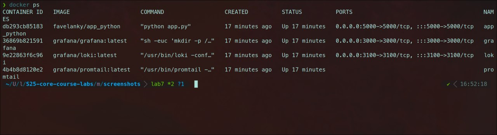
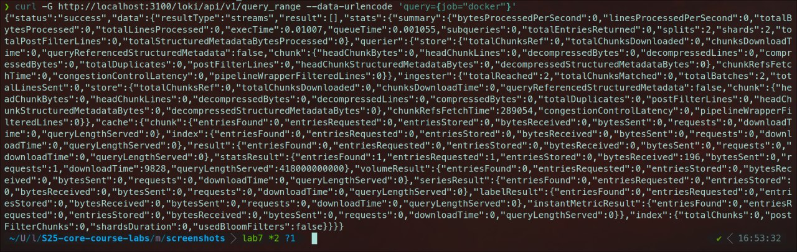

# **Logging Stack Report**

## **Overview**
The logging stack in this project uses **Grafana Loki**, **Promtail**, and **Grafana** to collect, store, and visualize logs from a Dockerized application (`favelanky/app_python`). The stack is set up using **Docker Compose** for easy deployment and management. 

### **Stack Components:**

- **Grafana**: Provides a web-based user interface (UI) to query and visualize logs from Loki.
- **Loki**: A log aggregation system that collects, stores, and indexes logs. It acts as the storage backend for Promtail's log data.
- **Promtail**: A log collector that reads logs from the Docker containers and sends them to Loki.
- **Dockerized Python Application (`favelanky/app_python`)**: The app that generates logs, which are then collected by Promtail.




---

## **Components of the Stack**

### **1. Grafana**

#### **Role in the Stack:**
Grafana is the tool used to **visualize and query logs**. It connects to **Loki** as the data source and allows users to interact with logs via a friendly UI. Grafana provides a powerful query language (LogQL) for searching and filtering log data.

#### **How It Works:**
- **Provisioning**: At startup, Grafana is configured to connect to Loki as a data source. This configuration is done via a provisioning YAML file, which is automatically set by the Grafana container.
- **Access**: Grafana listens on port `3000` and can be accessed via `http://localhost:3000` (default username and password: `admin`).

#### **Key Features**:
- **Log Exploration**: Users can use the **Explore** feature in Grafana to run queries and view logs from Loki.
- **Dashboard**: Custom dashboards can be created in Grafana to visualize log data in real-time.


---

### **2. Loki**

#### **Role in the Stack:**
Loki is the **log aggregation system** that collects, indexes, and stores log data. It allows efficient querying and retrieval of logs from various sources, such as Promtail. Loki is designed to work seamlessly with Grafana to visualize log data.

#### **How It Works:**
- **Logs Collection**: Loki stores logs sent to it by **Promtail** (or other log shipping tools).
- **Querying**: Grafana queries Loki to retrieve logs. Loki uses **labels** to organize logs, making it easy to filter logs based on various criteria like application name, container ID, or log level.
- **Port**: Loki listens on port `3100` and is accessed by Promtail and Grafana.

#### **Key Features**:
- **Efficient Storage**: Loki indexes logs efficiently, making querying fast and cost-effective.
- **Integration with Grafana**: Works seamlessly with Grafana for visualization and log querying.




---

### **3. Promtail**

#### **Role in the Stack:**
Promtail is the **log collector** responsible for reading logs from Docker containers and sending them to Loki. Promtail monitors specified log directories (such as Docker's log directory) and pushes logs to Loki based on a predefined configuration.

#### **How It Works:**
- **Log Scraping**: Promtail scrapes logs from Docker container log files (`/var/lib/docker/containers/*/*.log`).
- **Labels**: Promtail adds labels to each log entry based on the configured scrape job (e.g., `job="docker"`).
- **Sending Logs**: Promtail sends logs to Loki using the `/loki/api/v1/push` endpoint.

#### **Key Features**:
- **Dynamic Configuration**: Promtail's configuration is highly customizable to define which logs to scrape and how to send them to Loki.
- **Docker Integration**: Promtail can scrape logs from running Docker containers using the `docker` job configuration.


---

### **4. Dockerized Application (`favelanky/app_python`)**

#### **Role in the Stack:**
The application (`favelanky/app_python`) is a simple **Flask web app** that outputs logs (including HTTP requests) which are captured by Promtail. These logs are then stored in Loki and can be queried in Grafana.

#### **How It Works:**
- **Log Generation**: The Flask application generates logs, including details about HTTP requests, response times, and application-specific log messages.
- **Log Shipping**: These logs are captured by Docker's **JSON log driver**, which Promtail reads from the container and sends to Loki.

#### **Key Features**:
- **Flask Application**: Runs on port `5000` and serves a simple web page showing the current time in Moscow.
- **Logs Format**: The application uses the default **JSON log format** which is compatible with Promtail.

---

## **Architecture Overview**

The stack works as follows:

1. **Flask Application Logs**:  
   - The Flask app generates logs that are collected by Docker's built-in logging driver (JSON format).
   
2. **Promtail Scrapes Docker Logs**:  
   - Promtail watches the Docker log files and scrapes logs from all running containers, including `favelanky/app_python`. It adds metadata (labels) and sends these logs to **Loki**.
   
3. **Loki Stores and Indexes Logs**:  
   - Loki stores the logs and organizes them using labels. This enables efficient querying of logs based on various filter criteria.
   
4. **Grafana Queries and Visualizes Logs**:  
   - Grafana is connected to Loki and allows users to query logs via the UI. It uses **LogQL** for querying and presents the logs in a user-friendly way.

---

## **Usage and Querying Logs in Grafana**

### **1. Accessing Grafana**
- **URL**: `http://localhost:3000`
- **Credentials**: Username: `admin`, Password: `admin` (can be changed).

### **2. Explore Logs**
- Go to **Explore** and select **Loki** as the data source.
- Use the query format `{job="docker"}` to filter logs from the Docker containers.
  
#### **Sample Query**:
```logql
{job="docker"}
```

This query fetches logs from Docker containers. You can also apply additional filters (e.g., container name, log level).

---

## **Conclusion**
This logging stack provides a robust solution for collecting, storing, and visualizing logs from Dockerized applications. It leverages **Grafana** for visualization, **Loki** for log aggregation, and **Promtail** for log collection. The stack is highly flexible and can scale to collect logs from multiple containers in a Docker environment.

