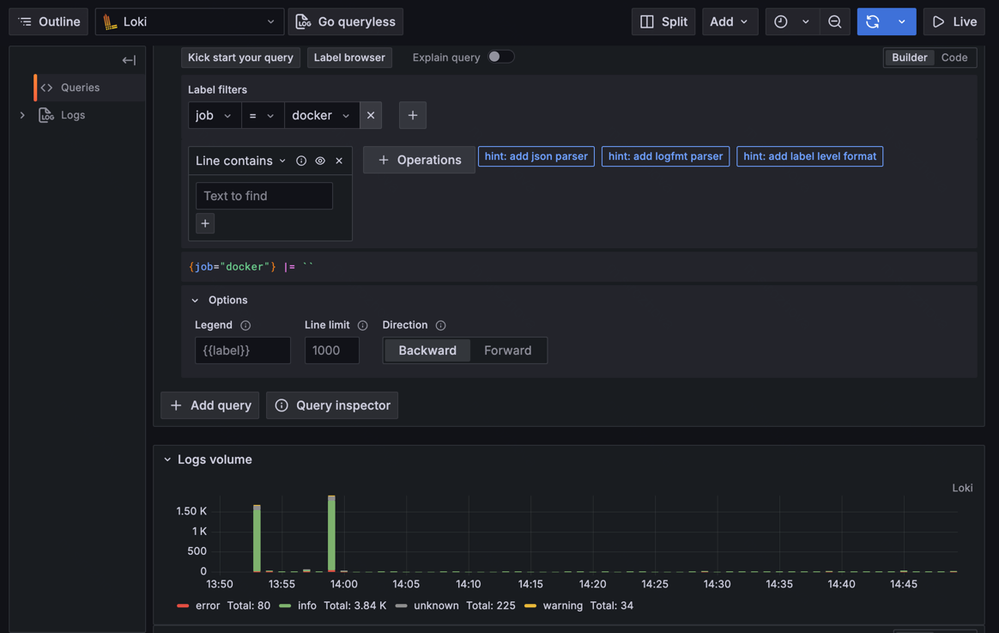
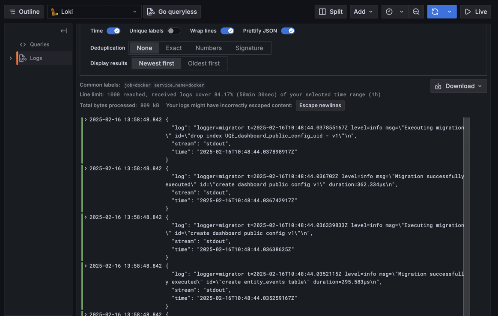
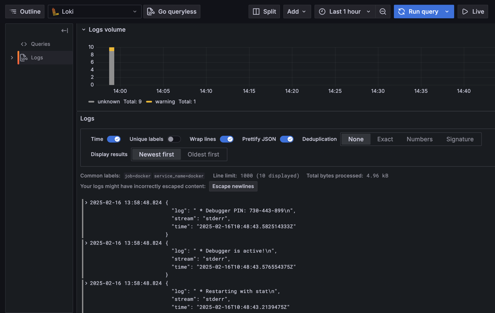
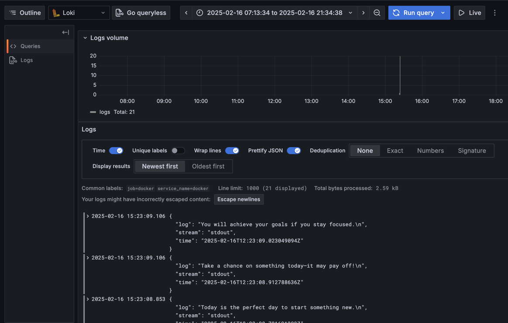

# Logging

## Overview

The logging stack is designed to collect, store, and visualize log data from various sources, including containerized applications.

## Components

### Loki

Loki is a log aggregation system that stores and indexes logs. It runs on port ```3100```, uses ```local-config.yaml``` for configuration, and stores logs in the ```loki-data``` volume. It operates in the ```loki``` network, enabling communication with other components.

### Promtail

Promtail collects logs from various sources and forwards them to Loki. It mounts ```/var/log``` for system logs and ```/var/lib/docker/containers``` for container logs. It is configured via ```promtail.yml``` and depends on Loki to store logs.

### Grafana

Grafana provides a web-based interface for log visualization. It runs on port ```3000```, uses a provisioning script to configure Loki as the default data source, and allows anonymous access with admin privileges. It supports advanced alerting and query features.

## Screenshots

### Containers


### Grafana screenshot



### All logs



### Python logs



### Containers new


### Go logs


