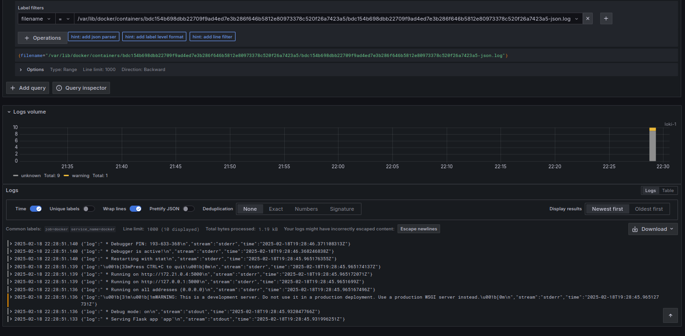
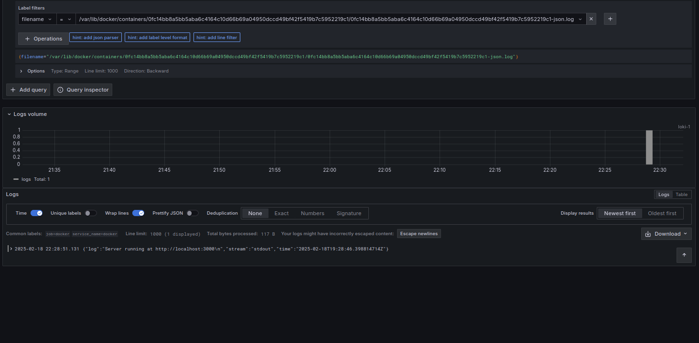

# Logging with Loki
To run:
```
docker-compose up
```


## Grafana
Grafana is a visualization tool that is integrated with Loki.
We can interact with it at `localhost:3000` where we can look
at logs.

## Loki
This tool is used to effectively store and manage logs. We need 
to specify address `http://loki:3100`. It doesn't attach an index 
the content of logs but labels instead for more efficient querying.

## Promtail
Promtail collects local logs and publish them to Loki. We need 
to configure it in `promtail-config.yml`.

## My applications (app_py and app_js)
They just run docker containers respectively for Python and JS.


# Results

## General for docker


## Python app


## JS app (bonus)



### Here are the docker containers
