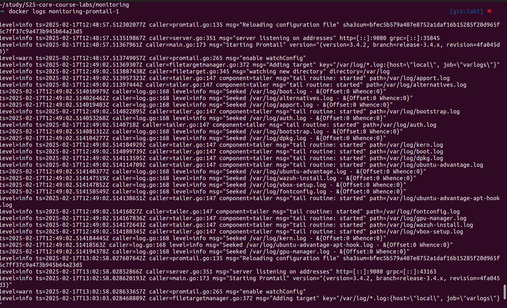

# Logging Stack Setup

## Overview

This document describes the setup and configuration of the logging stack using Promtail, Loki, and Grafana. The stack collects logs from Python and JavaScript applications and provides a centralized logging interface via Grafana.

## Components of the Logging Stack

### 1. **Loki**

Loki is a log aggregation system designed to store and query logs. Unlike traditional logging systems, Loki is optimized for high throughput and efficient querying of logs. It stores logs in a way that is highly compressible and can be easily queried using the Grafana interface.

**Role in the stack:**

- Acts as the central log storage system.
- Exposes an API for pushing and querying logs.

### 2. **Promtail**

Promtail is an agent responsible for collecting logs from various sources (such as Docker containers), processing them, and pushing them to Loki.

**Role in the stack:**

- Scrapes logs from Docker containers.
- Sends logs to Loki for storage.

### 3. **Grafana**

Grafana is a visualization tool that connects to data sources like Loki to display logs and metrics in customizable dashboards.

**Role in the stack:**

- Provides a user interface to query and view logs stored in Loki.
- Allows the creation of dashboards to monitor log data.

## Configuration Files

### `docker-compose.yml`

The Docker Compose configuration defines the services required to run the logging stack and the applications. Here are the key services:

1. **Loki** – The log storage service.
2. **Promtail** – The log collector.
3. **Grafana** – The log visualization tool.
4. **app_python** – A Flask application that generates logs.
5. **app_javascript** – An Express application that generates logs.

#### Key Sections of the `docker-compose.yml`

- **Networks**: Defines a network for the stack (`loki` network).
- **Loki**: Runs the `grafana/loki` container and exposes it on port 3100.
- **Promtail**: Runs the `grafana/promtail` container, configured to scrape logs from Docker containers and send them to Loki.
- **Grafana**: Runs the `grafana/grafana` container and provides a UI for visualizing logs.
- **Applications**: Includes both `app_python` and `app_javascript` which generate logs.

### `promtail-config.yaml`

This configuration file defines how Promtail scrapes logs and sends them to Loki. The key sections include:

- **Scrape Configurations**: Defines Docker as the source for logs and specifies how to label and process logs from the containers.
- **Pipeline Stages**: Specifies processing steps for logs, such as timestamp parsing and regex-based extraction.

## Logs Generation in Applications

### `app_python`

A simple Flask application that generates logs for every request to show the current time in Moscow. The logging configuration uses Python's built-in `logging` module.

Key features:

- Logs the request for the current time.
- Logs when the Flask server starts.

### `app_javascript`

An Express application that uses `winston` for logging. It logs when the home page is requested and when the server starts.

Key features:

- Logs the request to the home page.
- Logs the startup of the server.

## Testing and Verification

After setting up the logging stack using Docker Compose, the following steps verify that the system works as expected:

1. **Start the Docker Compose stack**: Run `docker-compose up` from the `monitoring` folder.
2. **Access Grafana**: Open Grafana on `http://localhost:3000` and log in.
3. **Add Loki as a Data Source**: Grafana is pre-configured to connect to Loki.
4. **View Logs**: Use Grafana's Explore feature to query and view logs coming from both `app_python` and `app_javascript`.

## Screenshots

### Grafana Logs

### Promtail Logs

### Loki Logs

  

### Python Application Logs

  

### Javascript Application Logs

