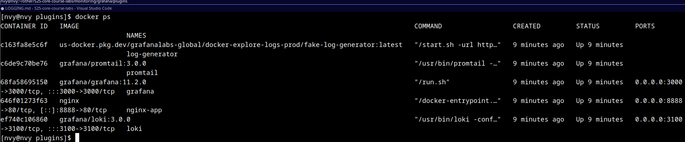

# Lab7: Monitoring and Logging

## Overview
Components of the Logging Stack

- Grafana - The visualization tool used to create dashboards and monitor logs.
- Loki - The log aggregation system that stores and indexes logs.
- Promtail - The log forwarder that collects logs from Docker containers and sends them to Loki.
- Nginx - A sample web application to generate logs.
- Log Generator - A fake log generator to simulate log ingestion.

### Folder structure

```
monitoring/
│── docker-compose.yml               # Defines the logging stack
│── loki-config.yaml                 # Loki configuration file
│── promtail-config.yaml              # Promtail configuration file
│── grafana/
│   ├── datasources/
│   │   └── grafana.yaml             # Defines Loki as a datasource in Grafana
│   ├── plugins/
│   │   └── app.yaml                 # Configures Grafana Loki Explore plugin
│── LOGGING.md                        # Documentation report (this file)

```

## Services

### Nginx (for bonus task)
1. Runs an Nginx container for generating logs.
2. Uses labels to mark logs for Promtail to scrape.
3. Logs in json format.

### Grafana
1. Grafana exposes a web UI on port 3000.
2. Uses Loki as a data source to display logs.
3. Plugin installation may fail due to network issues.

When using `GF_INSTALL_PLUGINS` to install plugin I came with network issue, so I downloaded the zip archive from official website and placed it into `grafana/plugins/data`.

### Loki 
Stores logs received from Promtail.
> Differs from prometheus by focusing on logs instead of metrics, and collecting logs via push, instead of pull.
Uses a configuration file (loki-config.yaml).

### Promtail (Log Collector)
Reads logs from Docker containers.

### Fake Log Generator
Simulates log ingestion into Loki.

## Running

```
docker compose up -d
```


## Troubleshoting 

```
docker ps
docker logs grafana
```



