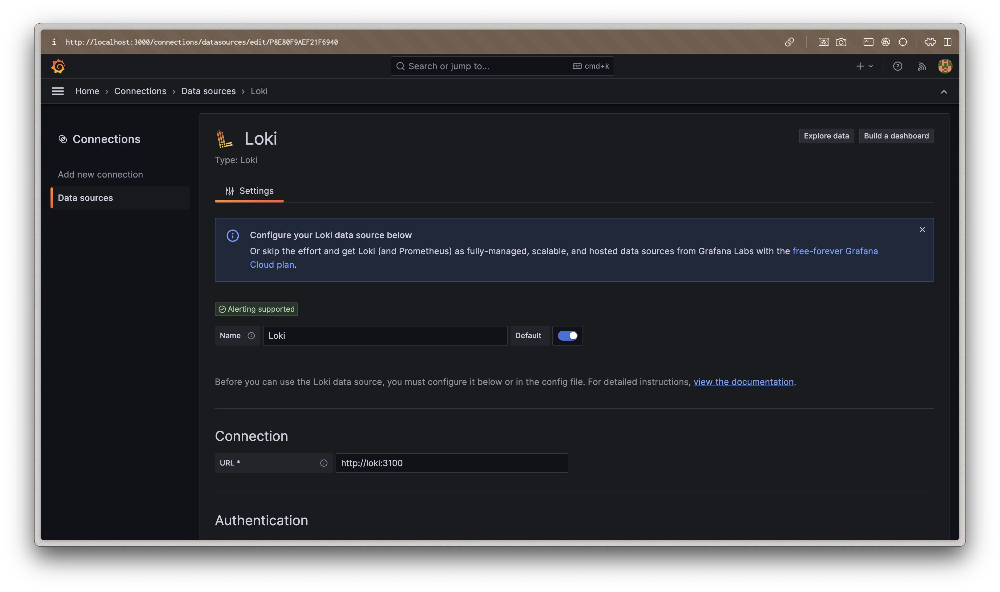

# Logging Stack Documentation

This document describes the logging stack implementation using Grafana, Loki, and Promtail.

## Components Overview

### 1. Loki
- **Purpose**: Loki is a horizontally scalable, highly available, multi-tenant log aggregation system.
- **Role**: Acts as the central log storage and query system.
- **Configuration**: Located in `loki-config.yaml`
  - Uses local filesystem storage
  - Configured for single-instance mode
  - Listens on port 3100
  - Uses Write-Ahead Log (WAL) for data durability
  - Requires specific volume mounts for data persistence

### 2. Promtail
- **Purpose**: Log collecting agent that gathers logs and forwards them to Loki.
- **Role**: Discovers targets, attaches labels to log streams, and pushes them to Loki.
- **Configuration**: Located in `promtail-config.yaml`
  - Collects system logs from `/var/log/*log`
  - Collects Docker container logs
  - Specifically configured to collect Python application logs with custom labels

### 3. Grafana
- **Purpose**: Visualization platform for logs and metrics.
- **Role**: Provides the user interface for querying and visualizing logs stored in Loki.
- **Configuration**:
  - Pre-configured with Loki datasource
  - Default credentials: admin/admin
  - Accessible on port 3000

## Network Configuration
- All components are connected through a dedicated Docker network named `logging-network`
- Internal service discovery is handled through Docker DNS

## Log Sources
1. **System Logs**
   - Source: `/var/log/*log`
   - Job name: `system`

2. **Docker Container Logs**
   - Source: `/var/lib/docker/containers/*/*-json.log`
   - Job name: `docker`

3. **Python Application Logs**
   - Source: Container logs with Python app label
   - Job name: `python-app`
   - Custom processing pipeline for structured logging

## How to Access

1. **Grafana Dashboard**
   - URL: http://localhost:3000
   - Username: admin
   - Password: admin

2. **Loki API**
   - URL: http://localhost:3100
   - Used internally by Promtail and Grafana

## Query Examples

### Basic LogQL Queries

1. View all logs from the Python application:
```logql
{app="python-app"}
```

2. Search for error messages:
```logql
{app="python-app"} |= "error"
```

3. View system logs:
```logql
{job="varlogs"}
```

## Screenshots

### 1. Logging Stack Running

*Screenshot showing all containers running successfully with `docker-compose ps`*

### 2. Grafana Login Page

*Screenshot of the Grafana login page at http://localhost:3000*

### 3. Loki Data Source Configuration

*Screenshot showing the Loki data source successfully connected in Grafana*

### 4. Log Exploration

*Screenshot of the Explore page in Grafana showing logs from the Python application*

### 5. Log Query Example

*Screenshot demonstrating a LogQL query filtering for error messages*

## Maintenance

### Log Retention
- Logs are retained based on the configuration in `loki-config.yaml`
- Current retention period: 168 hours (7 days)

### Storage
- Logs are stored in the local filesystem
- Docker logs are automatically rotated (max size: 10MB, max files: 3)
- Loki uses dedicated volumes for data persistence:
  - `loki-data`: For storing log chunks and indexes
  - `loki-wal`: For Write-Ahead Log (WAL) storage

## Troubleshooting

1. **Missing Logs**
   - Check Promtail status and configuration
   - Verify file permissions on log directories
   - Check network connectivity between components

2. **Grafana Can't Connect to Loki**
   - Verify Loki is running: `docker-compose ps`
   - Check Loki logs: `docker-compose logs loki`
   - Verify network connectivity

3. **Permission Issues**
   - If you encounter "permission denied" errors for the WAL directory:
     - Ensure the Loki container is running with appropriate permissions
     - The current configuration uses `user: "0"` (root) to avoid permission issues
     - Alternatively, you can create the directories with proper permissions before starting the container

## Configuration Notes

### Loki WAL Configuration
The Write-Ahead Log (WAL) is critical for Loki's operation. It ensures data durability by writing log entries to disk before they're fully processed. Our configuration:

- Explicitly enables WAL: `enabled: true`
- Sets WAL directory to `/wal` which is mounted as a volume
- Uses a dedicated Docker volume (`loki-wal`) to persist WAL data